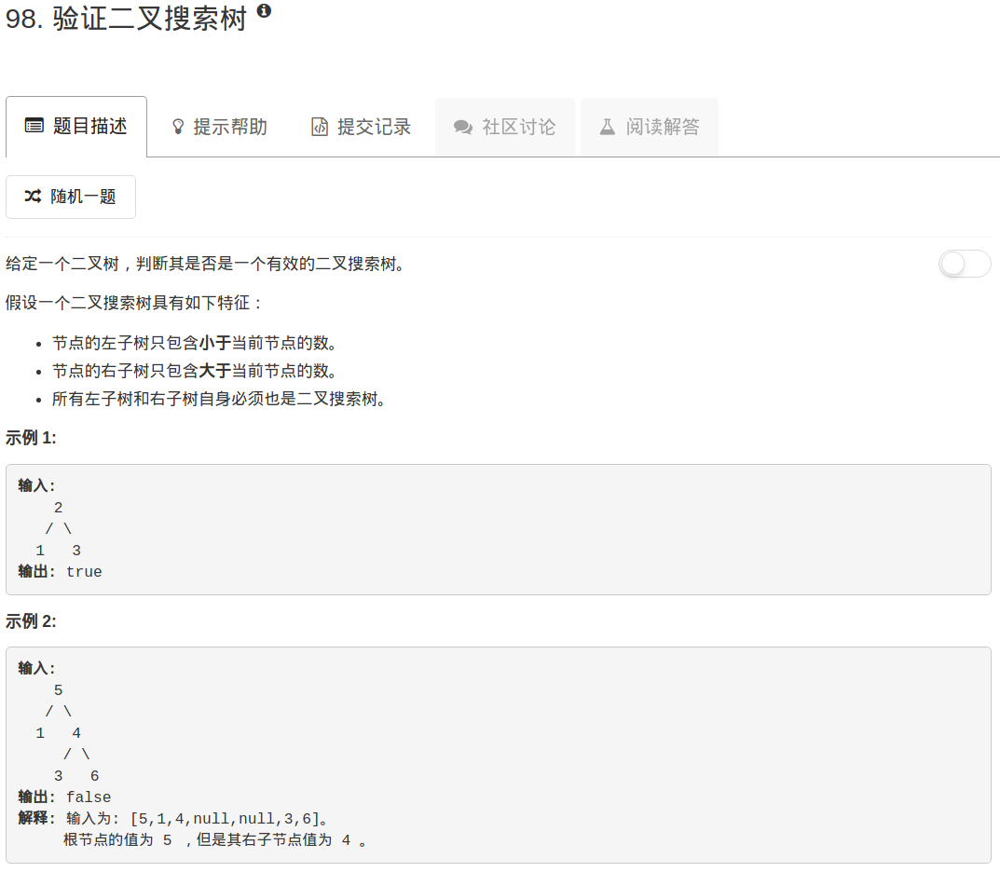

​

```python
# Definition for a binary tree node.
# class TreeNode:
#     def __init__(self, x):
#         self.val = x
#         self.left = None
#         self.right = None

class Solution(object):
    def inorder(self, root):
        if not root: return 
        
        ans = []
        
        left = self.inorder(root.left)
        if left: ans.extend(left)
            
        ans.append(root.val)
        
        right = self.inorder(root.right)
        if right: ans.extend(right)
        
        return ans
    
    def isValidBST(self, root):
        """
        :type root: TreeNode
        :rtype: bool
        """
        if not root: return True
        tmp = self.inorder(root)
        for ii in range(len(tmp)-1):
            if tmp[ii+1] <= tmp[ii]: return False
        return True
```

这道题其实对二叉树的结构做了限制，比如，如果左孩子等于根，这种树在这道题里是不算二叉树的。因此，中序遍历后得到的必然是一个严格递增的数组。