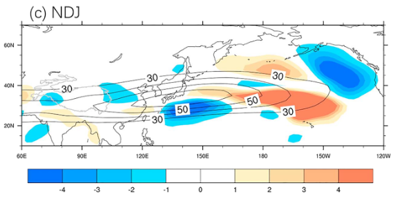
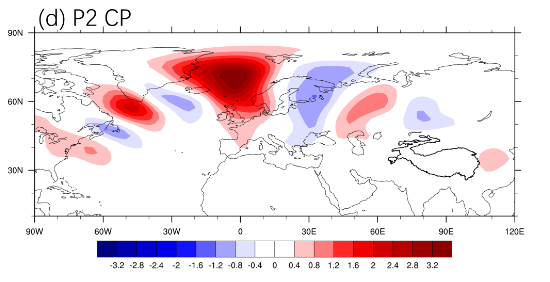

# Barotropic&Baroclinic Energy Conversion

Kosaka and Nakamura (2006)定义的正压能量转换（barotropical energy conversion，CK）和斜压能量转换（baroclinic energy conversion，CP）可以分析大气中某种扰动的能量来源。

## 理论

$$
CK = [\dfrac{v'^2-u'^2}{2}(\dfrac{\partial \bar{u}}{\partial x}-\dfrac{\partial \bar{v}}{\partial y})-u'v'(\dfrac{\partial \bar{u}}{\partial y}+\dfrac{\partial \bar{v}}{\partial x})]
$$

$$
CP=-[\dfrac{f}{\sigma}v'T'\dfrac{\partial \bar{u}}{\partial p}+\dfrac{f}{\sigma}u'T'\dfrac{\partial \bar{v}}{\partial p}]
$$

$$
\sigma=\dfrac{R\bar{T}}{c_pp}-\dfrac{d\bar{T}}{dp}
$$

上面的公式中的符号含义就是一般化的含义。方括号代表的是垂直积分，比如从地表积分到100hPa。当然，CK和CP也可以逐层单独计算。不过，CK可以单层算，但斜压过程本身涉及到空气的上升下沉，CP计算时垂直积分是不可少的。

CK对罗斯贝波列维持的贡献可以用正压能量转换对扰动动能补偿的时间尺度进行衡量。
$$
\tau_{ck}=\dfrac{<[KE]>}{<CK>}
$$

$$
KE=\dfrac{u'^2+v'^2}{2}
$$

CP对罗斯贝波列维持的贡献可以用斜压能量转换从基本气流中提取的能量对有效位能的补偿的时间尺度进行衡量。
$$
\tau_{cp}=\dfrac{<[APE]>}{<CP>}
$$

$$
APE=\dfrac{RT'^2}{2\sigma p}
$$

尖括号代表某个水平区域范围内的积分。

如果$\tau_{ck} \gg \tau_{cp}$，那么说明对于这种扰动波列而言，正压能量转换对波列的贡献远大于斜压能量转换，反之，则是斜压能量转换更重要。

## 编程应用

首先是CK

```
load "$NCARG_ROOT/lib/ncarg/nclscripts/contrib/calendar_decode2.ncl"
load "$NCARG_ROOT/lib/ncarg/nclscripts/csm/gsn_code.ncl"
load "$NCARG_ROOT/lib/ncarg/nclscripts/csm/gsn_csm.ncl"
load "$NCARG_ROOT/lib/ncarg/nclscripts/csm/contributed.ncl"

; SON
season = "SON"
idx_A = 8
idx_B = 9
idx_C = 10

yearstart = 1979
yearend = 1994
nyear = yearend - yearstart + 1

mylev = 200 

snow = asciiread("./sst.txt",(/nyear/),"float")

ufile = addfile("../ncfile/ncep2nc/uwnd.mon.mean.nc","r")
vfile = addfile("../ncfile/ncep2nc/vwnd.mon.mean.nc","r")

lat_wind = ufile->lat
lon_wind = ufile->lon
year=calendar_decode2(ufile->time,0)
year_idx=ind(year(:,0).ge.(yearstart).and.year(:,0).le.(yearend))
level_wind = ufile->level
lev_wind = ind(level_wind.eq.mylev)

uwnds = short2flt(ufile->uwnd(year_idx,lev_wind,:,:))
vwnds = short2flt(vfile->vwnd(year_idx,lev_wind,:,:))

uA = uwnds(idx_A::12,:,:)
uB = uwnds(idx_B::12,:,:)
uC = uwnds(idx_C::12,:,:)
u_season = (uA + uB + uC) / 3.0 

vA = vwnds(idx_A::12,:,:)
vB = vwnds(idx_B::12,:,:)
vC = vwnds(idx_C::12,:,:)
v_season = (vA + vB + vC) / 3.0 

rc_u = regCoef_n(snow, u_season, 0, 0)
rc_v = regCoef_n(snow, v_season, 0, 0)

copy_VarMeta(uA(0,:,:),rc_u)
copy_VarMeta(vA(0,:,:),rc_v)

uwnd_season_clim = dim_avg_n_Wrap(u_season, 0)
vwnd_season_clim = dim_avg_n_Wrap(v_season, 0)

re=6378388
pi = atan(1.0)*4.
dudx = center_finite_diff_n(uwnd_season_clim, lon_wind*pi/180.*re, True,0,1)
dvdx = center_finite_diff_n(vwnd_season_clim, lon_wind*pi/180.*re, True,0,1)
dudy = center_finite_diff_n(uwnd_season_clim, lat_wind*pi/180.*re, True,0,0)
dvdy = center_finite_diff_n(vwnd_season_clim, lat_wind*pi/180.*re, True,0,0)

ck = (rc_v*rc_v-rc_u*rc_u)/2.0*(dudx-dvdy)-rc_u*rc_v*(dudy+dvdx)
ck = ck * 1E5
copy_VarMeta(uA(0,:,:), ck)
copy_VarMeta(uA(0,:,:),uwnd_season_clim)
```

然后是CP

```
load "$NCARG_ROOT/lib/ncarg/nclscripts/contrib/calendar_decode2.ncl"
load "$NCARG_ROOT/lib/ncarg/nclscripts/csm/gsn_code.ncl"
load "$NCARG_ROOT/lib/ncarg/nclscripts/csm/gsn_csm.ncl"
load "$NCARG_ROOT/lib/ncarg/nclscripts/csm/contributed.ncl"

; SON
season = "SON"
idx_A = 8
idx_B = 9
idx_C = 10

yearstart = 1979
yearend = 1994
nyear = yearend - yearstart + 1

snow = asciiread("./sst.txt",(/nyear/),"float")

tfile = addfile("../ncfile/ncep2nc/air.mon.mean.nc","r")
ufile = addfile("../ncfile/ncep2nc/uwnd.mon.mean.nc","r")
vfile = addfile("../ncfile/ncep2nc/vwnd.mon.mean.nc","r")

lat = tfile->lat
lon = tfile->lon
year=calendar_decode2(tfile->time,0)
year_idx=ind(year(:,0).ge.(yearstart).and.year(:,0).le.(yearend))

level = tfile->level
level = level*100.0

airdata = short2flt(tfile->air(year_idx,:,:,:))
udata = short2flt(ufile->uwnd(year_idx,:,:,:))
vdata = short2flt(vfile->vwnd(year_idx,:,:,:))

tA = airdata(idx_A::12,:,:,:)
tB = airdata(idx_B::12,:,:,:)
tC = airdata(idx_C::12,:,:,:)
t_season = (tA + tB + tC) / 3.0 
copy_VarMeta(tA, t_season)

uA = udata(idx_A::12,:,:,:)
uB = udata(idx_B::12,:,:,:)
uC = udata(idx_C::12,:,:,:)
u_season = (uA + uB + uC) / 3.0 
copy_VarMeta(uA, u_season)

vA = vdata(idx_A::12,:,:,:)
vB = vdata(idx_B::12,:,:,:)
vC = vdata(idx_C::12,:,:,:)
v_season = (vA + vB + vC) / 3.0 
copy_VarMeta(vA, v_season)

t_clim = dim_avg_n_Wrap(t_season, 0)
u_clim = dim_avg_n_Wrap(u_season, 0)
v_clim = dim_avg_n_Wrap(v_season, 0)


R_cp = 0.286
press = conform(t_clim, level, 0)
copy_VarMeta(t_clim, press)

dT_clim_dp = center_finite_diff_n(t_clim, level,False,0,0)

sigma = (R_cp*t_clim/press) - dT_clim_dp
copy_VarMeta(t_clim, sigma)
;print(sigma)

pi = atan(1.0)*4.
ff =  2.*2.*pi/(60.*60.*24.)*sin(pi/180. * lat)
f = conform(t_clim, ff, 1)

u = regCoef_n(snow, u_season, 0, 0)
v = regCoef_n(snow, v_season, 0, 0)
t = regCoef_n(snow, t_season, 0, 0)

du_clim_dp = center_finite_diff_n(u_clim, level,False,0,0)
dv_clim_dp = center_finite_diff_n(v_clim, level,False,0,0)

dcp = f/sigma*v*t*du_clim_dp - f/sigma*u*t*dv_clim_dp
copy_VarMeta(t_clim, dcp)

dp = new(dimsizes(level)-1, "float")
dp = level(0:dimsizes(level)-2) - level(1:dimsizes(level)-1)

dcp_new = new((/dimsizes(level)-1,dimsizes(lat),dimsizes(lon)/), "float")
dcp_new = (dcp(0:dimsizes(level)-2,:,:)+dcp(1:dimsizes(level)-1,:,:))/2.0

dp_new = conform(dcp_new, dp, 0)

cp = -dim_sum_n_Wrap(dcp_new*dp_new, 0)
copy_VarMeta(t_season(0,0,:,:), cp)
```

接着是$\tau_{ck}$

```
load "$NCARG_ROOT/lib/ncarg/nclscripts/contrib/calendar_decode2.ncl"
load "$NCARG_ROOT/lib/ncarg/nclscripts/csm/gsn_code.ncl"
load "$NCARG_ROOT/lib/ncarg/nclscripts/csm/gsn_csm.ncl"
load "$NCARG_ROOT/lib/ncarg/nclscripts/csm/contributed.ncl"

; SON
season = "SON"
idx_A = 8
idx_B = 9
idx_C = 10

yearstart = 1979
yearend = 1994
nyear = yearend - yearstart + 1

snow = asciiread("./sst.txt",(/nyear/),"float")

ufile = addfile("../ncfile/ncep2nc/uwnd.mon.mean.nc","r")
vfile = addfile("../ncfile/ncep2nc/vwnd.mon.mean.nc","r")

lat_wind = ufile->lat
lon_wind = ufile->lon
year=calendar_decode2(ufile->time,0)
year_idx=ind(year(:,0).ge.(yearstart).and.year(:,0).le.(yearend))
level = ufile->level

uwnds = short2flt(ufile->uwnd(year_idx,:,:,:))
vwnds = short2flt(vfile->vwnd(year_idx,:,:,:))

uA = uwnds(idx_A::12,:,:,:)
uB = uwnds(idx_B::12,:,:,:)
uC = uwnds(idx_C::12,:,:,:)
u_season = (uA + uB + uC) / 3.0 

vA = vwnds(idx_A::12,:,:,:)
vB = vwnds(idx_B::12,:,:,:)
vC = vwnds(idx_C::12,:,:,:)
v_season = (vA + vB + vC) / 3.0 

rc_u = regCoef_n(snow, u_season, 0, 0)
rc_v = regCoef_n(snow, v_season, 0, 0)

copy_VarMeta(uA(0,:,:,:),rc_u)
copy_VarMeta(vA(0,:,:,:),rc_v)

uwnd_season_clim = dim_avg_n_Wrap(u_season, 0)
vwnd_season_clim = dim_avg_n_Wrap(v_season, 0)

re=6378388
pi = atan(1.0)*4.
dudx = center_finite_diff_n(uwnd_season_clim, lon_wind*pi/180.*re, True,0,2)
dvdx = center_finite_diff_n(vwnd_season_clim, lon_wind*pi/180.*re, True,0,2)
dudy = center_finite_diff_n(uwnd_season_clim, lat_wind*pi/180.*re, True,0,1)
dvdy = center_finite_diff_n(vwnd_season_clim, lat_wind*pi/180.*re, True,0,1)

ckk = (rc_v*rc_v-rc_u*rc_u)/2.0*(dudx-dvdy)-rc_u*rc_v*(dudy+dvdx)

kee = (rc_u*rc_u + rc_v*rc_v)/2.0

dp = new(dimsizes(level)-1, "float")
dp = level(0:dimsizes(level)-2) - level(1:dimsizes(level)-1)

ckk_new = new((/dimsizes(level)-1,dimsizes(lat_wind),dimsizes(lon_wind)/), "float")
ckk_new = (ckk(0:dimsizes(level)-2,:,:)+ckk(1:dimsizes(level)-1,:,:))/2.0

kee_new = new((/dimsizes(level)-1,dimsizes(lat_wind),dimsizes(lon_wind)/), "float")
kee_new = (kee(0:dimsizes(level)-2,:,:)+kee(1:dimsizes(level)-1,:,:))/2.0

dp_new = conform(ckk_new, dp, 0)

ck = dim_sum_n_Wrap(ckk_new*dp_new, 0)
ke = dim_sum_n_Wrap(kee_new*dp_new, 0)

lon_wind = lonFlip(lon_wind)
ck = lonFlip(ck)
ke = lonFlip(ke)
lon_wind(0:71) = lon_wind(0:71) - 360.0

idxLon = ind(lon_wind.ge.-100.and.lon_wind.le.0)
idxLat = ind(lat_wind.ge.10.and.lat_wind.le.80)

ck_domain = ck(idxLat,idxLon)
ke_domain = ke(idxLat,idxLon)
londomain = lon_wind(idxLon)
latdomain = lat_wind(idxLat)

tao = dim_sum_n_Wrap(dim_sum_n_Wrap(ke, 1),0)/dim_sum_n_Wrap(dim_sum_n_Wrap(ck, 1),0)/24.0/3600.0
print(tao)
```

最后是$\tau_{cp}$

```
load "$NCARG_ROOT/lib/ncarg/nclscripts/contrib/calendar_decode2.ncl"
load "$NCARG_ROOT/lib/ncarg/nclscripts/csm/gsn_code.ncl"
load "$NCARG_ROOT/lib/ncarg/nclscripts/csm/gsn_csm.ncl"
load "$NCARG_ROOT/lib/ncarg/nclscripts/csm/contributed.ncl"

; SON
season = "SON"
idx_A = 8
idx_B = 9
idx_C = 10

yearstart = 1979
yearend = 1994
nyear = yearend - yearstart + 1

snow = asciiread("./sst.txt",(/nyear/),"float")

tfile = addfile("../ncfile/ncep2nc/air.mon.mean.nc","r")
ufile = addfile("../ncfile/ncep2nc/uwnd.mon.mean.nc","r")
vfile = addfile("../ncfile/ncep2nc/vwnd.mon.mean.nc","r")

lat = tfile->lat
lon = tfile->lon
year=calendar_decode2(tfile->time,0)
year_idx=ind(year(:,0).ge.(yearstart).and.year(:,0).le.(yearend))

level = tfile->level
level = level*100.0

airdata = short2flt(tfile->air(year_idx,:,:,:))
udata = short2flt(ufile->uwnd(year_idx,:,:,:))
vdata = short2flt(vfile->vwnd(year_idx,:,:,:))

tA = airdata(idx_A::12,:,:,:)
tB = airdata(idx_B::12,:,:,:)
tC = airdata(idx_C::12,:,:,:)
t_season = (tA + tB + tC) / 3.0 
copy_VarMeta(tA, t_season)

uA = udata(idx_A::12,:,:,:)
uB = udata(idx_B::12,:,:,:)
uC = udata(idx_C::12,:,:,:)
u_season = (uA + uB + uC) / 3.0 
copy_VarMeta(uA, u_season)

vA = vdata(idx_A::12,:,:,:)
vB = vdata(idx_B::12,:,:,:)
vC = vdata(idx_C::12,:,:,:)
v_season = (vA + vB + vC) / 3.0 
copy_VarMeta(vA, v_season)

t_clim = dim_avg_n_Wrap(t_season, 0)
u_clim = dim_avg_n_Wrap(u_season, 0)
v_clim = dim_avg_n_Wrap(v_season, 0)


R = 290
R_cp = 0.286
press = conform(t_clim, level, 0)
copy_VarMeta(t_clim, press)

dT_clim_dp = center_finite_diff_n(t_clim, level,False,0,0)

sigma = (R_cp*t_clim/press) - dT_clim_dp
copy_VarMeta(t_clim, sigma)
;print(sigma)

pi = atan(1.0)*4.
ff =  2.*2.*pi/(60.*60.*24.)*sin(pi/180. * lat)
f = conform(t_clim, ff, 1)

u = regCoef_n(snow, u_season, 0, 0)
v = regCoef_n(snow, v_season, 0, 0)
t = regCoef_n(snow, t_season, 0, 0)

du_clim_dp = center_finite_diff_n(u_clim, level,False,0,0)
dv_clim_dp = center_finite_diff_n(v_clim, level,False,0,0)

dcp = f/sigma*v*t*du_clim_dp - f/sigma*u*t*dv_clim_dp
copy_VarMeta(t_clim, dcp)

dp = new(dimsizes(level)-1, "float")
dp = level(0:dimsizes(level)-2) - level(1:dimsizes(level)-1)

dcp_new = new((/dimsizes(level)-1,dimsizes(lat),dimsizes(lon)/), "float")
dcp_new = (dcp(0:dimsizes(level)-2,:,:)+dcp(1:dimsizes(level)-1,:,:))/2.0


dp_new = conform(dcp_new, dp, 0)

cp = -dim_sum_n_Wrap(dcp_new*dp_new, 0)
copy_VarMeta(t_season(0,0,:,:), cp)

ape_local = R*t*t/2.0/sigma/press

ape_new = new((/dimsizes(level)-1,dimsizes(lat),dimsizes(lon)/), "float")
ape_new = (ape_local(0:dimsizes(level)-2,:,:)+ape_local(1:dimsizes(level)-1,:,:))/2.0

ape = dim_sum_n_Wrap(ape_new*dp_new, 0)

lon = lonFlip(lon)
cp = lonFlip(cp)
ape = lonFlip(ape)
lon(0:71) = lon(0:71) - 360.0

idxLon = ind(lon.ge.-90.and.lon.le.120)

idxLat = ind(lat.ge.10.and.lat.le.90)

cp_domain = cp(idxLat,idxLon)
ape_domain = ape(idxLat,idxLon)

tao_cp = dim_sum_n_Wrap(dim_sum_n_Wrap(ape_domain, 1),0)/dim_sum_n_Wrap(dim_sum_n_Wrap(cp_domain, 1),0)/24.0/3600.0
print(tao_cp)
```

这几个量的核心计算要点就是算扰动。扰动可以动过合成分析或者线性回归得到

下面是两张样图：

CK



CP



## 参考文献

Kosaka, Y., & Nakamura, H. (2006). Structure and dynamics of the summertime Pacific–Japan teleconnection pattern. *Quarterly Journal of the Royal Meteorological Society: A journal of the atmospheric sciences, applied meteorology and physical oceanography*, *132*(619), 2009-2030.