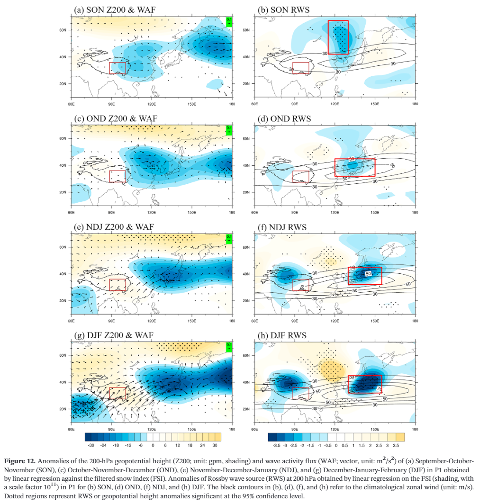
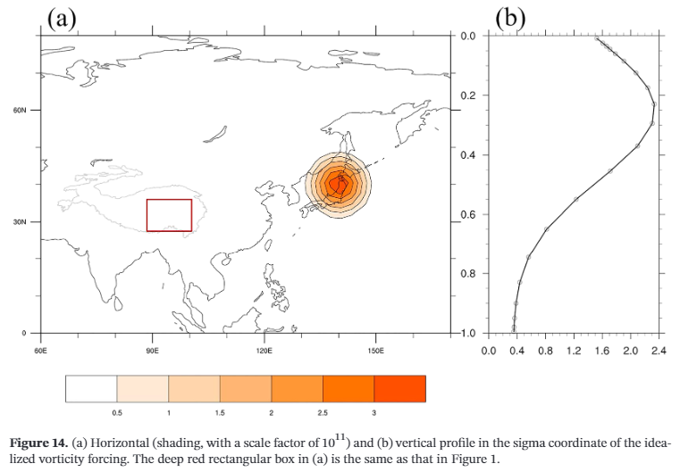
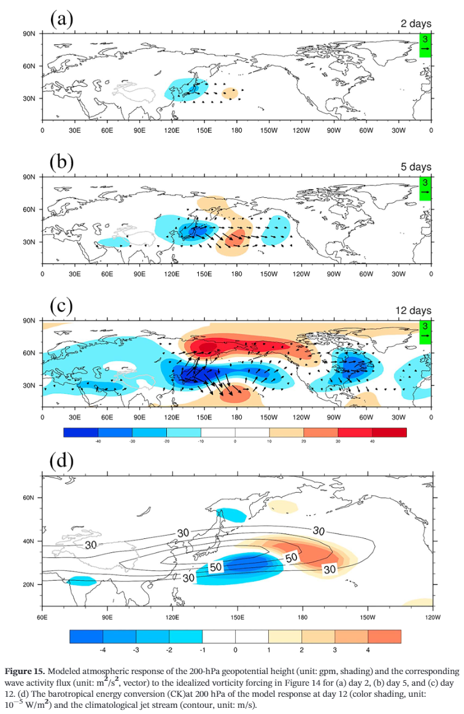

# Rossby Wave Source

Rossby Wave Source (RWS)，罗斯贝波波源，在大气动力学诊断中也是非常有用的一个工具。RWS可以用于判断波列的源汇，为开展理想模式数值试验提供指导。

## 理论

在经典罗斯贝波的理论框架下，非线性的涡度方程可以表述为：
$$
(\dfrac{\partial}{\partial t}+\bold{v}\cdot \nabla)\xi=-\xi D+F\qquad(1)
$$
其中，$\xi$是绝对涡度，$D$是散度，$\bold{v}$是水平风场，$F$是摩擦项。一般情况下，这个方程仅适用于大气高层（例如150hPa，200hPa，250hPa，500hPa），因为这个方程已经通过假设略去了垂直方向的运动。此外，根据Sardeshmukh and Hoskins（1987），从行星尺度上考虑$F$，几乎地球上所有位置$F$都是可忽略的小项。

根据亥姆霍兹速度分解定理将水平风场分解为旋转风和辐散风：
$$
\bold{v}=v_{\psi}+v_{\chi}\qquad(2)
$$

$$
\nabla \cdot v_{\chi}=D\qquad(3)
$$

将2，3代入至1，经过几步变换后，方程1变为：
$$
(\dfrac{\partial}{\partial t}+v_{\psi}\cdot\nabla)\xi=S+F\qquad(4)
$$

$$
S=-v_{\chi}\cdot \nabla \xi-\xi D\qquad(5)
$$

注意，尽管在行星尺度上地球处处$|v_{\chi}|$比$|v_{\psi}|$至少小3倍，但由于$|v_{\chi}|$的平流项量级却与$v_{\psi}$相当，因此方程5右边第一项是不能忽略的（Sardeshmukh and Hoskins, 1988）。

方程5等价为：
$$
S=-\nabla \cdot (v_{\chi}\xi)\qquad(6)
$$
方程6就是一般意义下由于某处散度变化而形成的罗斯贝波波源$S$。

对于固定辐散流（a fixed divergent flow），由于$\xi$随时间变化，$S$仍然可以随时间改变，$S$并不是固定的。这一结论即使对于线性动力系统仍然成立。

因此，对于线性化的动力系统，当大气中存在某种异常辐散$D'$时，引起的罗斯贝波波源异常（$S'$）可以表述为：
$$
S'=-\nabla\cdot(v'_{\chi}\bar{\xi})-\nabla\cdot(\bar{v_{\chi}}\xi')\qquad(7)
$$
方程7中所有带$'$的项都表示异常项，带$\bar{}$的表示基本气流。方程7可以通过线性化方程6或者方程5得到，公式推导非常简单，这里就不详细列出过程了。

## 编程与应用

为了便于理解理论和编程实践，以Qian et al. (2019)的工作为例进行阐述。Qian et al. (2019)工作主要围绕秋季青藏高原积雪。秋季青藏高原积雪异常在大气高层会激发出一个局地低压响应，随后，这个低压响应东移至日本海一带，在东亚急流核区产生涡度扰动。这一扰动以罗斯贝波波列的形式传播至下游北美，从而对北美冬季气温产生影响。

Qian et al. (2019)首先对高原秋季积雪建立积雪指数并标准化，然后把标准化的积雪指数回归到高度场，并计算了wave activity flux和RWS。下图右列即所得的RWS场。由于Qian et al. (2019)关注的是秋季，因此，秋季大气的气候平均定义为基本气流。



用NCL来表达核心代码

```
load "$NCARG_ROOT/lib/ncarg/nclscripts/contrib/calendar_decode2.ncl"
load "$NCARG_ROOT/lib/ncarg/nclscripts/csm/gsn_code.ncl"
load "$NCARG_ROOT/lib/ncarg/nclscripts/csm/gsn_csm.ncl"
load "$NCARG_ROOT/lib/ncarg/nclscripts/csm/contributed.ncl"

; SON
season = "SON"
idx_A = 8
idx_B = 9
idx_C = 10

yearstart = 1979
yearend = 1994
nyear = yearend - yearstart + 1

ttestval = 2.131

mylev = 200

;读取积雪指数
snow = asciiread("../../fig01/before.txt",(/nyear/),"float")

;读取所有u，v
ufile = addfile("../../ncfile/ncep2nc/uwnd.mon.mean.nc","r")
vfile = addfile("../../ncfile/ncep2nc/vwnd.mon.mean.nc","r")

us = short2flt(ufile->uwnd)
vs = short2flt(vfile->vwnd)

lat = ufile->lat
lon = ufile->lon
time = ufile->time
level = ufile->level
year=calendar_decode2(ufile->time,0)
year_idx=ind(year(:,0).ge.(yearstart).and.year(:,0).le.(yearend))
level_wind = ufile->level
lev_wind = ind(level_wind.eq.mylev)

;计算基本气流u，v
u = us(year_idx,lev_wind,:,:)
v = vs(year_idx,lev_wind,:,:)

uA = u(idx_A::12,:,:)
uB = u(idx_B::12,:,:)
uC = u(idx_C::12,:,:)
u_season = (uA + uB + uC) / 3.0 

vA = v(idx_A::12,:,:)
vB = v(idx_B::12,:,:)
vC = v(idx_C::12,:,:)
v_season = (vA + vB+ vC) / 3.0 

;定义圆周率和地球自转常数f
pi = atan(1.0)*4.
f =  2.*2.*pi/(60.*60.*24.)*sin(pi/180. * lat)

;计算相对涡度rv和绝对涡度av
rv = uv2vr_cfd(u_season,v_season,lat,lon,3)
av = rv + conform_dims(dimsizes(rv), f, 1)

;计算积雪异常导致的绝对涡度异常
av_anom = regCoef_n(snow(0:nyear-2), av, 0, 0)

;计算基本气流绝对涡度
av_mean = dim_avg_n_Wrap(av, 0)

;计算基本气流散度，中央差分法
div = uv2dv_cfd(u_season,v_season,lat,lon,3)

;计算辐散风和旋转风
dv = dv2uvF_Wrap(div)
dv_u = dv(0,:,:,:)
dv_v = dv(1,:,:,:)

;计算积雪异常导致的辐散风异常、旋转风异常
dv_u_anom = regCoef_n(snow(0:nyear-2), dv_u, 0, 0)
dv_v_anom = regCoef_n(snow(0:nyear-2), dv_v, 0, 0)

;计算基本气流的辐散风、旋转风
dv_u_mean = dim_avg_n_Wrap(dv_u, 0)
dv_v_mean = dim_avg_n_Wrap(dv_v, 0)

;根据方程7计算积雪异常导致的罗斯贝波波源异常
s = -uv2dv_cfd(dv_u_anom*av_mean,dv_v_anom*av_mean,lat,lon,3)-uv2dv_cfd(dv_u_mean*av_anom,dv_v_mean*av_anom,lat,lon,3)
copy_VarMeta(u(0,:,:), s)
```

通过上面这段代码，就可以计算出青藏高原秋季积雪异常导致的罗斯贝波波源变化。

## 模式模拟

RWS对理想试验具有指导性的意义。仍然以Qian et al. (2019)工作为例。

Qian et al. (2019)发现青藏高原秋季积雪在东亚急流核区附近施加涡度扰动，而这种涡度扰动以罗斯贝波波列的形式向下游传播。东亚急流核区附近罗斯贝波波源有明显的变化。因此，可以利用线性斜压模式进行数值模拟。

模式中涡度扰动设置如下



涡度扰动的位置与前面OND时的RWS的位置相同。线性斜压模式积分12天，罗斯贝波波列完全发展起来后，其结构与观测非常接近。




## 参考文献

Sardeshmukh, Prashant D., and Brian J. Hoskins. "On the derivation of the divergent flow from the rotational flow: The χ problem." *Quarterly Journal of the Royal Meteorological Society* 113.475 (1987): 339-360.

Sardeshmukh, Prashant D., and Brian J. Hoskins. "The generation of global rotational flow by steady idealized tropical divergence." *Journal of the Atmospheric Sciences* 45.7 (1988): 1228-1251.

Qian, QiFeng, XiaoJing Jia, and Renguang Wu. "Changes in the Impact of the Autumn Tibetan Plateau Snow Cover on the Winter Temperature Over North America in the mid‐1990s." *Journal of Geophysical Research: Atmospheres* 124.19 (2019): 10321-10343.