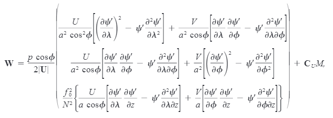

# Wave Activity Flux

Wave Activity Flux (WAF)，波活动通量，是指示波传播方向的重要工具。WAF发展了很多年，最终在2000年，Takaka and Nakamura设计出了一种普适的WAF。本文主要介绍Takaya and Nakamura (2000)工作中设计出的WAF。

## 理论

对于基本气流上的小振幅扰动，WAF服从一个守恒律：
$$
\dfrac{\partial A}{\partial t}+\nabla \cdot F=D
$$
其中，$A$是波活动密度（density of wave activity flux），$F$是它的通量，$D$是源汇项。当基本气流和波都是守恒的时候，$D=0$。

对于Wentzel-Kramers-Brillouin (WKB)意义下缓变的波列,
$$
F=C_g A
$$
$F$可以刻画缓变波列波包的传播。$F$的辐合辐散代表着波的形成和消散。理想状况下，$F$应该与大气波动的位相无关（phase-independent），也应该与基本气流和波的类型（transient/stationary wave）无关。

根据Takaya and Nakamura (2000)，球坐标下，WAF可以表述为：



U、V是风场，a是地球半径，$\phi$是纬度，$\lambda$是经度，$z$是高度，$N^2$是Brunt-Vaisala 频率。

## 编程与应用

WAF计算的核心是根据小扰动$\psi'$计算出需要的其他变量。在一般大气动力或者气候动力的应用中，小扰动$\psi'$可以通过线性回归或者合成分析得到。下面这段代码先计算高度场的扰动，然后通过高度场扰动计算出WAF

```
load "$NCARG_ROOT/lib/ncarg/nclscripts/contrib/calendar_decode2.ncl"
load "$NCARG_ROOT/lib/ncarg/nclscripts/csm/gsn_code.ncl"
load "$NCARG_ROOT/lib/ncarg/nclscripts/csm/gsn_csm.ncl"
load "$NCARG_ROOT/lib/ncarg/nclscripts/csm/contributed.ncl"

; SON
season = "SON"

infile = addfile(season+".nc", "r")
hgt_clim = infile->hgt_clim
hgt_anom = infile->hgt_anom

mylev = infile->mylev

lat = infile->lat
lon = infile->lon

nlat = dimsizes(lat)

tval_hgt = reshape(hgt_anom@tval,(/dimsizes(hgt_anom(:,0)),dimsizes(hgt_anom(0,:))/))
copy_VarMeta(hgt_anom, tval_hgt)

;  Gas constant
gc=290
;  Gravitational acceleration
ga=9.80665

;  Radius of the earth
re=6378388

; pi
pi = atan(1.0)*4.

; Coriolis parameter
f =  2.*2.*pi/(60.*60.*24.)*sin(pi/180. * lat(:))
f!0 = "lat"
f&lat = lat
f@_FillValue = hgt_anom@_FillValue

; missing for 10S - 10N
do ilat = 0, nlat-1
if (abs(lat(ilat) ).lt. 5. ) then
f(ilat)= f@_FillValue
end if
end do

; cosine
coslat = cos(lat(:)*pi/180.)

coslattmp = conform_dims(dimsizes(hgt_anom),coslat,0)
ftmp = conform_dims(dimsizes(hgt_anom),f,0)

bb=z2geouv(hgt_clim, lat, lon, 1)
uwnd_clim = bb(0,:,:)
vwnd_clim = bb(1,:,:)

; magnitude of climatological wind
cumag = sqrt(uwnd_clim^2 + vwnd_clim^2)
cumag@_FillValue = uwnd_clim@_FillValue
cumag = where(cumag .gt. 0, cumag, cumag@_FillValue)

; QG steam function for anomaly
psidev = hgt_anom*ga /ftmp

;dpsidev/dlon
dpsidevdlon =  center_finite_diff_n(psidev,lon*pi/180.,True,0,1)

;ddpsidev/dlonlon
ddpsidevdlonlon =  center_finite_diff_n(dpsidevdlon,lon*pi/180.,True,0,1)

;dpsidev/dlat
dpsidevdlat = center_finite_diff_n(psidev, lat*pi/180., False,0,0)

;ddpsidev/dlonlat
ddpsidevdlonlat =  center_finite_diff_n(dpsidevdlon,lat*pi/180.,False,0,0)

;ddpsidev/dlatdlat
ddpsidevdlatlat = center_finite_diff_n(dpsidevdlat, lat*pi/180.,False,0,0)

xuterm = (dpsidevdlon*dpsidevdlon - psidev*ddpsidevdlonlon)
xvterm = (dpsidevdlon*dpsidevdlat - psidev*ddpsidevdlonlat)
;yuterm = xvterm
yvterm = (dpsidevdlat*dpsidevdlat - psidev*ddpsidevdlatlat)

; Mask out where westerlies is small or negative (less than 5 m/s).
;  by using mask

;x-component of (38)
Fx = mask( mylev/1000./(2.*cumag*re*re)*( uwnd_clim/coslattmp * xuterm + vwnd_clim * xvterm), uwnd_clim.lt.5,False)
;Fx =mylev/1000./(2.*cumag*re*re)*( uwnd_clim/coslattmp * xuterm + vwnd_clim * xvterm)

;y-component 
Fy = mask(mylev/1000./(2.*cumag*re*re)*( uwnd_clim*xvterm + coslattmp*vwnd_clim*yvterm),  uwnd_clim.lt.5,False)
;Fy = mylev/1000./(2.*cumag*re*re)*( uwnd_clim*xvterm + coslattmp*vwnd_clim*yvterm)


fspd = sqrt(Fx*Fx+Fy*Fy)
Fx = mask(Fx, fspd.le.0.035, False)
Fy = mask(Fy, fspd.le.0.035, False)


; for output
Fx!0 = "lat"
Fx&lat = lat
Fx!1 = "lon"
Fx&lon = lon

Fy!0 = "lat"
Fy&lat = lat
Fy!1 = "lon"
Fy&lon = lon

psidev!0 = "lat"
psidev&lat = lat
psidev!1 = "lon"
psidev&lon = lon

Fx@units = "m^2/s^2"
Fx@units = "m^2/s^2"

copy_VarMeta(hgt_anom, Fx)
copy_VarMeta(hgt_anom, Fy)
```

## 参考文献

Takaya, Koutarou, and Hisashi Nakamura. "A formulation of a phase-independent wave-activity flux for stationary and migratory quasigeostrophic eddies on a zonally varying basic flow." *Journal of the Atmospheric Sciences* 58.6 (2001): 608-627.