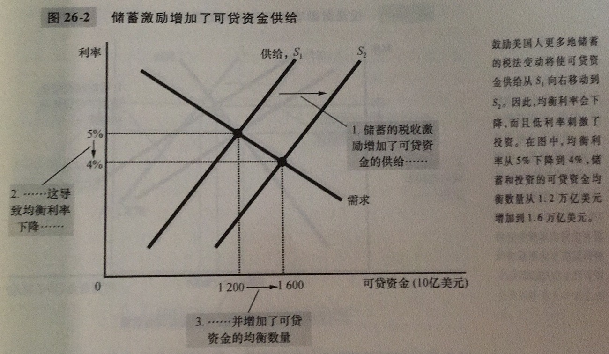
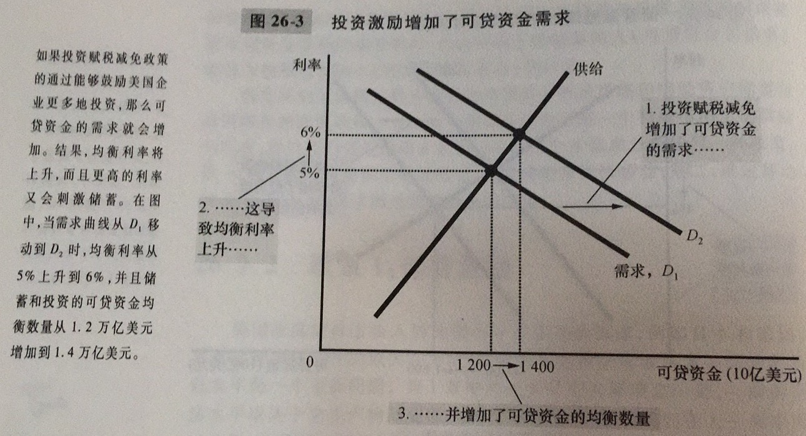
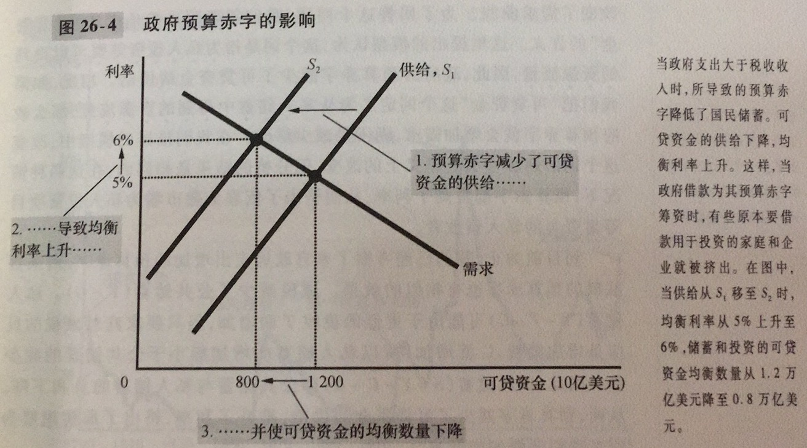

金融体系：经济中促使一个人的储蓄与另一个人的投资相匹配的一组机构

金融市场：储蓄者可以借以直接向贷款者提供资金的金融机构

债券：一种债务证明书

股票：企业部分所有权的索取权

金融中介机构：储蓄者可以借以间接地向借款者提供资金的金融机构

共同基金：向公众出售股份，并用收入来购买股票与债券资产组合的机构

国民储蓄：在用于消费和政府购买后剩下的一个经济中的总收入。国民储蓄=私人储蓄+公共储蓄

私人储蓄：家庭在支付了税收和消费之后剩下来的收入

公共储蓄：政府在支付其支出后剩下的税收收入

预算盈余：税收收入大于政府支出的余额

预算赤字：政府支出引起的税收收入短缺

可贷资金市场：想储蓄的人借以提供资金、想借钱投资的人借以借贷资金的市场。储蓄是可贷资金供给的来源，投资是可贷资金需求的来源

在投资和储蓄方面，有这样几种政策可以影响：

1. 储蓄激励

如果税法改革鼓励更多储蓄，则利率下降且投资增加

2. 投资激励

3. 政府预算赤字与盈余

挤出：政府借款所引起的投资减少

当政府通过预算赤字减少了国民储蓄时，利率就会上升且投资减少

金融危机的几个表现：

1. 一些资产的价格大幅度下降
2. 金融机构的破产
3. 金融机构的信心下降
4. 信贷不足
5. 经济下滑
6. 恶性循环