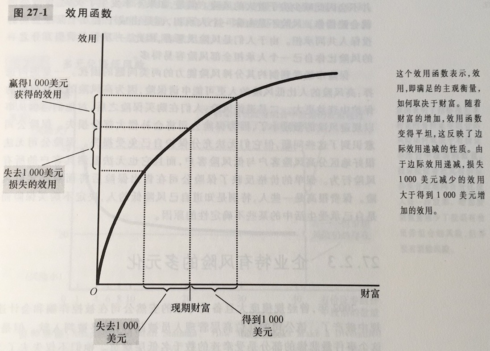

金融学：研究人们如何在某一时期内做出关于配置资源和应对风险的决策的学科

现值：用现行利率产生一定量未来货币所需要的现在货币量

终值：在现行利率既定时，现在货币量将带来的未来货币量

复利：货币量的累积，比如说银行账户上货币量的累积，即赚得的利息仍留在账户上以赚取未来更多的利息

风险厌恶：不喜欢不确定性

多元化：通过用大量不相关的小风险代替一种风险来降低风险

企业特有风险：只影响一家公司的风险

市场风险：影响股市上所有公司的风险

基本面分析：为决定一家公司的价值而对其会计报表和未来前景进行的研究

有效市场假说：认为资产价格反映了关于一种资产价值的所有公开的、可获得的信息的理论

信息有效：以理性方式反映所有可获得的信息的有关资产价格的描述

随机游走：一种不可预期的变量变动的路径

由于边际效用递减，大部分人是风险厌恶的。他们可以通过购买保险，使其持有财产多元化，以及选择低风险和低收益的有价证券组合来降低风险。

一种资产的价格等于所有者将得到的现金流的现值。对一股股票而言，这些现金流包括红利流量以及最终出售价格。根据有效市场假说，金融市场理性地处理可获得的信息，因此股票价格总是等于企业价值的最好估算。当然，也有一部分经济学家认为心理因素也会影响资产价格