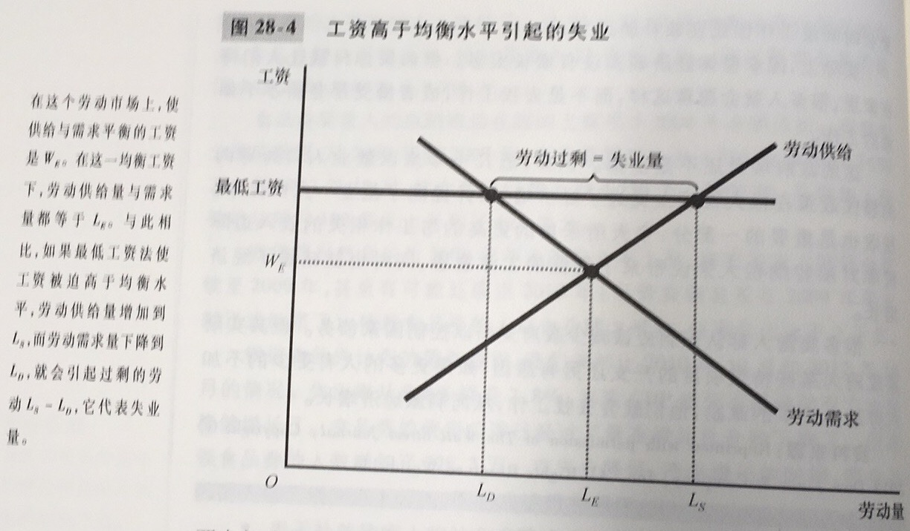

劳动力：既包括就业者又包括失业者的工人总数

失业率：劳动力中失业者所占的百分比

劳动力参工率：劳动力占成年人口的百分比

自然失业率：失业率围绕它而波动的正常失业率

周期性失业：失业率对自然失业率的背离

对于失业，要谨慎处理，研究表明，大多数失业是短期的，但是任何一个既定时间段内观察到的大多数失业又是长期的

摩擦性失业：由于工人寻找最适合自己嗜好和技能的工作需要时间而引起的失业

结构性失业：由于某些劳动力市场上可提供的工作岗位数量不足以为每个想工作的人提供工作而引起的失业

失业保险：当工人失业时为他们提供部分收入保障的政府计划

如果工资由于任何一种原因高于均衡水平，就会导致失业

工会：与雇主就工资、津贴和工作条件进行谈判的工人协会

这里需要指出，工会是一种卡特尔。所有卖者团结在一起以期望发挥其共同市场势力的一个集团。

集体谈判：工会和企业就就业条件达成一致的过程

罢工：工会组织工人从企业撤出劳动

效率工资：企业为了提高工人生产率而支付的高于均衡水平的工资。效率工资理论包含一些观点，比如工人健康、工人流动率、工人素质、工人努力程度等

