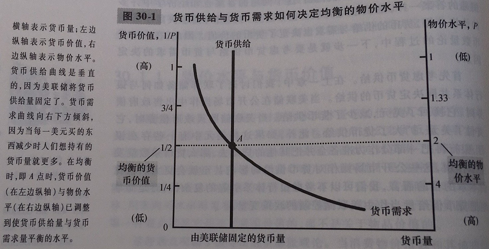
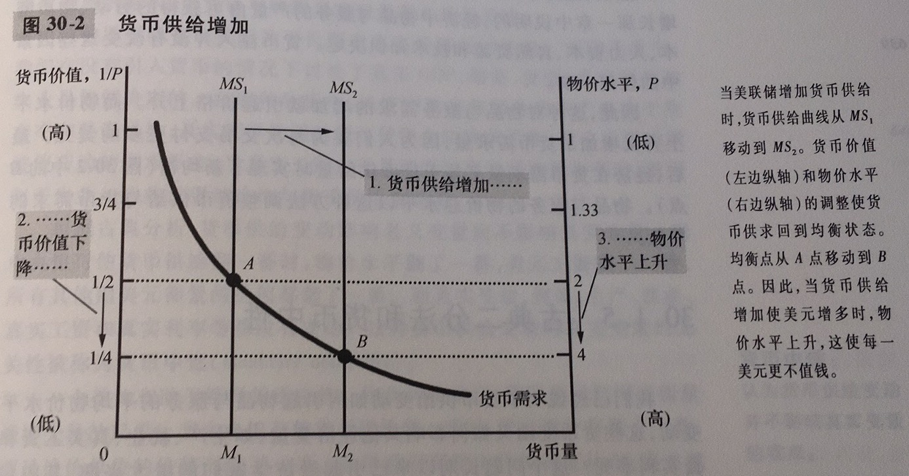

货币的价值也是由货币的供给和需求决定的。货币的供给是由美联储和银行体系决定的。货币需求反应了人们想以流动性形式持有的财富量。诸多变量中，最能影响货币需求的一项是经济中的平均物价水平。价格越高，正常交易所需要的货币就越多，即：物价水平上升（货币价值下降）增加了货币需求量。长期中，物价总水平会调整到使货币需求等于货币供给的水平

货币数量论：一种认为可得到的货币量决定物价水平，可得到的货币增长率决定通货膨胀率的理论

货币注入之前，经济是均衡的，但注入货币后，现行的物价水平下，货币供给量超过了货币需求量。人们会花掉这些货币来购买服务和产品，但由于生产是由劳动、物质资本、人力资本、自然资源和技术知识决定的，所以注入货币并不会改变其中任何一项。所以，物价就上升了，物价上升引起货币的需求量增加，从而实现了新的均衡

名义变量：按货币单位衡量的变量

真实变量：按实物单位衡量的变量

货币中性：认为货币供给变动并不影响真实变量的观点

货币流通速度：货币易手的速度，货币流通速度=物价水平（GDP平减指数）\*产量（真实GDP）/货币量

数量方程式：货币数量\*货币流通速度=产品价格\*产量

数量方程式表明，货币量的增加必然反映在其他三个变量中的一个上

M1反映着经济中的现实购买力；M2同时反映现实和潜在购买力。若M1增速较快，则消费和终端市场活跃；若M2增速较快，则投资和中间市场活跃。中央银行和各商业银行可以据此判定货币政策。M1过高M2过低，表明需求强劲、投资不足，存在通货膨胀风险；M2过高而M1过低，表明投资过热、需求不旺，存在资产泡沫风险。

通货膨胀税：政府通过创造货币而筹集的收入。通货膨胀税是一种向每个持有货币的人征收的税

国家需要钱时，一种简单粗暴的方式就是多印钱，这样就变相从持币者手中夺取了财富

费雪效应：名义利率对通货膨胀率进行的一对一的调整。具体而言，高货币增长率长期结果就是高通货膨胀率和高名义利率。费雪效应在长期中是正确的

要注意的是，通货膨胀并没有降低人们的实际购买力，真实收入是由真实变量决定的，如物质资本、人力资本、自然资源等等

皮鞋成本：当通货膨胀鼓励人们减少货币持有量时所浪费的资源

菜单成本：改变价格的成本

未预期到的通货膨胀会以一种既与价值无关，又与需要无关的方式重新分配财富。通货膨胀固然不好，但通货紧缩可能更坏，通货紧缩往往是更深层经济问题的症状

通货膨胀的主因是货币量的增加，因此，中央银行需要对货币量进行严格的控制。超速通货膨胀对经济的危害是巨大的，但温和通货膨胀，每年物价上升小于10%，由皮鞋成本、菜单成本、相对价格变动的加剧等等成本的大小目前仍然是不确定的

