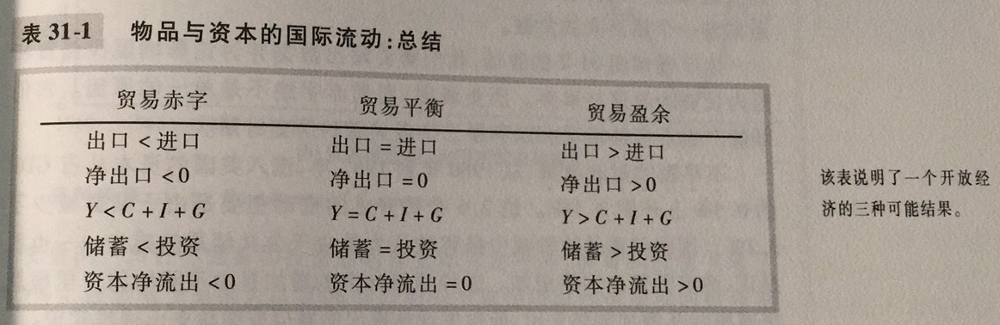
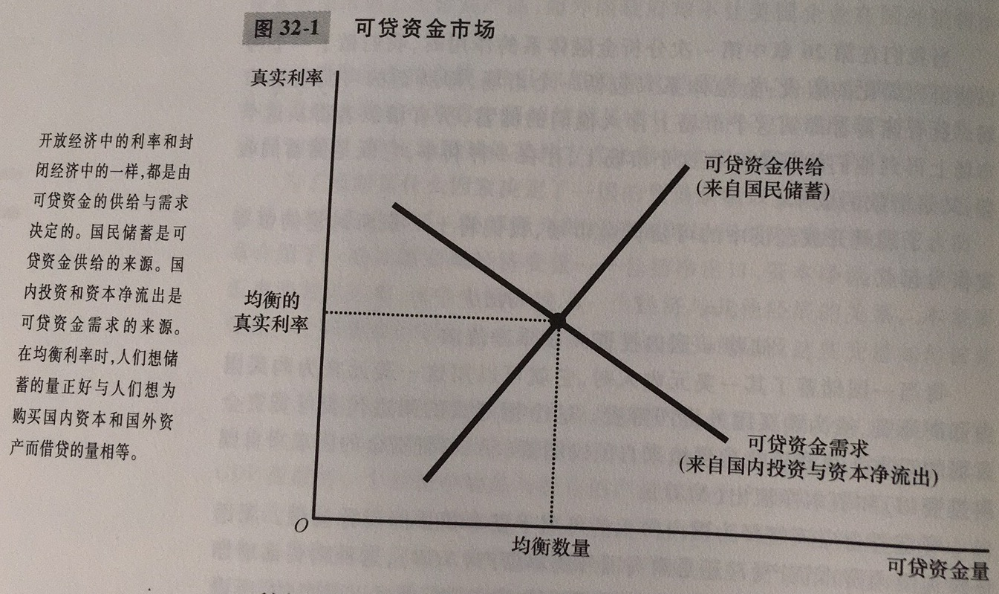
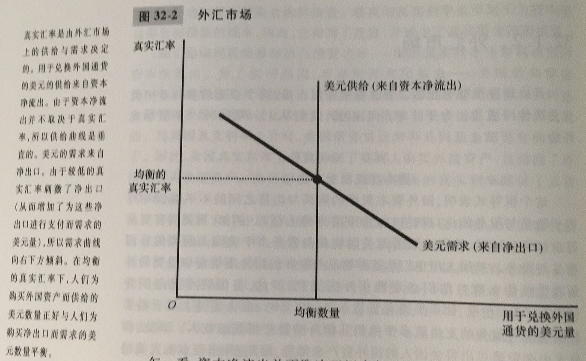
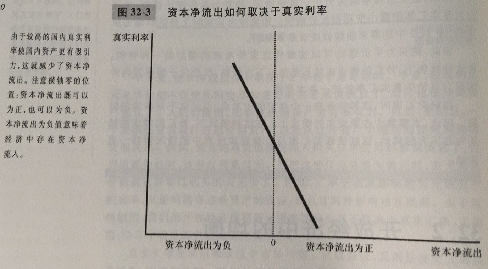
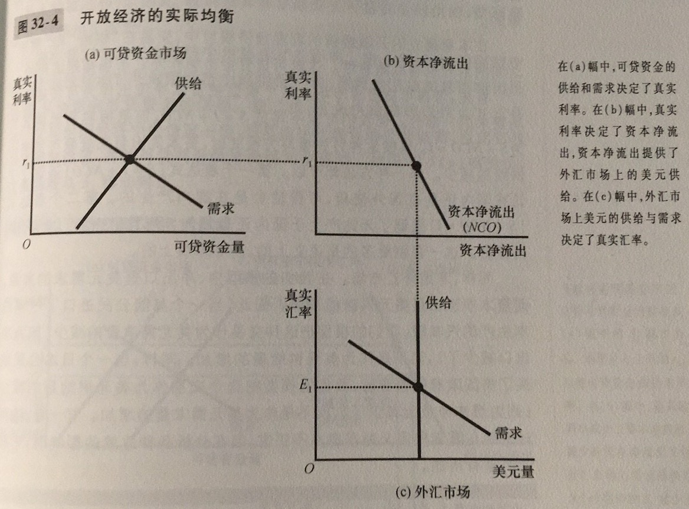
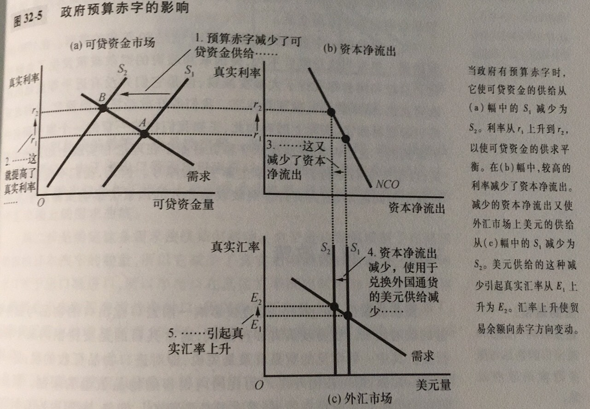
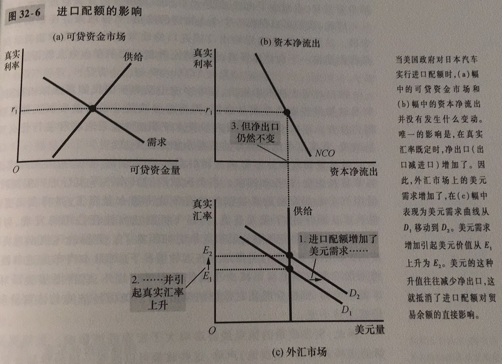
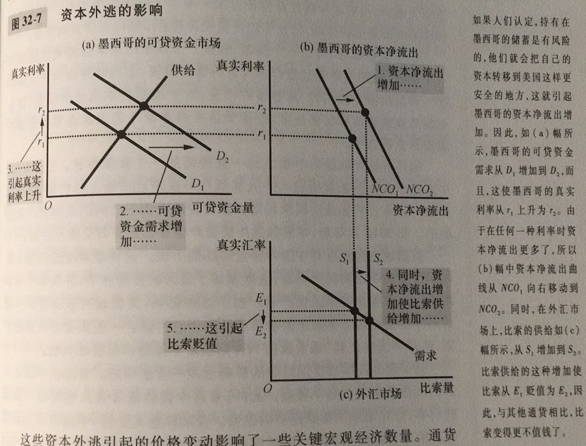

封闭经济：不与世界上其他经济相互交易的经济

开放经济：与世界上其他经济自由交易的经济

出口：在国内生产而在国外销售的物品与服务

进口：在国外生产而在国内销售的物品与服务

净出口：一国的出口值减进口值，又称贸易余额

贸易余额：一国的出口值减进口值，又称净出口

贸易盈余：出口大于进口的部分

贸易赤字：进口大于出口的部分

贸易平衡：出口等于进口的状况

资本净流出：本国居民购买的外国资产减外国人购买的本国资产

这里有一个等式：资本净流出和净出口相等。

名义汇率：一个人可以用一国通货交换另一国通货的比率。名义汇率等于外国物价水平与国内物价水平的比率。

升值：按所能购买到的外国通货量衡量的一国通货的价值增加

贬值：按所能购买到的外国通货量衡量的一国通货的价值减少

真实汇率：一个人可以用一国的物品与服务交换另一国的物品与服务的比率

购买力平价：一种认为任何一单位通货应该能在所有国家买到灯亮物品的汇率理论。这种理论存在这样几个问题：1.许多物品是不容易进行贸易的；2.即使是可贸易物品，当他们在不同国家生产时，也并不总能完全替代

可贷资金市场：储蓄=可贷资金=国内投资+资本净流出

外汇市场：资本净流出=净出口

真实利率和真实汇率共同调整使几个市场的供求达到平衡

在一个开放经济中，政府预算赤字提高了真实利率，挤出了国内投资，引起货币升值，并使得贸易余额向赤字方向变动

贸易政策：直接影响一国进口或出口的物品与服务数量的政府政策

要注意的是贸易政策并不能影响贸易余额，因为：净出口等于资本净流出，资本净流出又等于国民储蓄减去国内投资，贸易政策并没有改变贸易余额，因为这些政策无法改变国民储蓄和国内投资。贸易政策的微观经济影响大于宏观经济

资本外逃：一国资产需求大量且突然地减少

