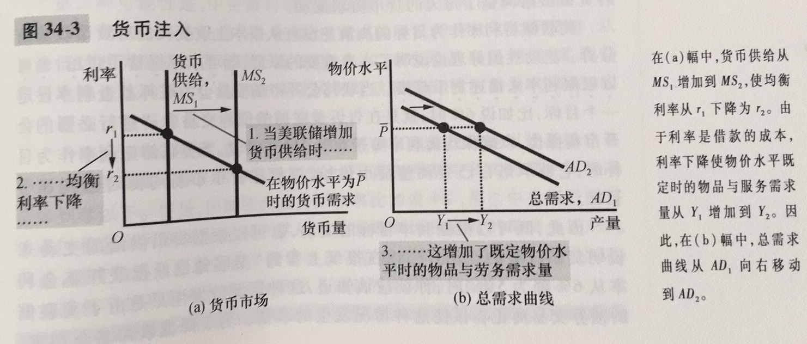
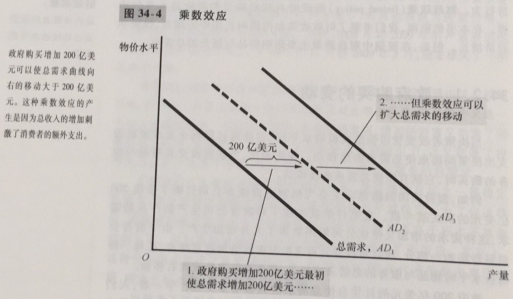

衰退：真实收入下降和失业增加的时期

萧条：严重的衰退

经济波动的三个事实：1.经济波动是无规律的且不可预测的；2.大多数宏观经济变量同时波动；3.随着产量减少，失业增加

总需求与总供给模型：大多数经济学家用来解释经济活动围绕其长期趋势的短期波动的模型

总需求曲线：表示在每一种物价水平时，家庭、企业、政府和外国客户想要购买的物品与服务数量的曲线

总供给曲线：表示在每一种物价水平时，企业选择生产并销售的物品与服务数量的曲线

总需求向右下方倾斜的几个原因：

1. 物价水平与消费，财富效应：物价水平的下降提高了货币的真实价值，并使得消费者更富有，从而消费增加，物品与服务的需求量增加（消费者富有，刺激了消费）
2. 物价水平与投资，利率效应：物价水平下降降低了利率，鼓励更多地用于投资品的指出，总而增加了物品与服务的需求（利率下降，刺激投资品需求）
3. 物价水平与净出口：汇率效应：物价下降引起利率下降，货币在外汇市场上的真实价值下降了，这种贬值刺激了出口，增加了物品与服务的需求量（通货贬值，刺激了净出口）

总需求曲线移动的原因：

1. 消费变动引起的移动
2. 投资变动引起的移动
3. 政府购买变动引起的移动
4. 净出口变动引起的移动

在长期中，总供给曲线是垂直的，而短期中，总供给曲线向右上方倾斜

在长期中，一个经济的物品与服务生产（真实GDP）取决于它的劳动、资本和自然资源的供给，以及可得到的用于把这些生产要素变为物品与服务的技术

长期总供给曲线移动的原因：

1. 劳动变动引起的移动
2. 资本变动引起的移动
3. 自然资源变动引起的移动
4. 技术知识变动引起的移动

长期生产水平有时称为潜在产量或者充分就业产量。

自然产出水平：一个经济在长期中当失业处于其正常率时达到的物品与服务的生产水平

应该把产量与物价水平的短期波动视为对持续的产量增长和通货膨胀长期趋势的背离

短期总供给曲线向右上方倾斜的理论有：

1. 黏性工资理论：短期总供给曲线向右上方倾斜是因为名义工资对经济状况变动的调整缓慢（强调工资随着时间推移调整缓慢）；
2. 黏性价格理论：一些物品与服务的价格对经济状况变动使缓慢的；
3. 错觉理论：物价总水平的变动会暂时误导供给者对自己出售产品的个别市场发生的事情的看法，由于这些短期的错觉，供给者对物价水平的变动做出了反应，并且这种反应引起曲线向右上方倾斜

这三个理论表明，当实际物价水平背离人们预期的物价水平时，短期产量就背离自然产出水平

产量的供给量=自然产出水平+a（实际物价水平-预期的物价水平）

a决定产量对未预期到的物价水平变动做出多大反应的数字

短期总供给曲线的移动原因：预期物价水平上升减少了物品与服务的供给量，并使短期总供给曲线向左移动；预期物价水平下降增加了物品与服务的供给量，并使短期总供给曲线向右移动

经济波动的两个原因：

1. 总需求移动的影响
2. 总供给移动的影响

对于总需求有这几个结论：

1. 短期中，总需求移动引起经济中物品与服务产量的波动；
2. 长期中，总需求移动影响物价总水平，但不影响产量；
3. 影响总需求的决策者可以潜在地减缓经济波动的严重性；

滞胀：产量减少而物价上升的时期

总供给移动会引起滞胀——衰退（产量减少）与通货膨胀（物价上升）结合

那些能影响总需求的决策者可以潜在地减缓对产量的不利影响，但是只能以加剧通货膨胀问题为代价

流动性偏好理论：凯恩斯的理论，认为利率的调整使货币供给与货币需求平衡

货币政策影响总需求： 

货币供给增加时，利率降低，增加了既定物价水平时的物品与服务需求量，总需求曲线向右移动。

旨在扩大总需求的货币政策变动既可以被描述为货币供给增加，也可以被描述为利率降低；旨在紧缩总需求的货币政策变动可以被描述为货币供给减少，又可以被描述为利率提高

财政政策：政府决策者对政府支出和税收水平的确定

财政政策对总需求的影响：

乘数效应：当扩张性财政政策增加了收入，从而增加了消费支出时引起的总需求的额外变动

挤出效应：当扩张性财政政策引起利率上升，从而减少了投资支出时所引起的总需求减少

当政府增加X元购买时，物品与服务的总需求增加可以大于也可以小于X元，取决于乘数效应和挤出效应的相对大小

除了乘数效应和挤出效应，另一种财政政策是税收水平。

自动稳定器：当经济进入衰退时，决策者不必采取任何有意的行动就可以刺激总需求的财政政策变动

