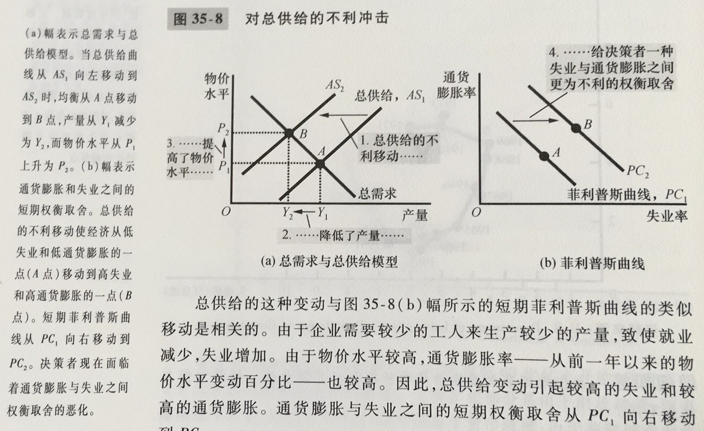

菲利普斯曲线：一条表示通货膨胀与失业之间短期权衡取舍的曲线

菲利普斯曲线表明，短期中出现的通货膨胀与失业的组合是由于总需求曲线的移动使经济沿着短期总供给曲线变动

但是短期中并不存在稳定的菲尔普斯曲线

自然率假说：认为无论通货膨胀率如何，失业最终都要回到其正常率或自然率的观点

供给冲击：直接改变企业的成本和价格，使经济中的总供给曲线移动，进而使菲利普斯曲线移动的事件

牺牲率：在通货膨胀减少一个百分点的过程中每年产量损失的百分点数

