# 需求

市场：由某种物品或服务的买者与卖者组成的一个群体

竞争市场：有许多买者与卖者，以至于每个人对市场价格的影响都微乎其微的市场

完全竞争的市场需要满足：1. 可供销售的物品是完全相同的；2. 买者和卖者的人数众多，以至于没有任何一个买者或卖者可以影响市场价格

垄断者：一些市场只有一个卖者，而且这个卖者决定价格

需求量：买者愿意并且能够购买的一种物品的数量

需求定理：认为在其他条件不变时，一种物品的价格上升，对该物品的需求量减少的观点

市场需求：市场需求是所有个人对某种特定物品或服务的需求的总和

需求曲线的斜率告诉我们，购买量会对价格变动作出多大的反应。斜率小，需求曲线较为平坦，则说明价格变动时，购买量会有大幅度调整；反之，调整则较小。

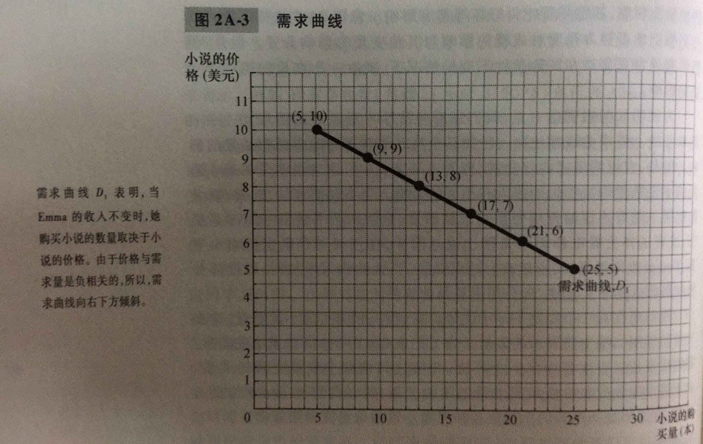

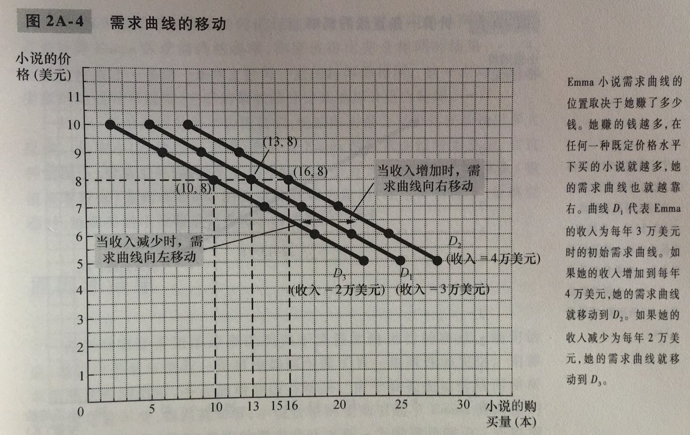

需求曲线的移动：某种因素改变了任何一种既定价格水平下的需求量，需求曲线就会移动。向右移动，称为需求增加，向左移动，称为需求减少

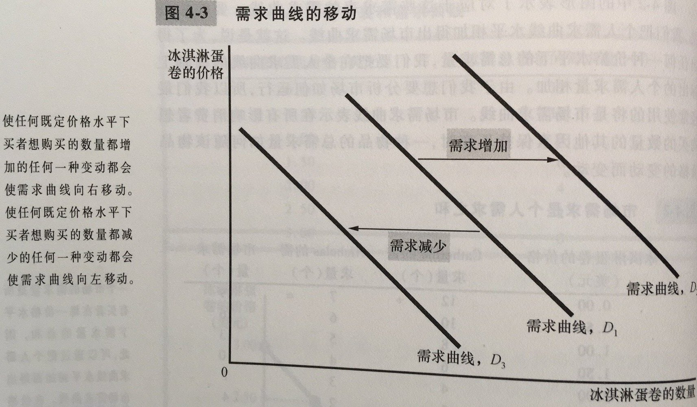

正常物品：在其他条件相同时，收入增加引起需求量增加的物品

低档物品：在其他条件相同时，收入增加引起需求量减少的物品

替代品：一种物品价格上升引起另一种物品的需求量的增加的两种物品

互补品：一种物品价格上升会引起另一种物品需求量减少的两种物品

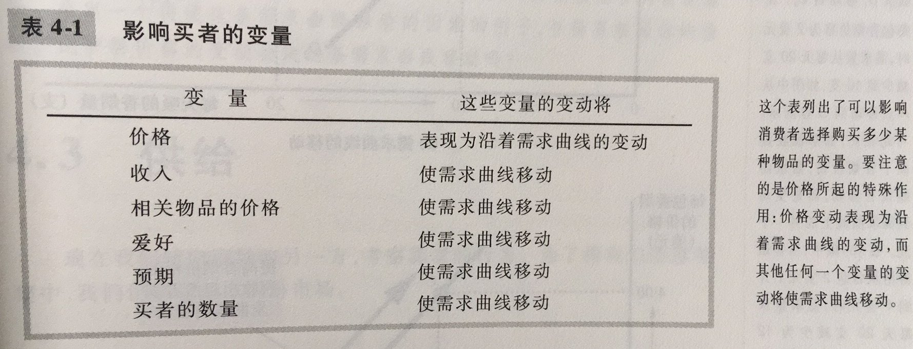

# 供给

供给量：卖者愿意并且能够出售的一种物品的数量

供给定理：在其他条件不变的前提下，一种物品的价格上升，该物品的供给量增加的观点

市场供给：所有卖者供给的总和

供给曲线的移动：右移，供给增加，左移，供给减少

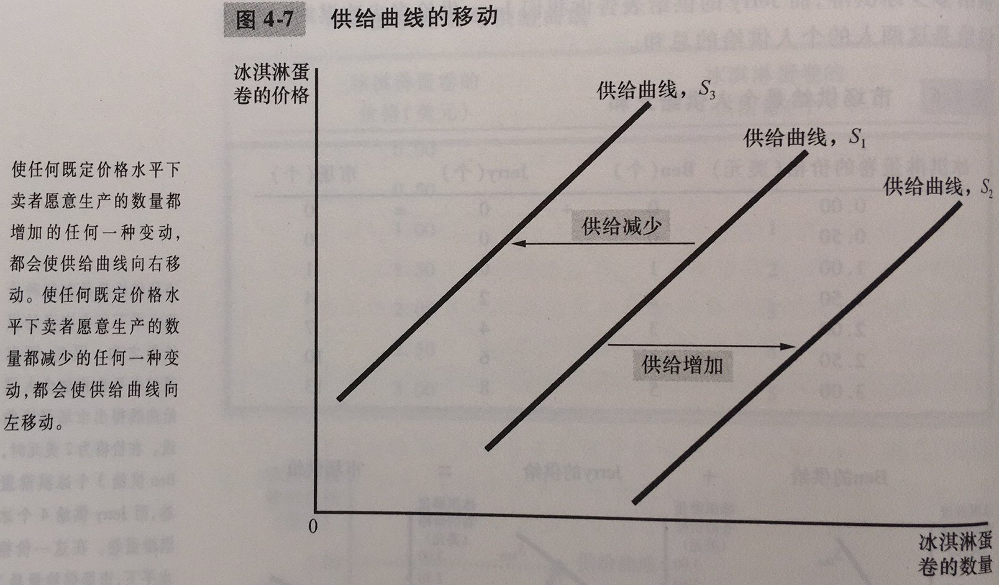

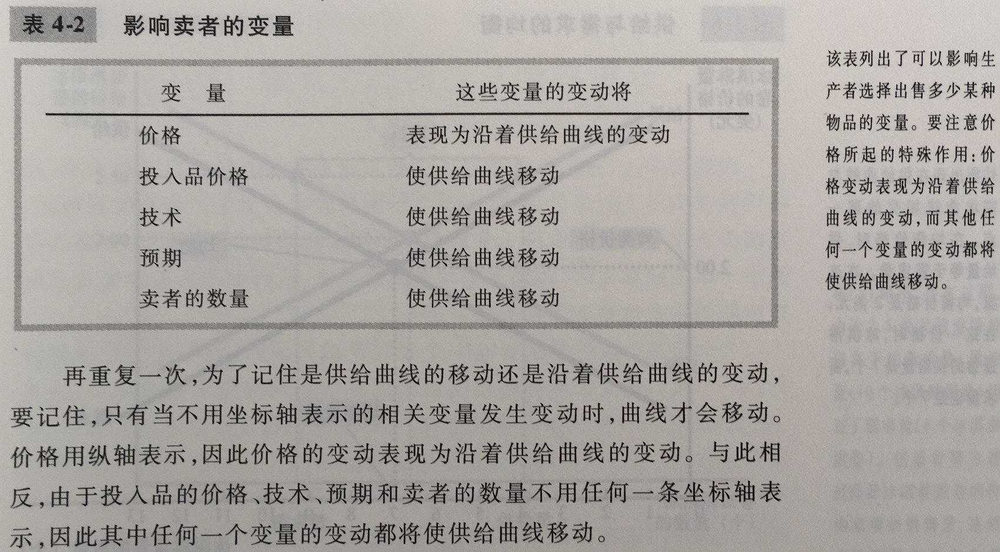

均衡：市场价格达到使得供给量和需求量相等的水平时的状态

均衡价格：使供给和需求平衡的价格，有时也称为市场出清价格

均衡数量：均衡价格下的供给量和需求量

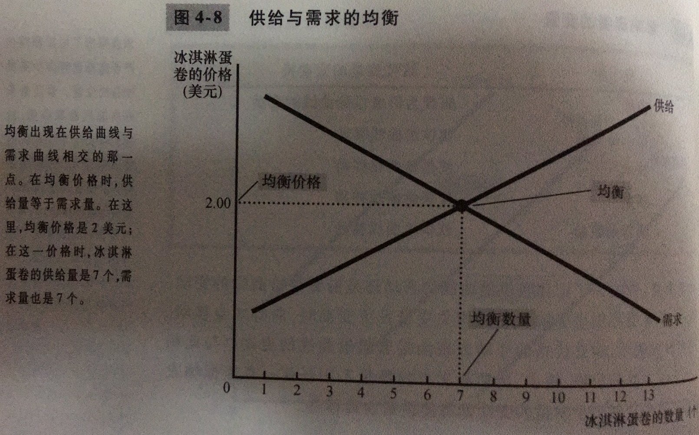

过剩：供给量大于需求量的状态

短缺：需求量大于供给量的状态

供求定理：认为任何一种物品价格都会自发调整，使该物品的供给与需求达到平衡的观点

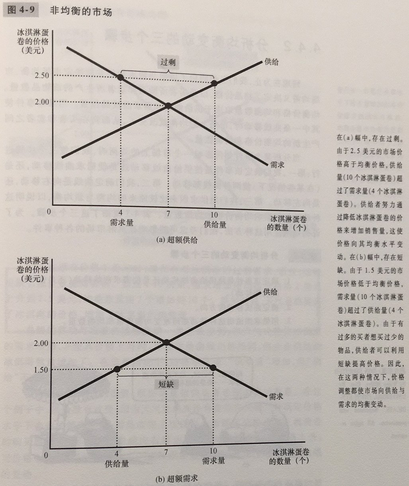

注意：供给指的是供给曲线的位置，供给量指的是供给者希望出售的数量

**供给曲线的移动称为供给变动，需求曲线的移动称为需求变动，沿着某固定的供给曲线的变动被称为供给量的变动，沿着某固定的需求曲线的变动被称为需求量的变动**

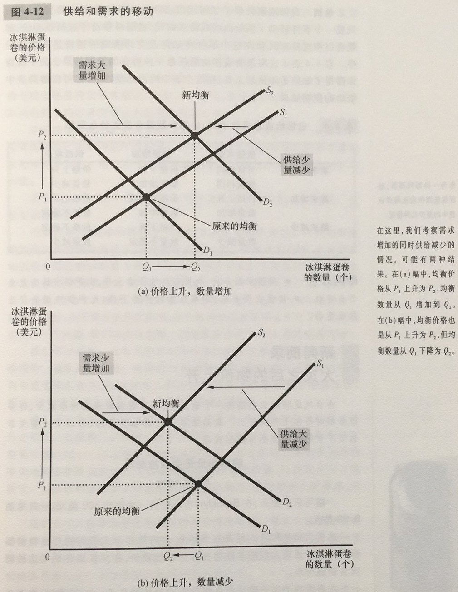

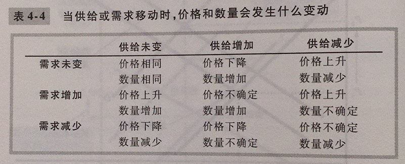

# 弹性

弹性：衡量需求量或者供给量对其某种决定因素的变动的反应程度的指标

需求价格弹性：衡量一种物品需求量对其价格变动反应程度的指标，用*需求量变动百分比除以价格变动百分比来计算*

中点法：中点法与普通方法的差别是，中点法用变动量除以原先水平与最后水平的中点值来计算变动百分比
$$
需求价格弹性：\dfrac{(Q_1-Q_2)/[(Q_1+Q_2)/2]}{(P_1-P_2)/[(P_1+P_2)/2]}
$$
需求曲线的分类：当弹性大于1时，需求是富有弹性的；弹性小于1时，需求是缺乏弹性的；当弹性等于1时，我们说需求是具有单位弹性的

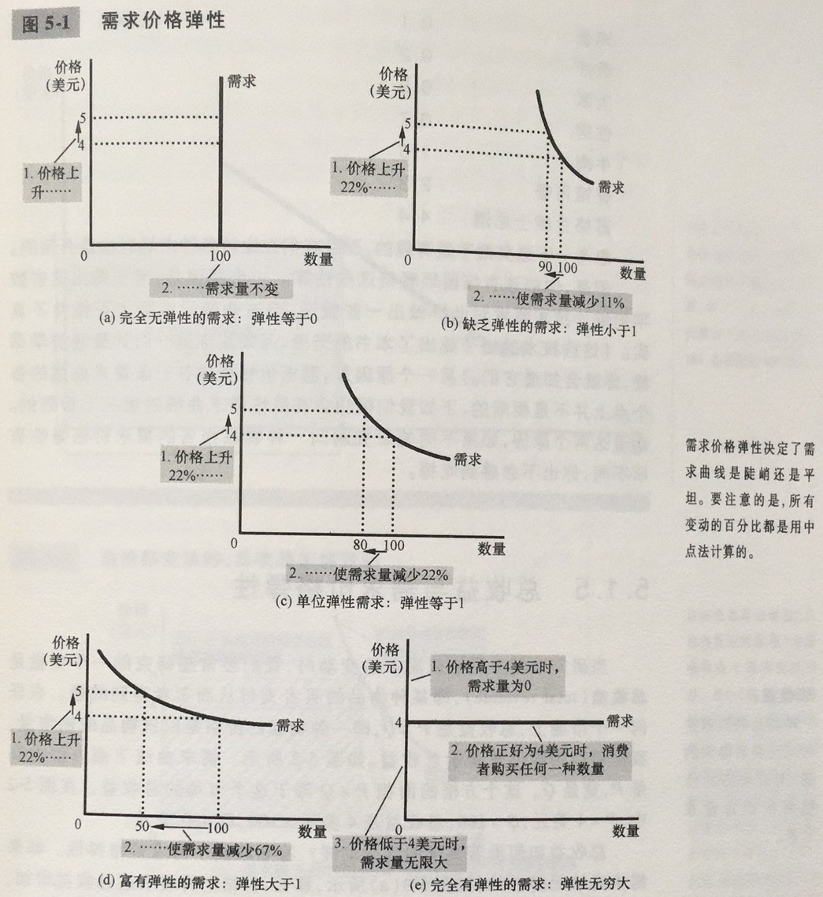

在价格低而数量高的点上，需求曲线是缺乏弹性的；在价格高而数量低的点上，需求曲线是富有弹性的

总收益：一种物品的买者支付从而卖者得到的量，用该物品的价格乘以销售量来计算

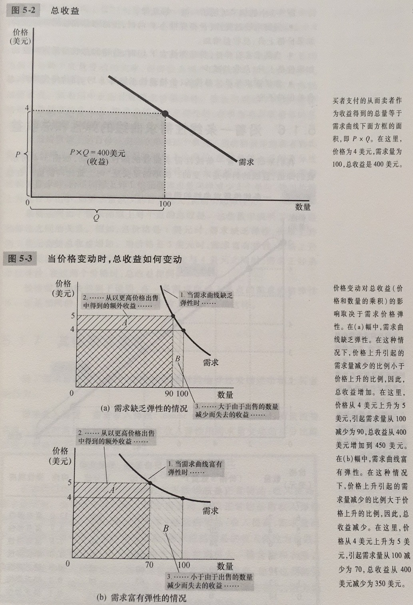

需求收入弹性：衡量一种物品需求量对消费者收入变动反应程度的指标，用需求量变动百分比除以收入变动百分比来计算

需求交叉价格弹性：衡量一种物品需求量对另一种物品价格变动的反应程度的指标，用第一种物品需求量变动百分比除以第二种物品价格变动百分比来计算

供给价格弹性：衡量一种物品供给量对其价格变动反应程度的指标，用供给量变动百分比除以价格变动百分比来计算

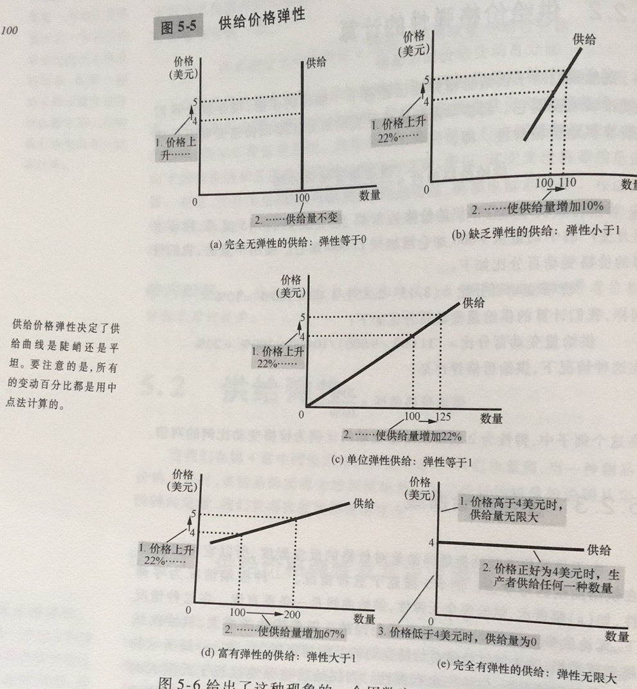

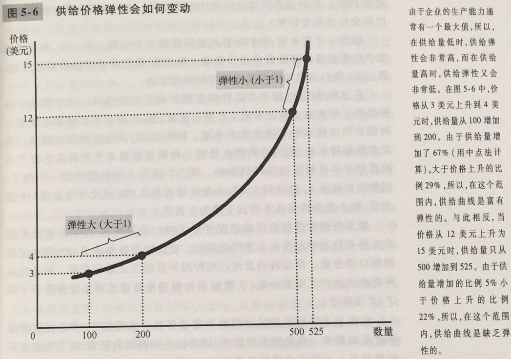

# 供给、需求与政府政策

价格上限：出售一种物品的法定最高价格

价格下限：出售一种物品的法定最低价格

当政府对竞争和市场实行限制性价格上限，同时价格上限低于均衡价格时，就产生了物品的短缺，而且，卖者必须在大量潜在买者中配给稀缺物品。反之，设定价格下限，则会引起过剩

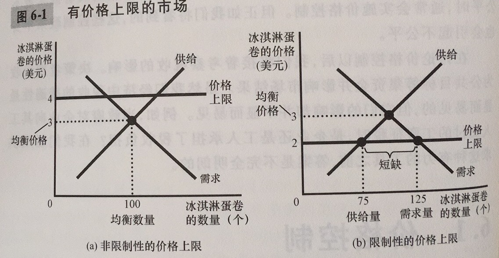

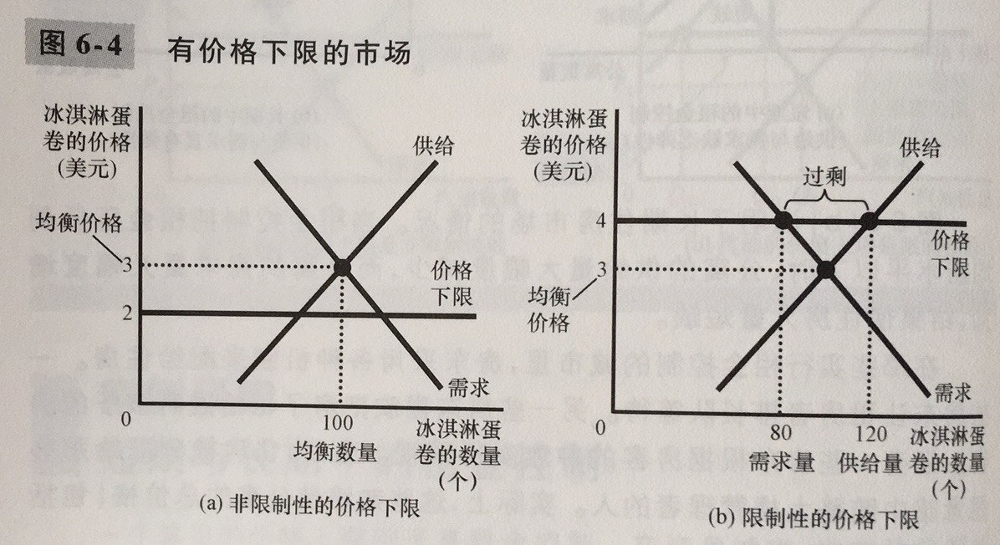

# 税收归宿

税收归宿：税收负担在市场参与者之间进行分配的方式

税收抑制了市场活动，当对一种物品征税时，该物品在*新均衡时的销售量减少了*。买者与卖者分摊了税收负担，在新均衡时，买者为该物品支付的更多了，而卖者得到的更少了

对买者征税和对卖者征税基本结果是相同的，唯一区别在于谁交钱给政府

对一种物品的征税是在买者支付的价格和卖者得到的价格之间打入的一个楔子，当市场向新均衡变动时，买者为该物品支付的价格高了，卖者从该物品得到的价格低了。从这种意义上说，买者和卖者分摊了税收负担。税收归宿并不取决于向买者征税还是卖者征税。

税收归宿取决于供给和需求的价格弹性。税收负担更多地落在缺乏弹性的市场一方，因为这一方很难通过改变购买量或销售量来对税收做出反应。

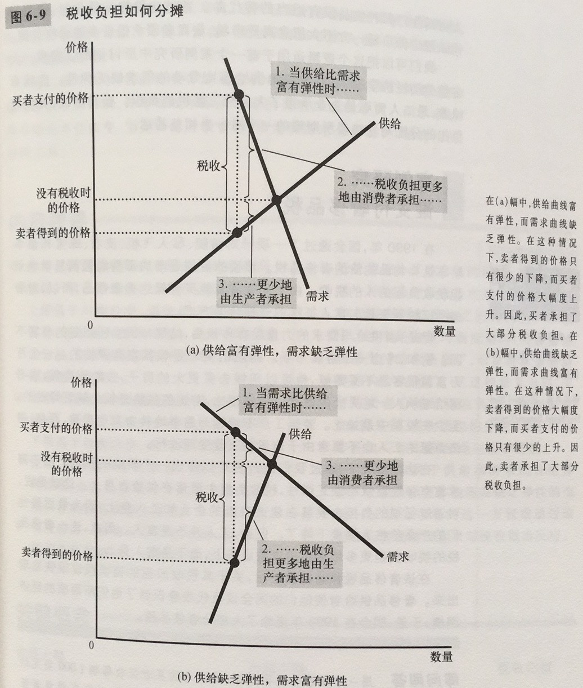

税收负担更多地落在缺乏弹性的市场一方身上。