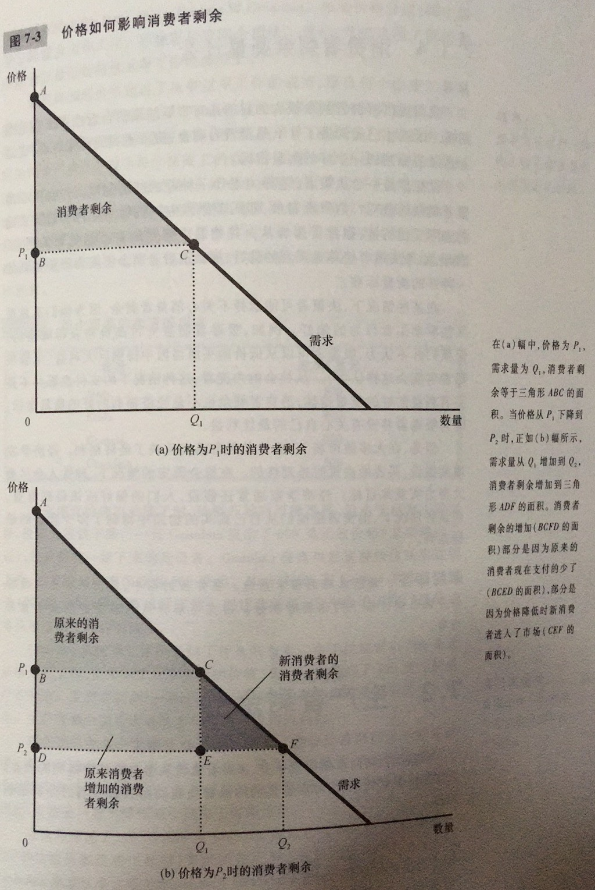
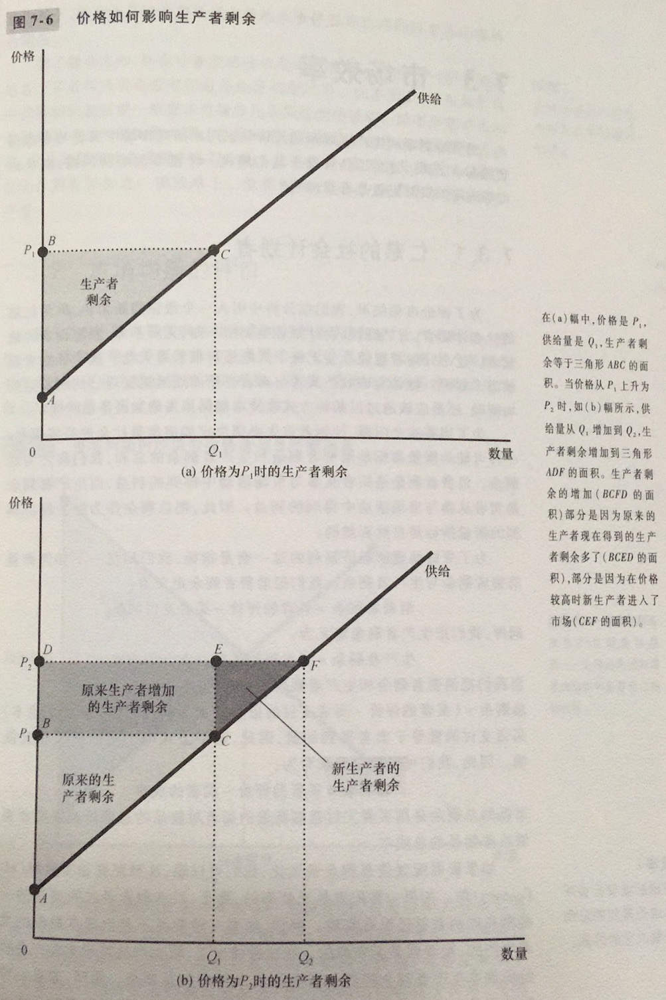
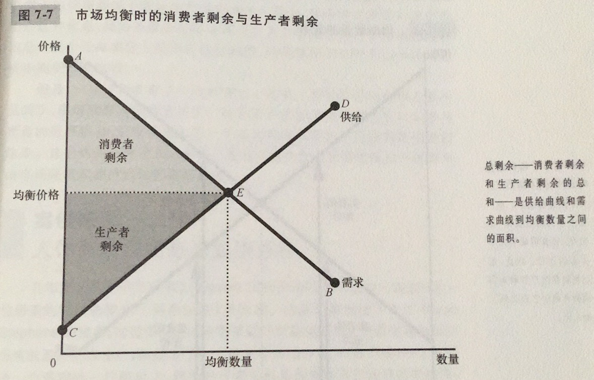
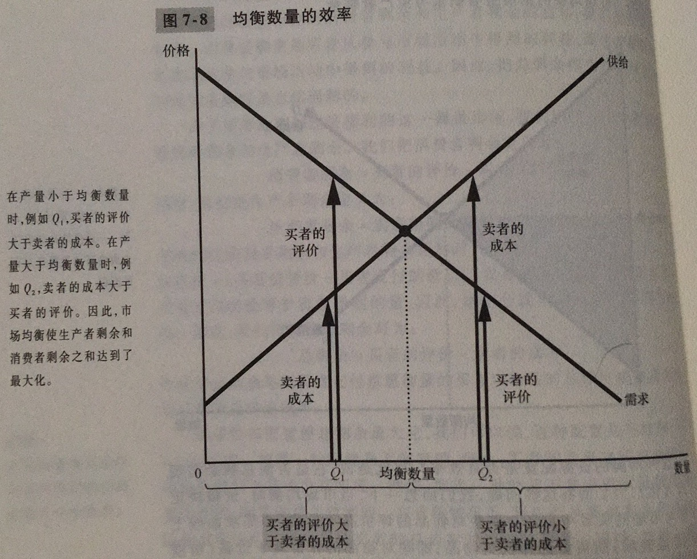

# 消费者剩余

支付意愿：买者愿意为某种物品支付的最高量

消费者剩余：买者愿意为一种物品支付的量减去其为此实际支付的量。消费者剩余衡量买者从参与市场中得到的利益

需求曲线以下和价格以上的面积衡量一个市场上的消费者剩余。这之所以正确，是因为需求曲线的高度衡量买者对物品的评价，即买者对此物品的支付意愿，这种支付意愿与市场价格之间的差额是每个买者的消费者剩余

# 生产者剩余

成本：卖者为了生产一种物品而必须放弃的所有东西的价值

生产者剩余：卖者出售的一种物品得到的量减去其生产成本。生产者剩余衡量卖者从参与市场中得到的利益

# 市场效率

效率：资源配置使社会所有成员得到的总剩余最大化的性质

总剩余：消费者剩余与生产者剩余的总和。实际上就是用买者支付意愿衡量的买者对物品的总评价减去卖者提供这些物品的总成本

平等：在社会成员中平均地分配经济成果的性质

自由市场把物品的供给分配给对这些物品评价最高的买者，这种评价用买者的支付意愿来衡量

自由市场把物品的需求分配给能够以最低成本生产这些物品的卖者

自由市场生产出使消费者剩余和生产者剩余的总和最大化的物品量

前面所有的分析都有两个潜在的假设：

1. 市场是完全竞争的
2. 市场结果只影响参与市场的买者和卖者

当这两个假设不成立时，往往会出现市场失灵。对于假设1，在一些市场上，某个单个或者小群买者或卖者可以控制市场价格，这种影响价格的能力被称为市场势力。市场势力可以使市场无效率，因为它会使价格和数量背离供求均衡。对于假设2，买者和卖者的决策有时候会影响到根本不参与市场的人，这种现象被称为市场的外部性。外部性使市场福利不仅仅取决于买者的评价和卖者的成本。由于买者和卖者在决定消费量和生产量时并没有考虑这种副作用，所以，从整个社会的角度看，市场均衡可能是无效率的。

市场势力和外部性是市场失灵的典型例子。市场失灵是指一些不受管制的市场不能有效地配置资源。当出现市场失灵时，公共政策有可能纠正这些问题并提高经济效率。

