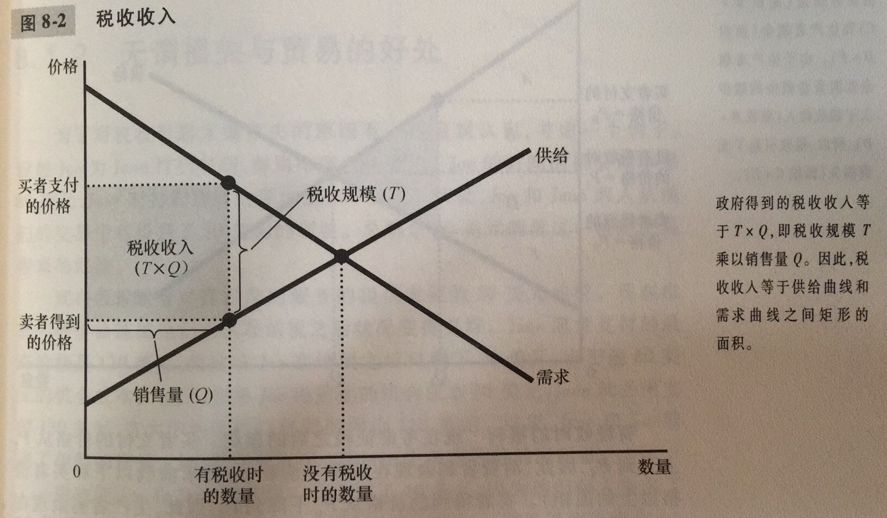
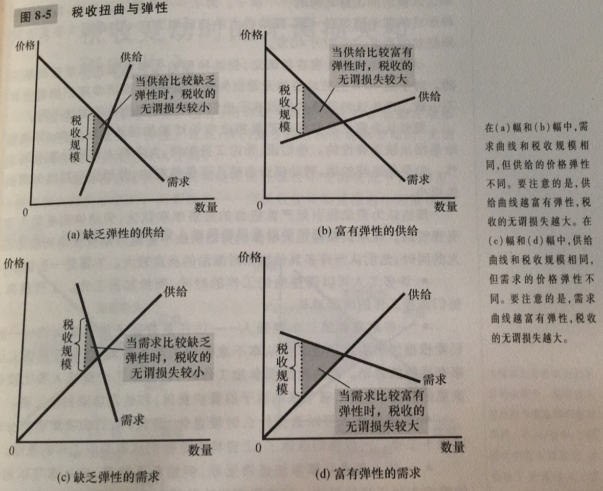
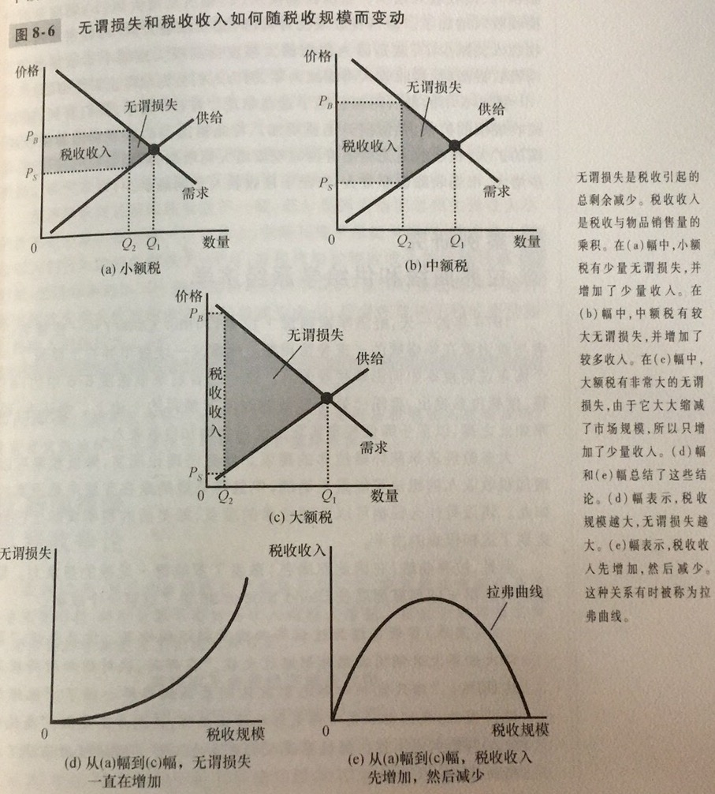

无谓损失：市场扭曲（例如税收）引起的总剩余减少

供给和需求的弹性越大，税收的无谓损失也就越大

一种物品的税收使该物品买者与卖者的福利减少了，而且消费者剩余和生产者剩余的减少常常超过了政府筹集到的收入。

税收增加越多，它对激励的扭曲越大，无谓损失也就越大。但由于税收减小了市场规模，税收收入不会一直增加，税收收入起初随着税收规模的扩大而增加，但如果税收规模达到足够大，税收收入就会开始下降