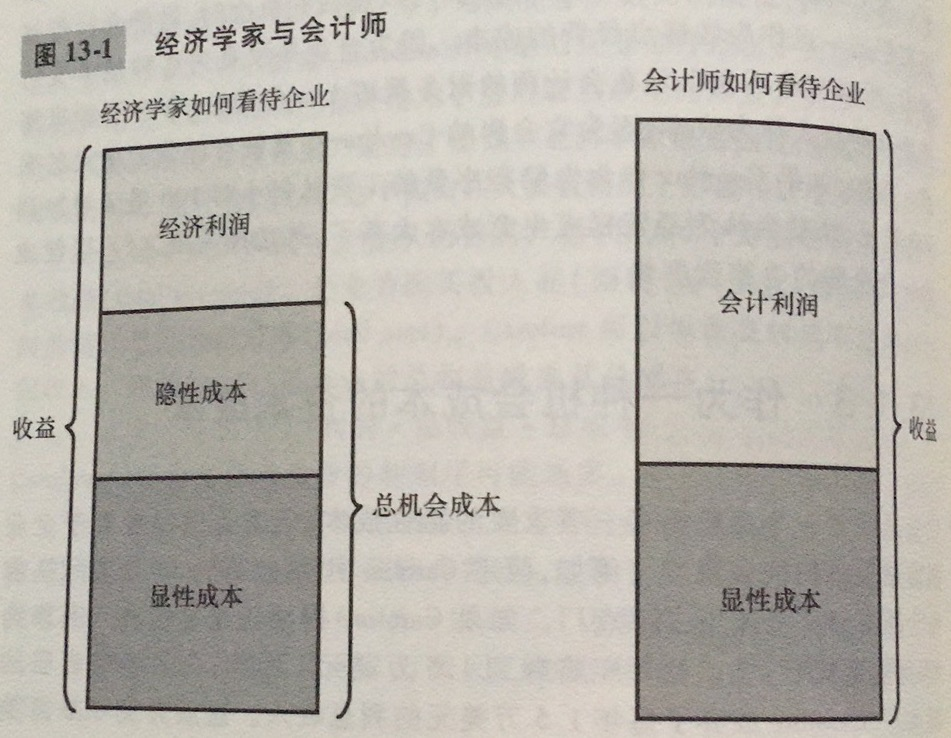
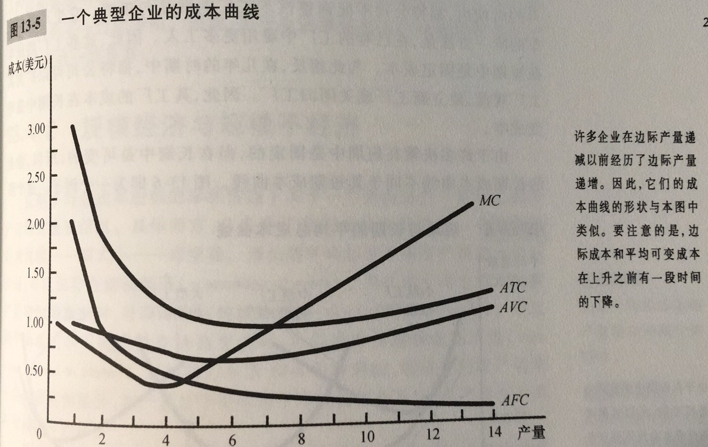
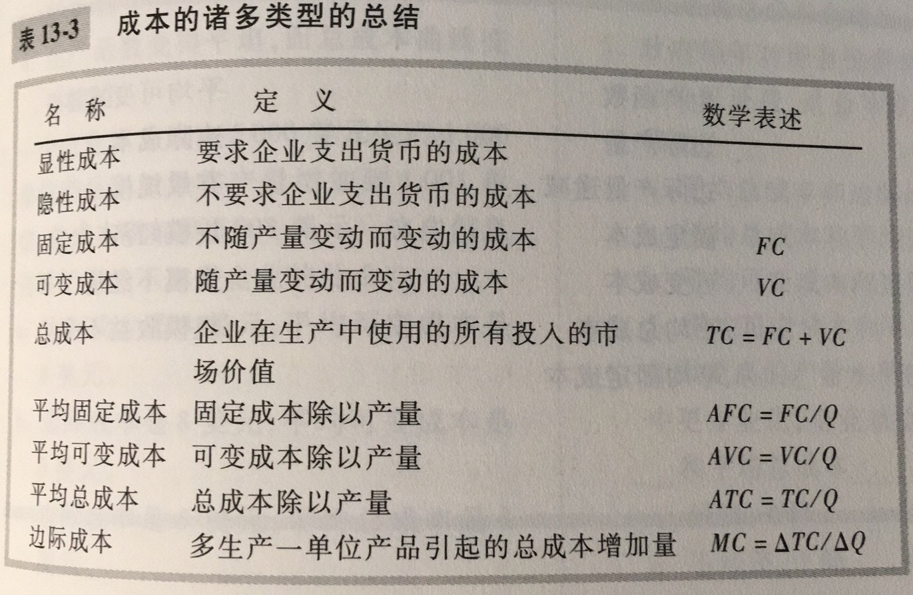

总收益：企业出售其产品多得到的货币量

总成本：企业用于生产的投入品的市场价值

利润：总收益减去总成本

显性成本：需要企业支出货币的投入成本

隐性成本：不需要企业支出货币的投入成本

经济利润：总收益减去总成本，包括显性成本和隐性成本

会计利润：总收益减去总显性成本

生产函数：用于生产一种物品的投入量与该物品产量之间的关系

边际产量：增加一单位投入所引起的产量增加

边际产量递减：一种投入的边际产量随着投入量增加而减少的特征

固定成本：不随着产量变动而变动的成本

可变成本：随着产量变动而变动的成本

平均总成本：总成本除以产量。平均总成本告诉我们如果总成本在所生产的所有单位中平摊，普通一单位产品的成本

平均固定成本：固定成本除以产量

边际成本：额外一单位产量所引起的总成本的增加。边际成本告诉我们，多生产一单位产品引起的总成本增加

有效规模：使平均总成本最小的产量

只要边际成本小于平均总成本，平均总成本就下降；只要边际成本大于平均总成本，平均总成本就上升。边际成本曲线与平均总成本曲线在平均总成本曲线的最低点处相交

规模经济：长期平均总成本随产量增加而减少的特性

规模不经济：长期平均总成本随产量增加而增加的特性

规模收益不变：长期平均总成本在产量变动时保持不变的特性

规模经济的产生是因为较高的产量水平允许在工人中实现专业化，而专业化可以使工人更精通某一项工作。规模不经济的产生可能由于任何一个大型组织中固有的协调问题。

一个企业的成本往往取决于所考虑的时间范围，特别是，许多成本在短期中是固定的，但在长期中是可变的。结果，当企业改变其产量水平时，短期中的平均总成本可以比长期中增加得更快