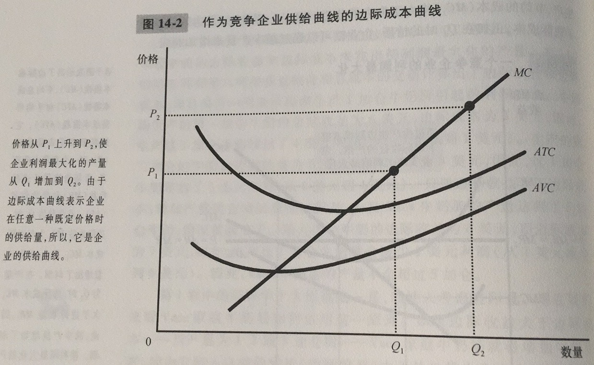

竞争市场：有许多交易相同产品的买者与卖者，以至于每个买者与卖者都是价格接受者的市场。注意竞争市场的两个特征：1.市场上有许多买者和卖者；2.各个卖者提供的物品大体是相同的；3.企业可以自由地进入或退出市场

平均收益：总收益除以销售量。对所有企业而言，平均收益等于物品的价格

边际收益：增加一单位销售量引起的总收益的变动。对竞争企业而言，边际收益等于物品的价格

本质上，由于企业的边际成本曲线决定了企业在任何一种价格时愿意供给的物品数量，因此，边际成本曲线也是竞争企业的供给曲线

竞争企业的短期供给曲线是边际成本曲线位于平均可变成本曲线之上的那一部分

沉没成本：已经发生且无法收回的成本。沉没成本是不纳入决策考虑的

如果从生产中得到的收益小于它的总成本，企业就应该退出市场

竞争企业的长期供给曲线是边际成本曲线位于平均总成本曲线之上的那一部分

在考虑市场的短期和长期时，要有所区别。短期，有固定数量企业的市场供给，而长期，则是有进入和退出的市场供给

长期，当市场上进入和退出过程结束时，仍然留在市场上的企业的经济利润必然为0。长期时，只要价格高于平均总成本，就有企业进入，因此，只有当价格与平均总成本相等时，进入与退出过程才结束。考虑到平均总成本最低的生产水平是企业的有效规模，那么当进入与退出过程结束时，企业一定是在其有效规模上运营

长期供给曲线是完全弹性的，但也可能会向右上方倾斜，这里有两个可能原因：1.用于生产的资源数量是有限的；2.不同企业可能有不同的成本

由于企业在长期中比在短期中更容易进入和退出，所以长期供给曲线一般比短期供给曲线更富有弹性

