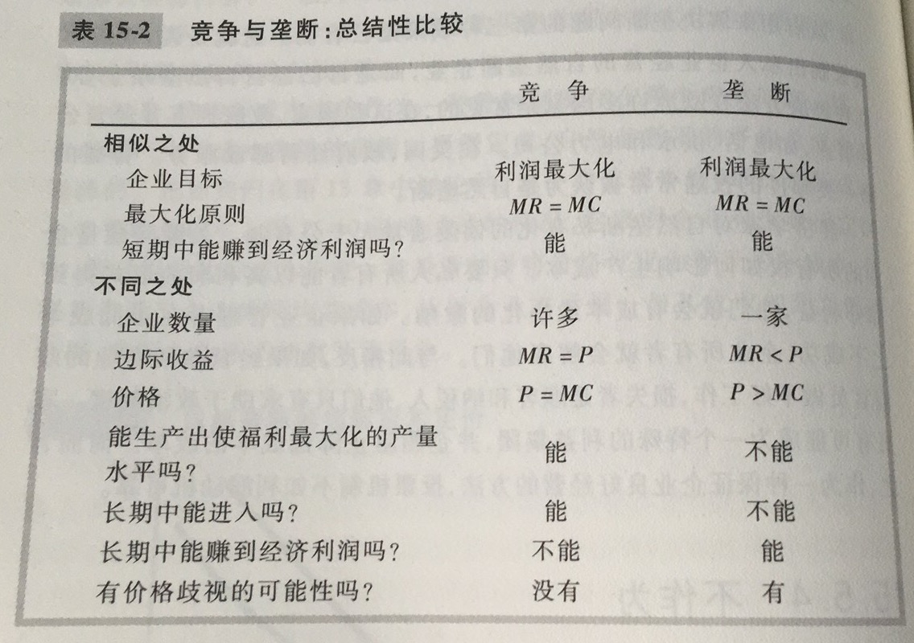

垄断企业：作为一种没有相近替代品的产品的唯一卖者的企业

竞争企业是价格接受者，而垄断企业是价格决定者

垄断产生的原因是进入壁垒：垄断企业能够在市场上保持唯一卖者的地位，是因为其他企业不能进入市场并与之竞争。而进入壁垒的形成又有这样几个原因：1.垄断资源：生产所需要的关键资源由单个企业所拥有；2.政府管制：政府给予单个企业排他性地生产某种物品或服务的权力；3.生产流程：某个企业能以低于大量企业的成本生产产品

自然垄断：由于一个企业能以低于两个或更多企业的成本向整个市场供给一种物品或服务而产生的垄断。规模经济是产生垄断的一个原因。当一个企业的平均总成本曲线持续维持向下时，该企业就是自然垄断企业。在这种情况下，当生产分散到更多企业中，每个企业的产量减少了，平均总成本上升。最终结果是，单个企业可以以最低成本生产任何既定量的产品

垄断者的利润最大化产量是由边际收益曲线与边际成本曲线的交点决定的

在竞争市场上，价格等于边际成本；在垄断市场上，价格大于边际成本。

垄断企业没有供给曲线，因为在生产的同时确定了价格。垄断企业是价格的决定者

需求曲线与边际成本曲线相交之处找出社会有效率的产量

所以我们这里有两个产量，一个是垄断者：生产需求曲线与边际成本曲线交点的产量；另一个是社会最有效率的产量：需求曲线与边际成本交点的产量。所以垄断会导致无谓损失，从而造成效率降低

价格歧视：以不同价格向不同顾客出售同一种物品的经营做法

价格歧视是利润最大化垄断者的一种理性策略，但是价格歧视要求能根据支付意愿划分顾客。某些市场力量会组织企业实行价格歧视，例如套利。价格歧视可以通过消除垄断定价中固有的无效率而增加了生产者剩余，从而提升了整个市场的经济福利。

垄断市场相比于竞争市场效率更低，因此，政府决策者会用下面四种方式之一来应对垄断：1.努力使垄断行业更有竞争性（反托拉斯法）；2.管制垄断者的行为；3.把一些私人垄断企业变为公共企业；4.不作为（政策不可避免的不完善性比市场失灵要严重）

从某种意义上而言，垄断是普遍的。因为大多数企业对他们收取的价格都有某种控制力，无法强迫他们对自己的产品收取市场价格，因为其提供的物品与其他企业提供的物品并不完全一样。