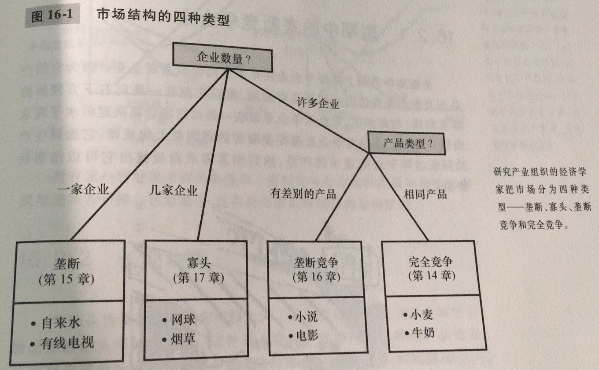
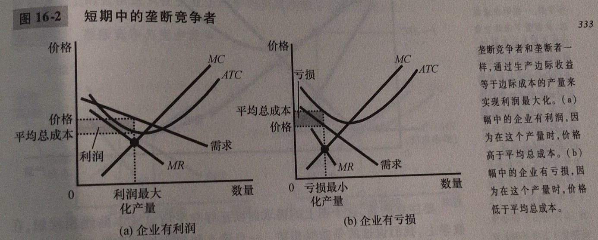
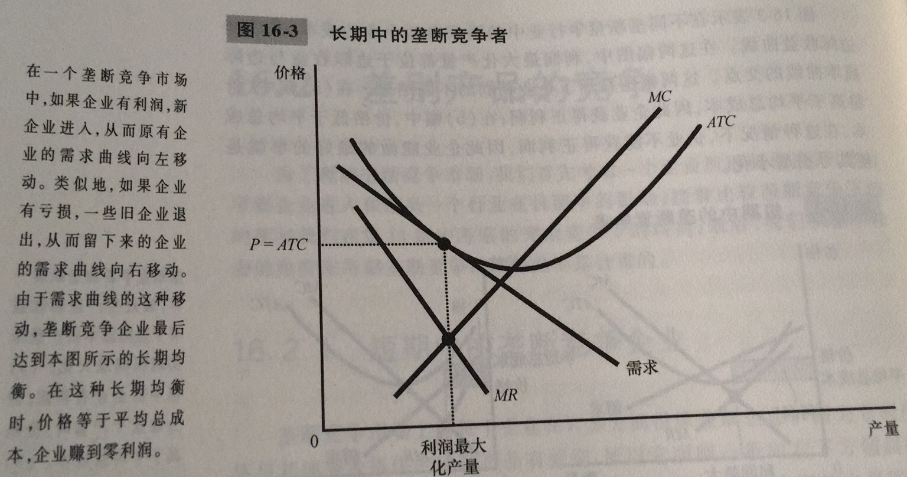
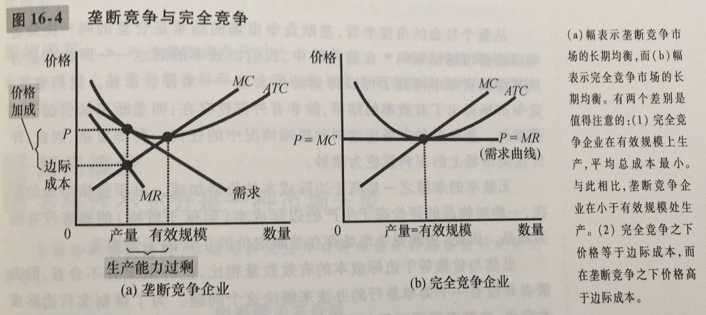
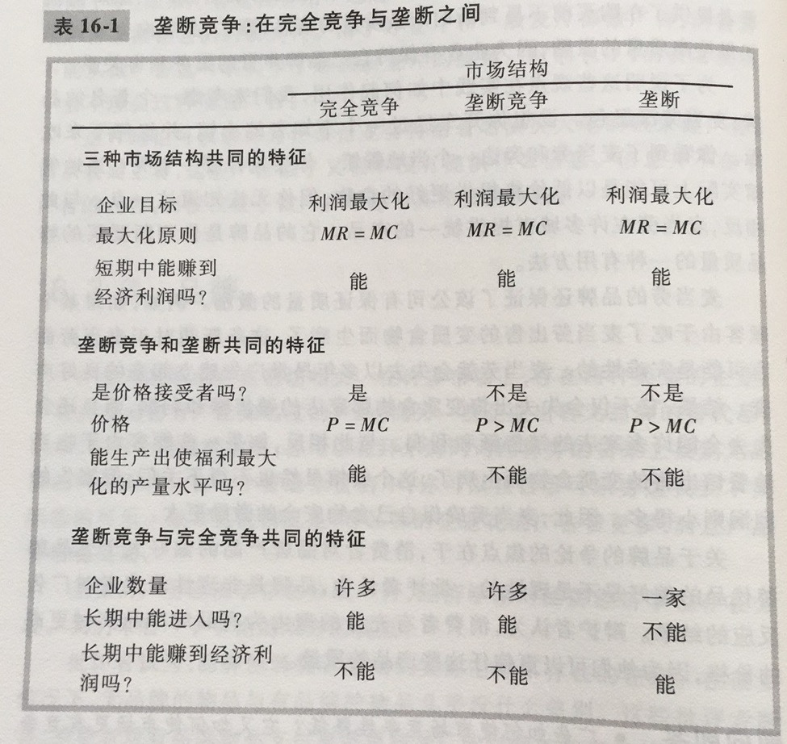

在完全竞争市场上，价格总是等于生产的边际成本；在长期中，进入与退出使得经济利润为零，因此，价格也等于平均总成本。垄断会使得价格高于边际成本，因此，就导致了企业的长期经济利润和社会的无谓损失。但是大多数情况下，并不会出现完全竞争或者垄断这样两种极端情况，而是出于两者之间，这种情况称为不完全竞争。不完全竞争的市场包含两种类型，一种称为寡头，另一种称为垄断竞争

寡头：只有少数几个提供相似或相同产品的卖者的市场结构

垄断竞争：存在许多出售相似但不相同产品的企业的市场结构

对于长期，正如在垄断市场上一样，价格大于边际成本；正如在竞争市场上一样，价格等于平均总成本。但是与垄断不同的是，由于垄断竞争市场仍然能够进入进出，所以企业的长期利润仍然为零

这里注意两点：1.生产力过剩；2.价格加成。这两点均体现垄断的一面。

垄断竞争的的市场福利及其复杂，很难讨论清楚。垄断竞争市场并不能保证总剩余最大化

垄断竞争市场具有三个特点：1.许多企业；2.有差别的产品；3.自由出入市场

垄断竞争和完全竞争的区别在于：1.垄断竞争市场上的每个企业有过剩生产能力；2.每个企业都收取高边际成本的价格

垄断竞争没有完全竞争的所有合意的特点，存在由高于边际成本的价格加成引起的垄断的标准无谓损失。企业的数量、产品的种类可能过多或者过少，决策者纠正这些无效率的能力是有限的。

垄断竞争汇总固有的产品差别使得企业分别取使用广告与品牌。