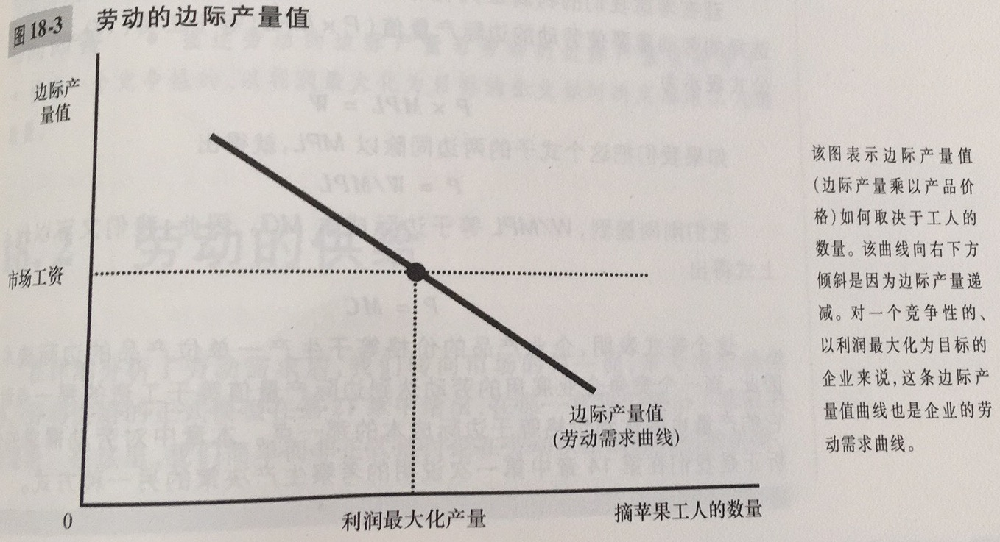
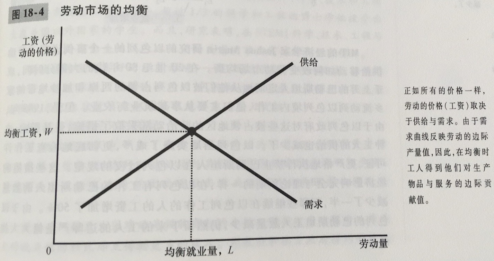
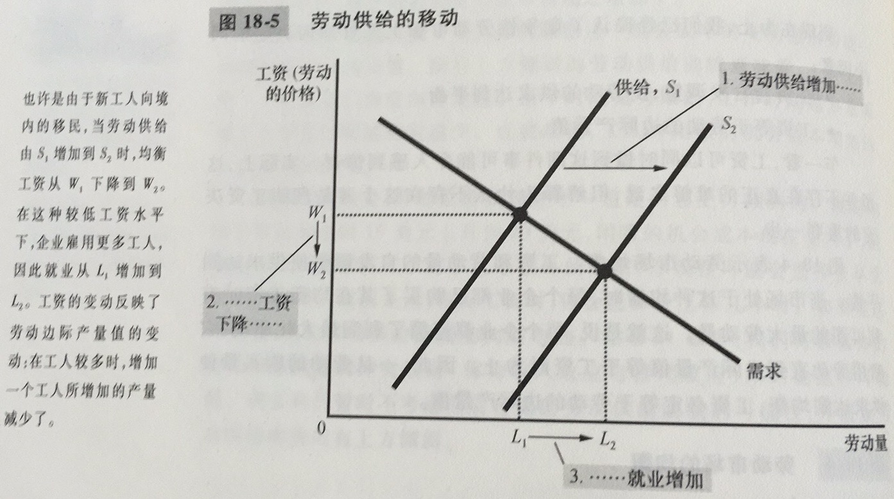
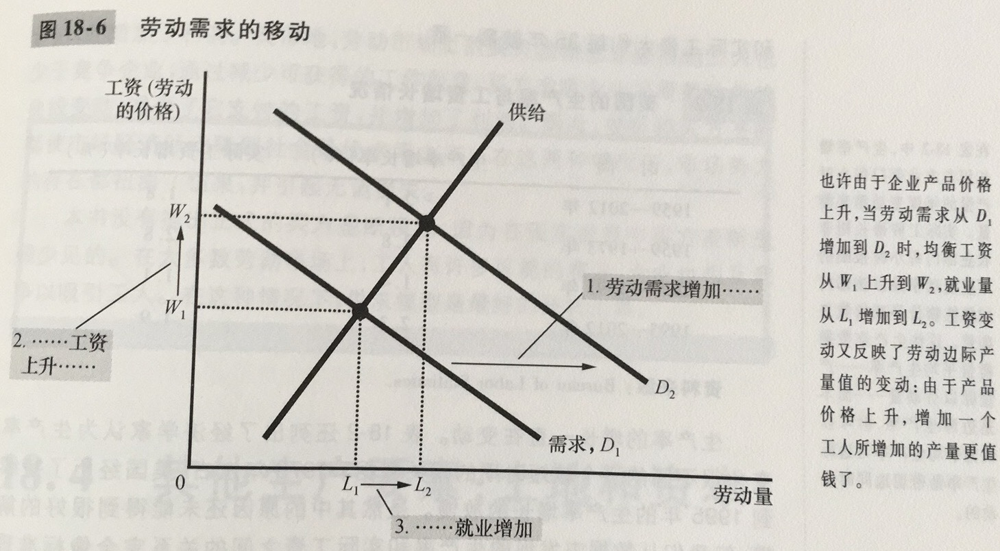
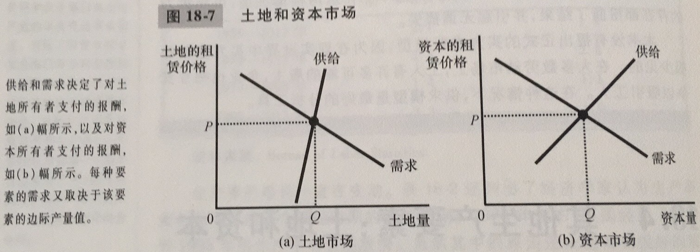

生产要素：用于生产物品与服务的投入

生产函数：用于生产一种物品的投入量与该物品产量之间的关系

劳动的边际产量：增加的一单位劳动所引起的产量增加量

边际产量递减：一单位投入的边际产量随着投入量增加而减少的性质

边际产量值：一种投入的边际产量乘以该产品的价格

边际收益量：企业从多使用一单位生产要素中得到的额外收益

一个竞争性的、利润最大化的企业雇佣工人数量要达到使劳动的边际产量值等于工资的那一点，同时，这就使得边际产量值曲线也就成为了劳动需求曲线

引起劳动需求曲线移动的要素：产品价格，技术变革，其他要素的供给

引起劳动供给曲线移动的要素：爱好变动，可供选择的机会改变，移民

劳动市场的工资：工资会自发调整，使得劳动的供求达到平衡；工资等于劳动的边际产量值

资本：用于生产物品与服务的设备和建筑物

生产要素主要有三个：劳动、土地、资本

土地和资本的购买价格时一个人为了无限期地拥有哪些生产要素而支付的价格

租赁价格是一个人为了在一个有限时期内使用哪些生产要素而支付的价格

每种要素的租赁价格就必须等于该要素的边际产量值。劳动、土地和资本各自赚到了他们生产过程中的边际贡献的价值。改变任何一种生产要素供给的时间会改变所有要素的收入

