预算约束线：对消费者可以支付得起的消费组合的限制

无差异曲线：一条表示给消费者带来相同满足程度的消费组合的曲线

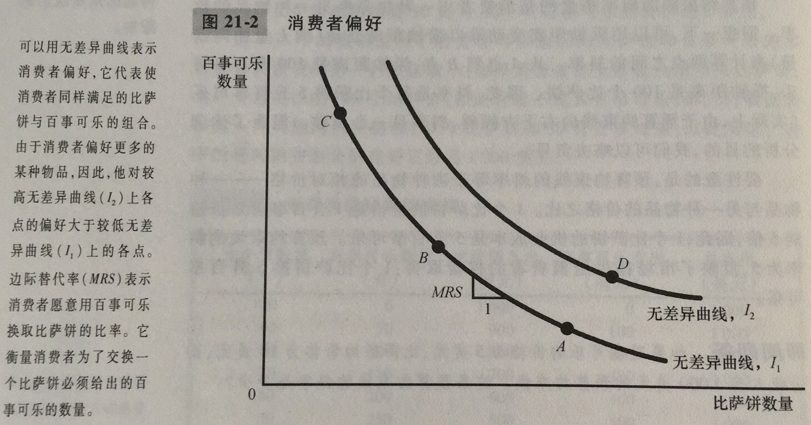

边际替代率：消费者愿意以一种物品交换另一种物品的比率

无差异曲线有四个特征：1. 消费者对于较高无差异曲线的偏好大于较低无差异曲线；2. 无差异曲线向右下方倾斜；3.无差异曲线不相交；4.无差异曲线凸向原点

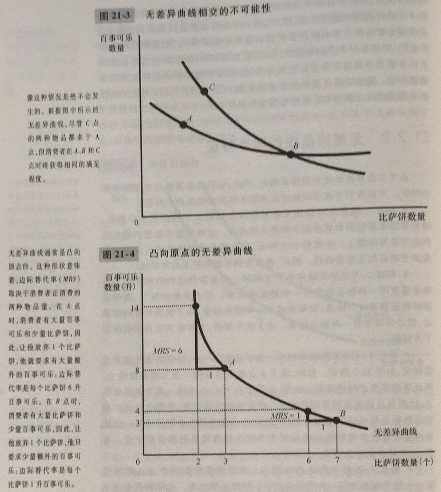

完全替代品：无差异曲线为直线的两种物品

完全互补品：无差异曲线为直角的两种物品

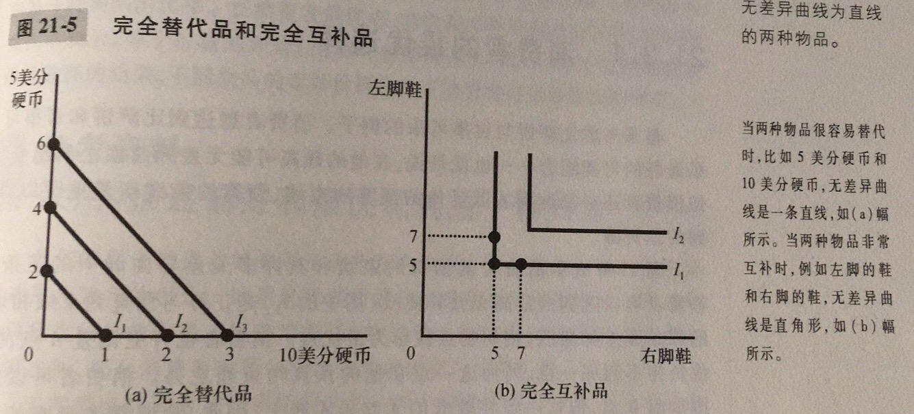

消费者选择的两种物品组合要使边际替代率等于相对价格

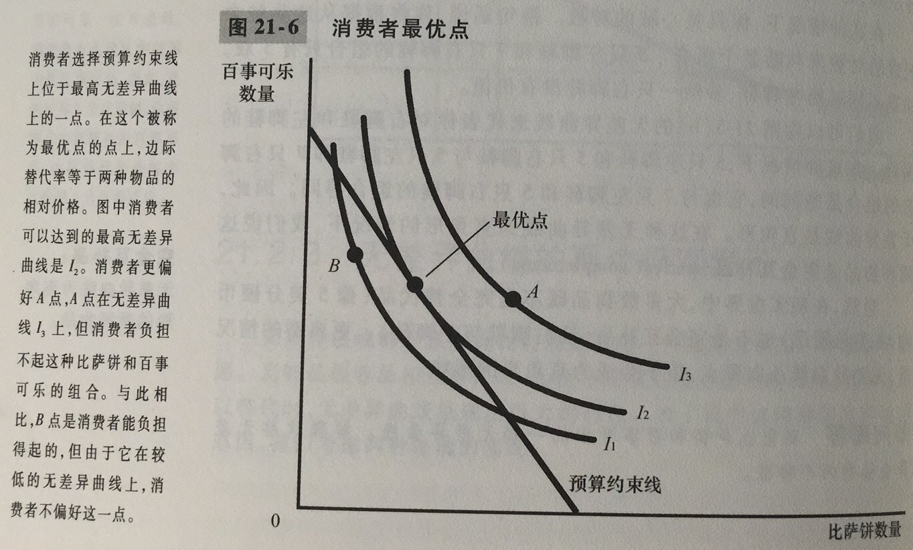

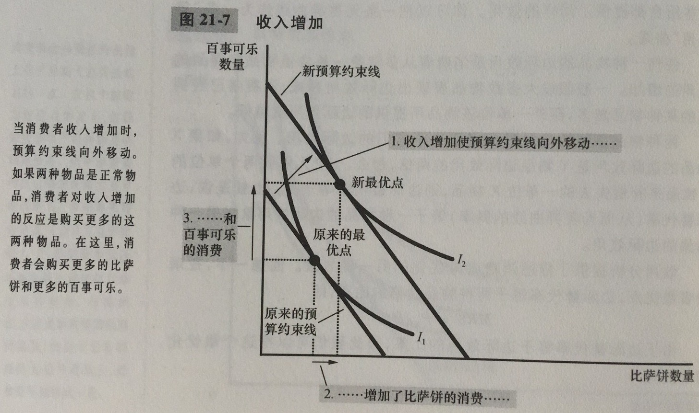

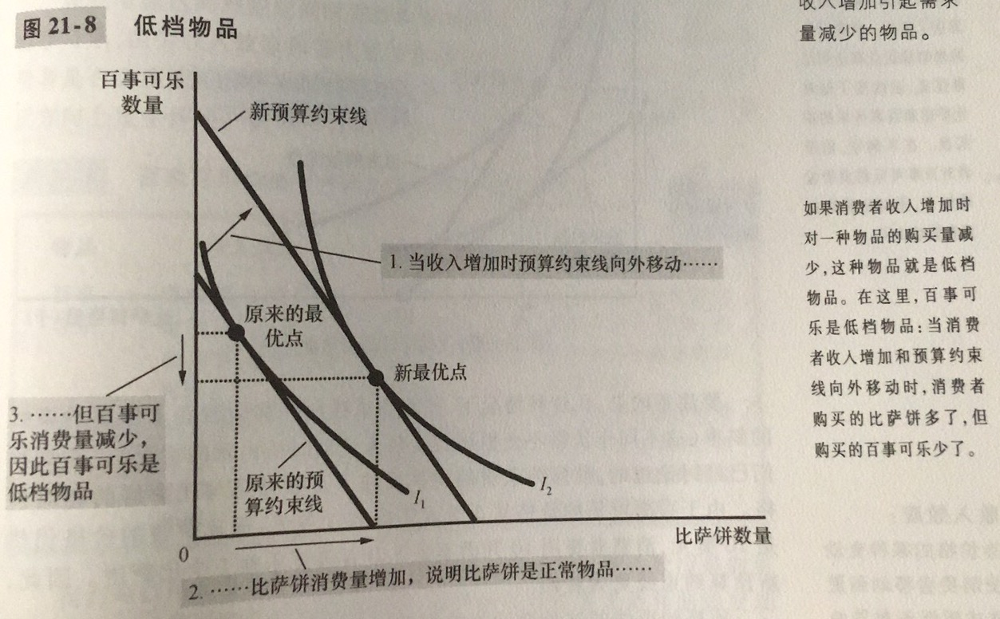

正常物品：收入增加引起需求量增加的物品

低档物品：收入增加引起需求量减少的物品

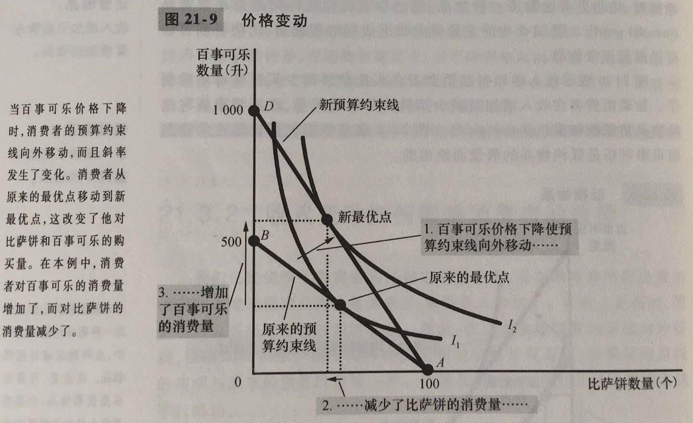

预算约束线的向外移动改变了预算约束线的斜率

收入效应：当价格的某种变动使消费者移动到更高或者更低无差异曲线时所引起的消费变动

替代效应：当价格的某种变动使消费者沿着一条既定的无差异曲线变动到有新边际替代率的一点时所引起的消费变动

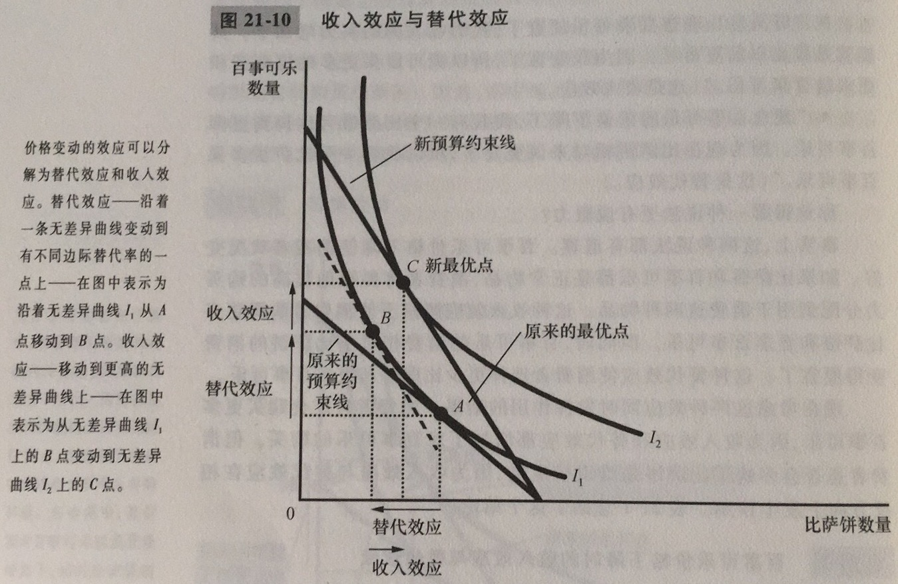

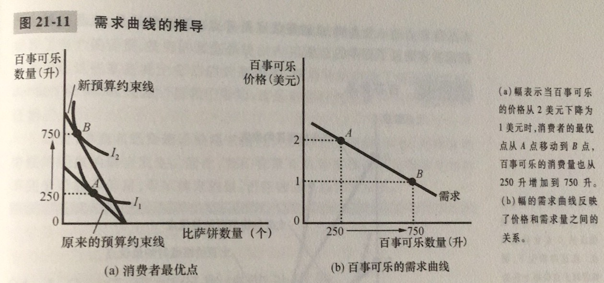

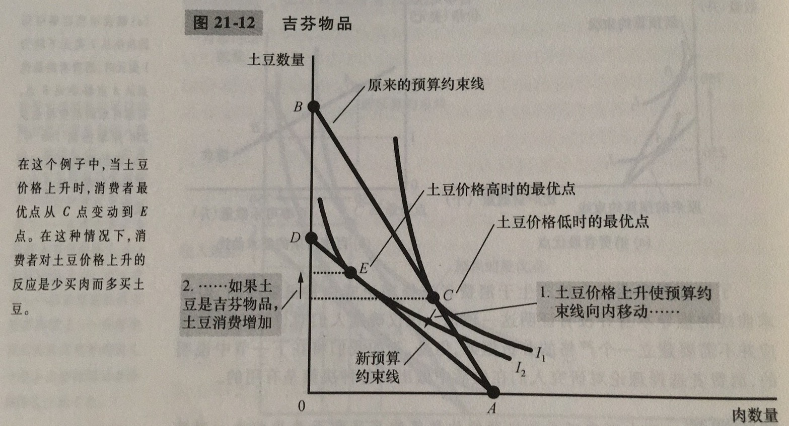

吉芬物品：价格上升引起需求量增加的物品

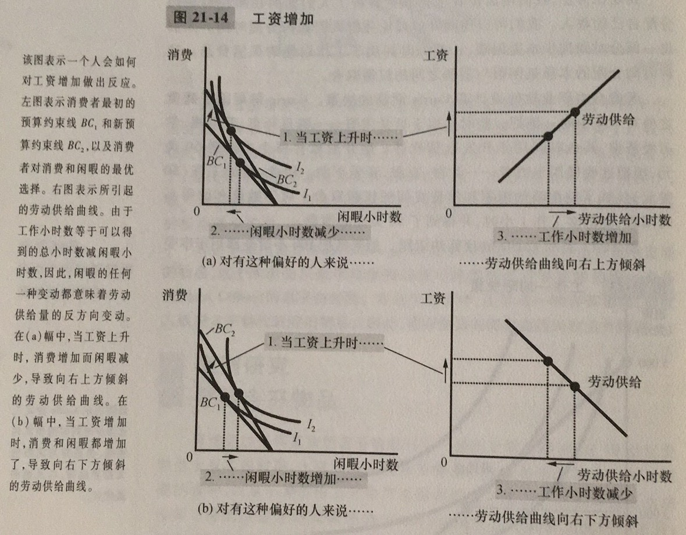

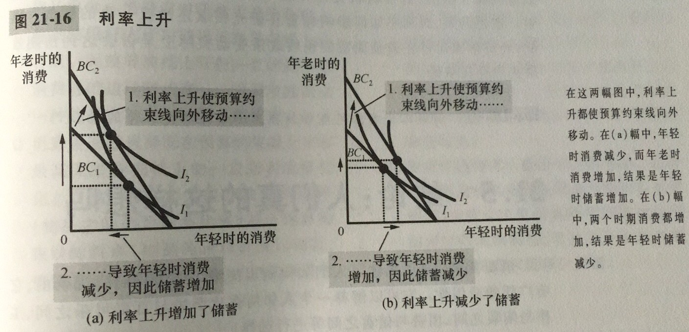

