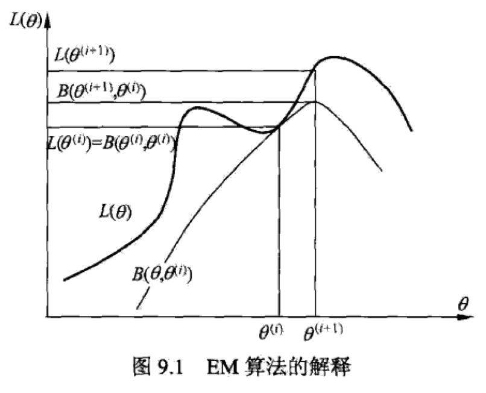

> EM算法是一种迭代算法，用于含有隐变量的概率模型参数的极大似然估计或者极大后验估计。EM算法的主要步骤分为两步，一步是求期望（Expectation），另一步是求极大（Maximization）。EM算法的全称就是期望极大算法（Expectation-Maximization Algorithm）。

# EM算法步骤

输入：观测数据$Y$，隐变量数据$Z$，联合分布$P(Y,Z|\theta)$，条件分布$P(Z|Y,\theta)$，输出：模型参数$\theta$。

1. 选择参数的初值$\theta_0$，开始迭代；

2. E步：记$\theta_i$为第$i$次迭代参数$\theta$的估计值，在第$i+1$次迭代的E步，计算：
   $$
   Q(\theta,\theta_{i+1})=E_Z[logP(Y,Z|\theta)|Y,\theta_i]=\sum_Z log P(Y,Z|\theta)P(Z|Y,\theta_i)
   $$
   这里，$P(Z|Y,\theta_i)$是在给定观测数据$Y$和当前的参数估计$\theta_i$下隐变量$Z$的条件概率分布；

3. M步：求使$Q(\theta,\theta_{i+1})​$极大化的$\theta​$，确定第$i+1​$次迭代的参数的估计值$\theta_{i+1}​$
   $$
   \theta_{i+1}=arg max_\theta Q(\theta,\theta_i)
   $$

4. 重复第2~3步直至收敛

EM算法中的$Q$函数定义如下：

完全数据的对数似然函数$logP(Y,Z|\theta)$关于在给定观测数据$Y$和当前参数$\theta_i$的条件下对未观测数据$Z$的条件概率分布$P(Z|Y,\theta_i)$的期望称为$Q$函数，即$Q(\theta,\theta_{i+1})=E_Z[logP(Y,Z|\theta)|Y,\theta_i]$

EM算法对于初值是敏感的。

# EM算法的推导

EM算法本质仍然是极大似然估计，即极大化不完全数据$Y$关于参数$\theta$的似然函数。

似然函数定义如下：
$$
L(\theta)=logP(Y|\theta)=log\sum_Z P(Y,Z|\theta)=log \sum_Z P(Y|Z,\theta)P(Z|\theta)
$$
EM算法通过迭代逐步近似极大化$L(\theta)$。我们希望新估值的$L(\theta)$要大于第$i$步的估计值$L(\theta_i)$，因此，我们可以先计算两者的差值：
$$
L(\theta)-L(\theta_i)=log \sum_Z P(Y|Z,\theta)P(Z|\theta)-logP(Y|\theta_i)
$$
对上面这个式子的处理难点主要是右侧第一项。这里先引入Jensen不等式，以便后续的推导：

如果$f(x)$是区间$(a,b)$上的凸函数，且$x_1,x_2,...,x_n \in (a,b)$，那么：
$$
f(\dfrac{x_1+x_2+...+x_n}{n}) \ge \dfrac{f(x_1)+f(x_2)+...+f(x_n)}{n}
$$
利用Jensen不等式，我们可以得到如下的推论（不予严格证明）：
$$
f(E[X]) \ge E[f(X)]
$$
这个不等式的含义就是，$X$为随机变量，当$f(X)$是凸函数，那么$X$期望的$f$函数大于$f(X)$的期望。

根据这个不等式，我们可以对似然函数做一数学变换：
$$
L(\theta)-L(\theta_i)=log \sum_Z P(Y|Z,\theta)P(Z|\theta)-logP(Y|\theta_i) \\
                                  =log \sum_Z P(Z|Y,\theta_i) \dfrac{P(Y|Z,\theta)P(Z|\theta)}{P(Z|Y,\theta_i)} - log P(Y|\theta_i) \\
                                  \ge \sum_Z P(Z|Y,\theta_i)log \dfrac{P(Y|Z,\theta)P(Z|\theta)}{P(Z|Y,\theta_i)} - log P(Y|\theta_i) \\
                                  = \sum_Z P(Z|Y,\theta_i)log \dfrac{P(Y|Z,\theta)P(Z|\theta)}{P(Z|Y,\theta_i)P(Y|\theta_i)}
$$

令：
$$
B(\theta, \theta_i) = L(\theta_i)+\sum_Z P(Z|Y,\theta_i)log \dfrac{P(Y|Z,\theta)P(Z|\theta)}{P(Z|Y,\theta_i)P(Y|\theta_i)}
$$
则有：
$$
L(\theta) \ge B(\theta,\theta_i)
$$
这就意味着函数$B(\theta,\theta_i)$是$L(\theta) $的一个下界，那么如果$B(\theta,\theta_i)$增加，就可以推动$L(\theta)$增加。因此我们可以选择能够让$B$极大化的$\theta$（忽略常数项）：
$$
\theta_{i+1} = argmax_\theta B(\theta,\theta_i) \\
                      = argmax_\theta \sum_Z P(Z|Y,\theta_i) log \dfrac{P(Y|Z,\theta)P(Z|\theta)}{P(Z|Y,\theta_i)P(Y|\theta_i)} \\
                      = argmax_\theta \sum_Z P(Z|Y,\theta_i) log[P(Y|Z,\theta)P(Z|\theta)] \\
                      = argmax_\theta \sum_Z P(Z|Y,\theta_i) log P(Y,Z|\theta) \\
                      = argmax_\theta Q(\theta,\theta_i)
$$
 现在可以看到，EM算法是通过不断求解下界的极大化逼近求解对数似然函数极大化的算法，而这个求解下界极大化的过程实际上就等价于求解$Q$函数的极大化。

# EM算法的收敛性

1. 设$P(Y|\theta)$是观测数据的似然函数，$\theta_i(i=1,2,…)$为EM算法得到的参数估计序列，$P(Y|\theta_i),i=1,2…$为对应的似然函数序列，则$P(Y|\theta_i)$是单调递增的，即满足：$P(Y|\theta_{i+1}) \ge P(Y|\theta_i)$;

2. 设$L(\theta)=logP(Y|\theta)$为观测数据的对数似然函数，$\theta_i,i=1,2…$为EM算法得到的参数估计序列，$L(\theta_i),i=1,2…$为对应的似然函数序列。

   1). 如果$P(Y|\theta)$有上界，那么$L(\theta_i)=log P(Y|\theta_i)$收敛到某一值$L^*$；

   2). 在函数$Q(\theta,\theta')$与$L(\theta)$满足一定条件下，由EM算法得到的参数估计序列$\theta_i$的收敛值$\theta^*$是$L(\theta)$的稳定点；

EM算法的收敛性包含似然函数序列收敛和参数估计序列收敛两层意思，但是前者并不蕴含后者。我们只能保证参数估计序列收敛到对数似然函数序列的稳定点，不能保证收敛到极大点。所以，实际应用时往往选择几个不同的初值进行迭代，然后对结果加以比较，从中选择最好的。

# EM算法与高斯混合模型

高斯混合模型是指具有如下形式的概率分布模型：
$$
P(y|\theta)=\sum_{k=1}^K \alpha_k \phi(y|\theta_k)
$$
其中，$\alpha_k \ge 0$是系数，$\sum_{k=1}^K \alpha_k=1$；$\phi(y|\theta_k)$是高斯分布密度，称为第k个分模型：
$$
\phi(y|\theta_k)=\dfrac{1}{\sqrt{2\pi \sigma_k}}exp(-\dfrac{(y-\mu_k)^2}{2\sigma_k^2})
$$
一般混合模型可以用任意概率分布密度代替上式中的高斯分布密度。

下面描述高斯混合模型的EM算法：

1. 取参数的初始值开始迭代；

2. E步：依据当前模型参数，计算分模型k对观测数据$y_j$的响应度：
   $$
   \hat{\gamma_{jk}}=\dfrac{\alpha_k\phi(y_j|\theta_k)}{\sum_{k=1}^K \alpha_k\phi(y_j|\theta_k)}, j=1,2,...,N; k=1,2,...,K
   $$

3. M步：计算新一轮迭代的模型参数：
   $$
   \hat{\mu_k}=\dfrac{\sum_{j=1}^N \hat{\gamma_{jk}}y_j}{\sum_{j=1}^N \hat{\gamma_{jk}}}, k=1,2,...K \\
   \hat{\sigma_k}^2=\dfrac{\sum_{j=1}^N \hat{\gamma_{jk}}(y_j-\mu_k)^2}{\sum_{j=1}^N\hat{\gamma_{jk}}}, k=1,2,...K \\
   \hat{\alpha_k}=\dfrac{\sum_{j=1}^N \hat{\gamma_{jk}}}{N}, k=1,2,...K
   $$

4. 重复第2~3步直至收敛

# EM算法的推广

> EM算法可以解释为F函数的极大-极大算法

F函数的定义如下：

假设隐变量数据$Z$的概率分布为$P(Z)$，定义分布$P$与参数$\theta$的函数$F(P,\theta)$如下：
$$
F(P,\theta)=E_p[logP(Y,Z|\theta)]+H(P) \\
H(P) = -E_plog P(Z)
$$
$H(P)$是分布$P(Z)$的熵。

对于固定的$\theta$，可以求得使$F(P,\theta)$达到极大的分布$\hat{P_\theta}(Z)=P(Z|Y,\theta)$，并且$\hat{P_\theta}(Z)$随$\theta$连续变化。如果$\hat{P}_\theta(Z)=P(Z|Y,\theta)$，则$F(\hat{P},\theta)=logP(Y|\theta)$。

设$L(\theta)=logP(Y|\theta)$是观测数据的对数似然函数，$\theta_i,i=1,2,…$为EM算法得到的参数估计序列。如果函数$F(\hat{P},\theta)$在$\hat{P}^*$和$\theta^*$有局部（全局）极大值，那么$L(\theta)$也在$\theta^*$有局部（全局）极大值。

EM算法的一次迭代可由$F$函数的极大-极大算法实现。

设$\theta_i$为第$i$次迭代参数$\theta$的估计，$\hat{P}_i$为第$i$次迭代函数$\hat{P}$的估计，在第$i+1$次迭代的两步为：

1. 对固定的$\theta_i$，求$\hat{P}_{i+1}$使$F(\hat{P},\theta_i)$极大化；
2. 对固定的$\hat{P}_{i+1}$，求$\theta_{i+1}$使$F(\hat{P}^{i+1},\theta)$极大化；

### GEM算法形式一

输入：观测数据，F函数

输出：模型参数

1. 初始化参数$\theta_0$，开始迭代；

2. 对第$i+1$次迭代：

   记$\theta_i$为$\theta$的估计值，$\hat{P}_i$为$\hat{P}$的估计值

   1）求$\hat{P}_{i+1}$使$\hat{P}$极大化$F(\hat{P},\theta_i)$;

   2）求$\theta_{i+1}$使$F(\hat{P}_{i+1},\theta)$极大化；

3. 重复第2步直至收敛；

### GEM算法形式二

输入：观测数据，Q函数

输出：模型参数

1. 初始化参数$\theta_0$，开始迭代;

2. 对第$i+1​$次迭代：

   记$\theta_i$为$\theta$的估计值

   1）计算$Q(\theta,\theta_i)=E_Z[logP(Y,Z|\theta)|Y,\theta_i]=\sum_Z P(Z|Y,\theta_i)log P(Y,Z|\theta)$;

   2）求$\theta_{i+1}$使$Q(\theta_{i+1},\theta_i) \gt Q(\theta_{i},\theta_i)$；

3. 重复第2步直至收敛；

### GEM算法形式三

输入：观测数据，Q函数

输出：模型参数

1. 初始化参数$\theta^0=(\theta_1^0,\theta_2^0,...,\theta_d^0)$，开始迭代；

2. 对第$i+1$次迭代：

   记$\theta^i=(\theta_1^i,\theta_2^i,...,\theta_d^i)$为参数$\theta=(\theta_1,\theta_2,...,\theta_d)$的估计值

   1）计算$Q(\theta,\theta_{i})=E_Z[logP(Y,Z|\theta)|Y,\theta_i]=\sum_Z P(Z|y,\theta_i) log P(Y,Z|\theta)$;

   2）进行d次条件极大化：

   a. 在$\theta_2^i,...,\theta_k^i$保持不变的条件下，求使$Q(\theta,\theta_i)$达到极大的$\theta_1^{i+1}$；

   b. 类似a，经过d次条件极大化，得到$\theta^{i+1}=(\theta_1^{i+1},...,\theta_d^{i+1})$，使得$Q(\theta^{i+1},\theta^i) \gt Q(\theta^{i},\theta^i)$;

3. 重复第2步，直至收敛；