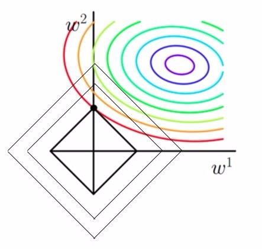

# L0与L1与L2正则化项

L0正则化项稍微有些特殊，我们先不看它，放到最后。

# 正则化的公式

以最简单的线性回归为例，一般的代价函数为：

$$
cost = min \dfrac{1}{N}\sum_{i=1}^N (y_i-\omega^Tx_i)^2
$$

加入L1正则化项的代价函数为（Lasso回归）：

$$
cost = min \dfrac{1}{N}\sum_{i=1}^N (y_i-\omega^Tx_i)^2+C||\omega||_1
$$

加入L2正则化项的代价函数为（岭回归）：

$$
cost = min \dfrac{1}{N}\sum_{i=1}^N (y_i-\omega^Tx_i)^2+C||\omega||_2^2
$$

# 正则化项作用的图像解释

[2018-05-09-决策树](决策树/决策树.md)的笔记中，我们曾经提到，决策树的代价函数分成两部分，一部分代表的是模型的误差，另一部分代表的是模型的复杂度，代表模型复杂度的项可以避免模型过拟合。某种意义上，这个代表模型复杂度的项也是一种正则化项。

上图是加入L1（左图）和L2（右图）正则化项后的图像。

L1正则化项实际上是$|\omega_1|+|\omega_2|=F$，在上图就是菱形。从这里我们看到，最小化代价函数，如果不加入正则化项，实际上就是最小化椭圆那部分（紫色圈），加入正则化项后，不仅要椭圆那部分小，还要让菱形这部分区域也要小。那么很自然地，当菱形的边与椭圆相切时，两者作为一个整体一定是最小的。

对于很多原函数的等高曲线而言，和某个菱形相交时，很容易相交在某个坐标轴上（如上图），也就是说最终的结果，解的某些维度及其容易是0（比如上图是$[0,\omega]$）。这也就是我们所说的**L1更容易得到稀疏解**（解向量0比较多）的原因。

严格一点讲，考虑一维情况，$h(\omega)=f(\omega)+C|\omega|$如果我们要让0点成为可能的极值点，尽管L1正则化项在0点不可导，我们也可以让0点左右的导数异号：$h'_l(0)h'_r(0)=(f'(0)+C)(f'(0)-C)<0$，换言之只要$C>f'(0)$，0点都是可能的最值点。

当加入L2正则化的时候，分析和L1正则化是类似的，也就是说我们仅仅是从菱形变成了圆形而已，同样还是求原曲线和圆形的切点作为最终解。当然与L1范数比，我们这样求的L2范数的从图上来看，不容易交在坐标轴上，但是仍然比较靠近坐标轴。因此这也就是我们老说的，L2范数能让解比较小（靠近0），但是比较平滑（不等于0）。

结构风险最小化： 在经验风险最小化的基础上（也就是训练误差最小化），尽可能采用简单的模型，以此提高泛化预测精度。因此，加正则化项就是结构风险最小化的一种实现。

# L2正则的解释

L2正则化实际上就是根据代价函数的特征，即目标函数的Hessian的特征值的方向，对代价函数进行了一次缩放。

如图所示，实线是原先的代价函数，它的特征是水平方向梯度增加小，而垂直方向梯度增加大，而L2正则将其水平轴拉向0，说明正则化项对水平轴有强烈的影响。

# 贝叶斯解释

对于线性回归，我们假设$P(Y|X;\omega)$服从$N(\omega^TX,\sigma)$，然后用极大似然法求解似然函数，得到的目标函数实际上就是我们线性回归的代价函数。但如果我们不是利用极大似然法，而是最大后验法估计参数，那么我们就需要对先验$P(\omega)$做一定的假设。

首先先摆出一般化的公式：

$$
log\prod_{i=1}^m p(y_i|x_i;\omega)*p(\omega)=log \prod_{i=1}^m p(y_i|x_i;\omega)+log \prod_{i=1}^m p(y_i|x_i;\omega)
$$

**L1**

当我们假设先验服从拉普拉斯分布，即概率密度函数为$\dfrac{1}{2}e^{-|x|}$，代入一般化的公式后我们就得到了L1正则化项。下图为拉普拉斯的分布图，我们可以看到取到0点的概率很大，换言之我们预先假设了$\omega$为0的概率比较大，所以L1正则化更容易稀疏。

**L2**

当我们假设先验服从一般的正态分布，然后代入上面的公式就可以得到L2正则化项。从下面这个分布图来看，先验仍然更有可能取到0，但是由于比较平滑，所以L2正则一般会导致结果很接近0，但就是不为0。

正则化之所以能够降低过拟合的原因在于，正则化是结构风险最小化的一种策略实现。

给loss function加上正则化项，能使得新得到的优化目标函数h = f+normal，需要在f和normal中做一个权衡（trade-off），如果还像原来只优化f的情况下，那可能得到一组解比较复杂，使得正则项normal比较大，那么h就不是最优的，因此可以看出加正则项能让解更加简单，符合奥卡姆剃刀理论，同时也比较符合在偏差和方差（方差表示模型的复杂度）分析中，通过降低模型复杂度，得到更小的泛化误差，降低过拟合程度。

L1正则化和L2正则化：

L1正则化就是在loss function后边所加正则项为L1范数，加上L1范数容易得到稀疏解（0比较多）。L2正则化就是loss function后边所加正则项为L2范数的平方，加上L2正则相比于L1正则来说，得到的解比较平滑（不是稀疏），但是同样能够保证解中接近于0（但不是等于0，所以相对平滑）的维度比较多，降低模型的复杂度。

# L0正则

L0正则我觉得是个很奇葩的东西：

$$
\sum_{j=1,\omega \neq 0}^m \omega_j^0
$$

这个公式的意思也很奇特，当$\omega=0$，啥作用都没有，当$\omega \neq0$，进行调整。换言之，每个对预测有作用的参数，我都罚一次，不管你作用大作用小。这就有点像，有人偷东西有人杀人，全被判了死刑。。。anyway，这玩意就是把函数往一根直线上调节。。。