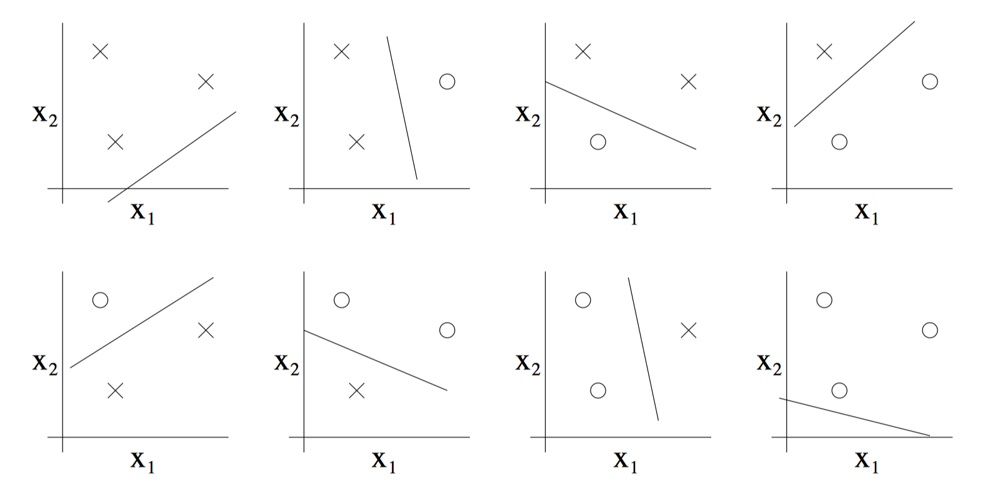
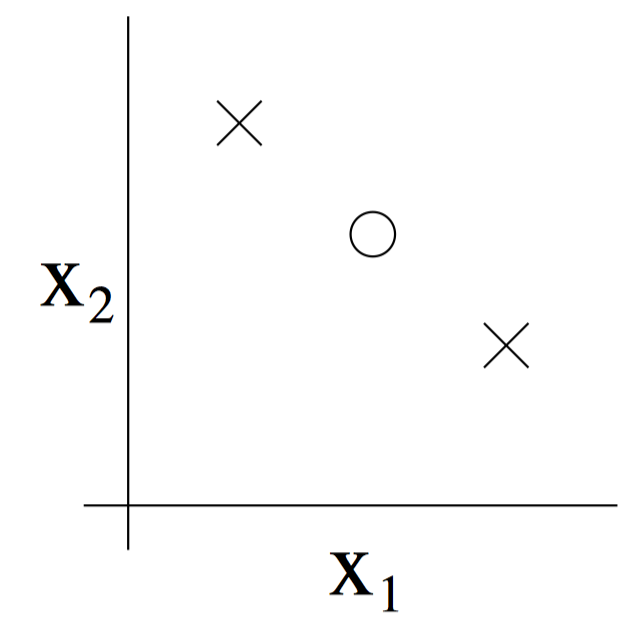

> 一般而言，VC维越大，学习能力就越强，学习也越复杂，可以通过VC维计算学习风险的上界。

这里用二维线性分类器（$h=\theta_0+\theta_1 x_1+\theta_2 x_2$）来解释什么是VC维。首先看集合样本数量为3的情况，这里有两种可能：1. 3个样本不在同一条直线；2. 3个样本在同一条直线上。

对于情况1，我们的二维线性分类器总能找到一条直线，打散样本为3的集合：

而对于情况2，我们不能找到一条直线打散样本为3的集合：

因此，对于二维线性分类器，它的VC维是3。

类似地，我们可以发现二维线性分类器不能打散样本数量为4的集合。

n维实数空间中线性分类器和线性实函数的VC维是n+1。

如果某函数的VC维无穷大，也就意味着，任意多个点无论怎样标注都能将其打散，它可以将任意多样本的任意标注情况精确分开，即在训练集上达到100%的分类正确率。