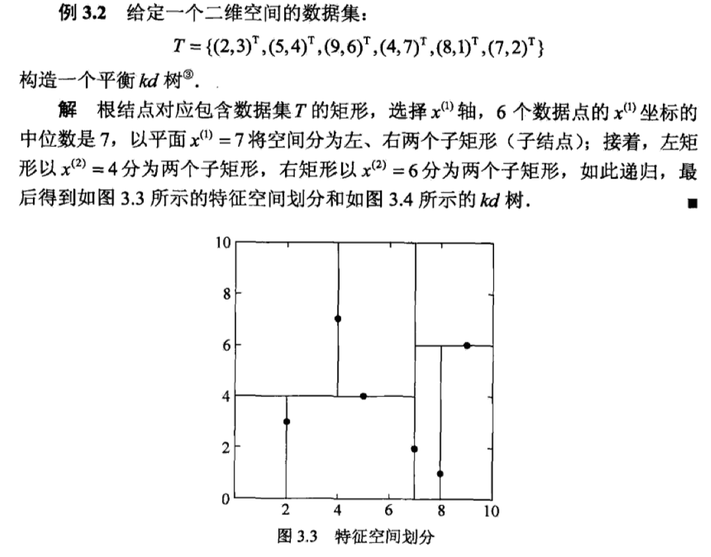
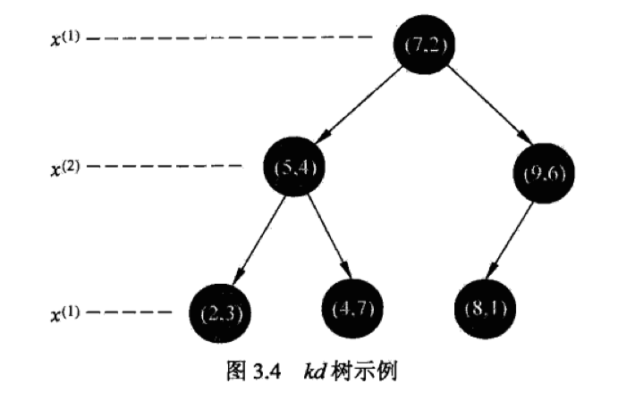
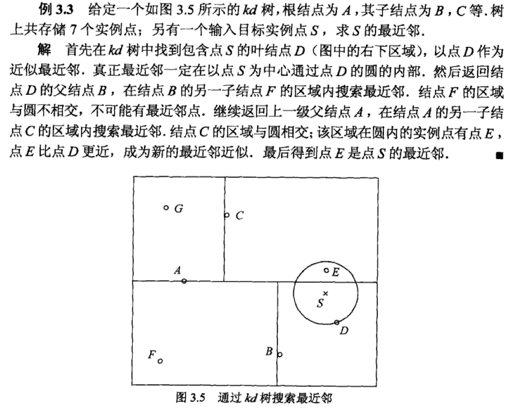

# k邻近

# k邻近

k邻近算法可以说是机器学习算法中最为简单的一个，而且非常直观。简单地说，给定某个训练集，对于新输入的样本，找到训练集中和这个样本距离最近的k个样本，如果这k个样本多数属于某个类，那么就认为这个新输入的样本属于这个类。

假设训练数据集为$T=\{(x_1,y_1),(x_2,y_2),...,(x_N,y_N)\}$，其中，样本的类别的集合设为$Y=\{c_1,c_2,...,c_K\}$。k邻近的具体算法如下：

1. 根据给定的距离度量，在训练集$T$中找出与样本最近的$k$个点，覆盖这$k$个点的邻域记为$N_k(x)$；
2. 在$N_k(x)$中根据分类规则决定样本的类别：
$$
y=arg {max}_{c_j}\sum_{x_i \in N_k(x)}I(y_i=c_j), i=1,2,...,N, j=1,2,...,K
$$
公式中的$I$为指示函数，即$y_i=c_j$时$I=1$，否则$I=0$。

k邻近的特殊情形是$k=1$，这种算法称为最近邻算法。k邻近算法与其他机器学习方法不同的一点在于，k邻近算法没有显式的学习过程。

# 距离度量

一般地，可以定义：

$$
L_p(x_i,x_j)=(\sum_{l=1}^n|x_i^l-x_j^l|^{p})^{\dfrac{1}{p}}
$$

1. 当$p=1$，称为曼哈顿距离；
2. 当$p=2$，称为欧几里得距离；
3. 当$p->\infty$，实际上就是最大距离；

# k的选择

可以从算法中直观地看到，k值的选择对结果有着重大的影响。如果k值较小，那么就相当于用训练集中较小的邻域进行预测，换言之，k较小则容易发生过拟合；或者如果训练集中的样本不是特别好，比如某些样本是噪声，那么k小的模型就容易出问题。

但是如果k较大，虽然不容易过拟合了，但是一些距离远的点也会对预测起作用。所以这种情况也会对预测造成影响。

如果k取为整个训练集的样本容量，则简单粗暴地把样本归为训练集中最多的一类，这是不可取的。

# 分类决策规则

k邻近法的分类决策一般是多数表决。如果覆盖$N_k(x)$的区域的类别是$c_j$，那么误分类率是：

$$
\dfrac{1}{k}\sum_{x_i\in N_k(x)}I(y_i \ne c_j)=1-\dfrac{1}{k}\sum_{x_i\in N_k(x)}I(y_i = c_j)
$$

要使误分类率最小，实际上就是要经验风险最小。

# kd树

k邻近的最简单的实现方法是直接使用线性扫描的办法，计算样本与训练集中每个样本的距离，但是这样效率就及其低下。可以采用kd树的数据结构来加速处理。

kd树是一种对k维空间中的样本点进行存储以便对其进行快速检索的数据结构。kd树是二叉树，表示对k维空间的一个划分，构造kd树相当于不断地用垂直于坐标轴的超平面将k维空间切分，构成一系列的k维超矩形区域。kd树的每个节点对应于一个k维超矩形区域。

构造kd树的具体算法如下：

1. 构造根节点，使得根节点对应于k维空间中包含的所有样本点的超矩形区域；
2. 通过递归方法，不断地对k维空间进行切分，生成子节点；
3. 在超矩形区域（节点）上选择一个坐标轴和在此坐标轴上的一个切分点，确定一个超平面，这个超平面通过选定的切分点并垂直于选定的坐标轴，将当前超矩形区域切分为左右两个子区域；
4. 样本被分到两个子区域中；
5. 重复这个过程直到子区域内没有样本时终止，终止时的节点为叶节点。在这个过程中把样本保存在相应的节点上；

通常，依次选择坐标轴对空间进行切分，选择训练样本在选定坐标轴的中位数为切分点，这样得到的kd树是平衡的，但需要注意的是，平衡的kd树的效率却未必是最优的。

kd树的搜索算法如下：

1. 在kd树种找出包含目标点x的叶节点：从根节点出发，递归向下访问kd树。若目标点x当前维的坐标小于切分点的坐标，则移动到左子节点，否则移动到右子节点，直到子节点为叶节点为止；
2. 以此叶节点为“当前最近点”；
3. 递归地向上回退，在每个节点进行如下操作：
a. 如果该节点保存的样本比当前最近点距离目标点更近，则以该样本点为当前最近点；
b. 当前最近点一定存在于该节点一个子节点对应的区域，检查该子节点的父节点的另一子节点对应的区域是否有更近的点。具体地，检查另一子节点对应的区域是否与以目标点为球心，以目标点与“当前最近点”间的距离为半径的超球体相交；如果相交，可能在另一子节点对应的区域内存在距离目标点更近的点，移动到另一个子节点。接着，递归地进行最近邻搜索；如果不相交，向上回退；
4. 当回退到根节点，搜索结束。最后的“当前最近点”即为x的最近邻点；

