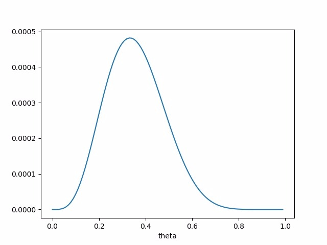
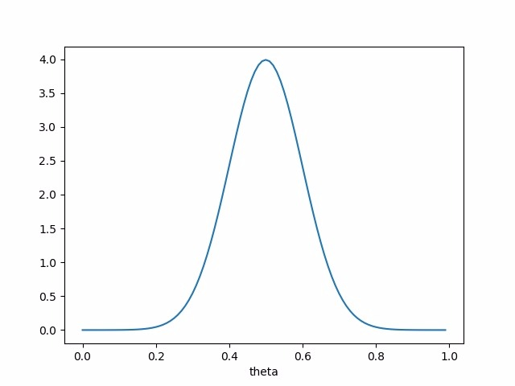
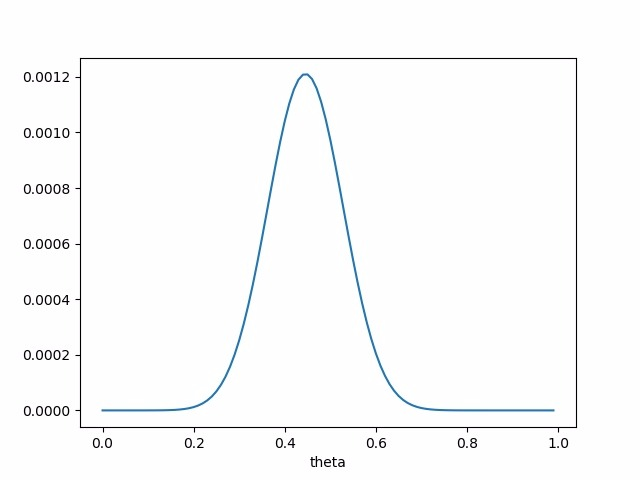

# 先验-后验-似然-极大似然估计-最大后验估计

在学习统计理论时，先验、后验、似然、极大似然估计和最大后验估计是最容易混淆的几个概念。这里我记录下我的一些简单理解。

首先我们来理清楚一个概念：概率与统计的差别。

我们来打个比方，以养猪为例。假如我要去养猪，那么我需要考虑的就是养什么品种（普通家猪，黑猪。。。）、给猪提供什么样的环境（圈养、放养）、吃什么饲料等等，但是我也想知道，在这些条件下，我养出来的猪会是怎么样的（肥还是瘦，当然，我希望它们是肥的）。那么如果我们给这个养猪的过程建模，模型的输入就是猪，模型包含一系列的参数（环境、饲料等），最终的输出是猪肉。这个模型就是一个预测的模型，预测在这些条件下，我养出来的猪能有多肥。这就是概率。用更正规的语言来说，概率就是给定一个模型和参数，我们如何预测这个模型产生的一些结果（这些结果就通过均值，方差等表示）。这里需要强调下，对于概率而言，模型是已知的。

统计则不同。统计的前提并不是模型是已知的，而是数据是已知的。仍然以养猪为例。假设我偶然有一天在市场上看到了一批待出售的猪，发现这些猪非常非常肥，于是我就会想这些猪是在什么条件下养出来的呢？是放养还是圈养，吃什么饲料？这个过程就是统计。这里我们很容易就能够理解，统计是根据已经观测到的数据，去推测这些数据是由什么样的模型和参数产生的。

理解了统计与概率的差别，我们来看一个非常重要的公式：贝叶斯公式。这个公式其实非常简单：

$P(A|B)=\dfrac{P(B|A)P(A)}{P(B)}=\dfrac{P(B|A)P(A)}{P(B|A)P(A)+P(B|*A)P(*A)}$

这里$*A$表示的是A的补集。

这公式表面看没什么，就是条件概率和联合概率的一个变形，但理解一下其实含义很丰富。

我们这里以宅家为例。假设今天我宅家，然后点了个外卖，突然间有人敲门。这时候我们能够考虑到的是，谁在敲门？也许是外卖送来了，也许是邻居抱怨我音响开太响，也许是来查水表的。我们把外卖送来这个事件记为A，把敲门这个事件记为B。$P(A|B)$表示的意义就是，现在已经有人在敲门了，有多大可能性是外卖送来了。$P(B|A)$代表的则是确实是外卖送来导致敲门的可能性（因为小哥可能不是敲门而是给你打电话），而$P(A)$代表的是外卖送来的可能性（一般是会送来的，但万一比如外卖小哥路上出车祸了。。。）。$*A$则代表所有的其他因素，比如说是邻居来了，朋友来了之类，然后门被敲了。

那么我们再考虑下这个公式，如果我们希望门被敲确实就是外卖送来了（$P(A|B)=1$），那么我们只需要让$P(B|*A)P(*A)=0$即可。也就是说，排除了其他所有的可能，省下来的唯一一个可能就是外卖来了。这就告诉我们，在进行推断的时候，需要尽可能多的考虑全面一些，就像侦探片里说的，排除了所有不可能的，留下来的哪怕再不可能也只能是真相。

OK，解释清楚贝叶斯公式的意义，我们来弄清楚先验、后验和似然。仍然以宅家叫外卖为例。

先看对应关系。先验对应的是$P(A)$，后验对应的是$P(A|B)$，而似然对应的是$P(B|A)$。

先验指的是外卖送来的可能性。因为虽然点了外卖，但是可能送不来，比如小哥出车祸了。当然，大部分情况下外卖是能送来的，所以往往认为$P(A)=1$。这里先埋个伏笔，为后面理解极大似然和最大后验做铺垫。

后验指的是，敲门确实因为外卖送来的可能性。此时敲门已经发生了，所以叫做后验。

似然指的是外卖送来了，敲门发生的可能性。这里有点绕。我们需要考虑到小哥可能在门外不是敲门，而是打电话。所以似然可以理解成“像这个样子发生”。

所以我们可以得到一个对应关系，后验=先验*似然。换句话说，敲门是因为外卖送来的概率的大小，是受两个因素影响的，一个是外卖能不能送来（先验），另一个是外卖送来了，小哥也得敲门而不是打电话。

现在解释清楚了先验、后验和似然，我们在回过头来看养猪的事情。我们用$x$代表猪的一些参数，比如肥不肥（体重）；用$\theta$代表一些养猪时的参数，比如放养还是圈养、饲料等。我们改写一下上面的贝叶斯公式方便理解：

$P(\theta|x)=\dfrac{P(x|\theta)P(\theta)}{P(x)}$

对于$P(x|\theta)$这个函数，我们有两种理解方式：

1. $\theta$是已知的，而$x$未知，那么$P(x|\theta)$代表的含义是，给定参数$\theta$，$x$发生的概率。比如说，我确定了饲养方式、饲料等等，那么我得到的猪肉是超级肥的概率；

2. $x$是已知的，而$\theta$未知，那么$P(x|\theta)$代表的意思就是似然。似然代表的意思是，对于不同的模型参数， $x$发生的概率是多少。以养猪为例，假设我尝试了不同的饲养方式，我得到肥肉的概率分别有多大，这就是似然。这里似然仍然可以理解为“像这个样子发生”，即，拿到这么肥的一块肉的概率。

下面我们来解释极大似然法和最大后验法。

首先我们来看为什么要极大似然。以养猪为例，我们当然是希望得到的肉大部分都是肥的，这样我们才有收益，所以我们希望似然$P(x|\theta)$尽可能大。用数学一点的语言来说，我们看到了模型产生的一系列数据，然后我们猜测参数是什么，那么很自然的想法就是，我们先看看不同参数的模型出来的数据， $x$最可能发生的那个模型就是生成这些数据的模型。而不同参数下$x$可能发生的程度就是似然$P(x|\theta)$。这么一说是不是很好理解为什么要极大似然了？

但是极大似然法存在一个问题。从上面我们可以看到，我们对参数$\theta$的估计仅仅只是通过极大化似然$P(x|\theta)$得到的，而对$\theta$可能的取值没有偏好，$\theta$所有的取值都是等可能的。也就是说，看到一堆猪肉，我们认为可能是放养的，也可能是圈养的，而不会先入为主地认为这肉比较好，这猪很可能是放养的吧？但是实际情况是，饲养的方式的概率可能是不同的。比如说，大家更可能圈养猪，因为方便。那么怎么办呢？很简单粗暴的想法是，我管你似然是不是极大了，我不管，我只要后验最大，$P(\theta|x)$我要最大！什么意思呢，意思就是我看到了一堆数据，根据这对数据得到某个$\theta$的概率最大，那么我们就认为这些数据是由这个$\theta$产生的。

所以另一种思路——最大后验法就这么愉快地出来了。

还是看这个公式：

$P(\theta|x)=\dfrac{P(x|\theta)P(\theta)}{P(x)}$

最大后验就是要求后验最大。需要注意这里我们已经知道$P(x)$，因为数据是已知的。同时，最大后验法中估计出来的参数$\theta$不一定会让似然最大，这一点与极大似然法是不同的。

另外，由于$P(x)$已知，所以，后验=先验*似然。在这个条件下，我们再重新理解一下参数估计的这两种方法。极大似然法是只从得到的数据考虑最大化似然，而不考虑其他因素；最大后验法则是考虑最大化后验，即整体考虑了先验和似然的影响。什么意思呢？最大后验法把先验的信息引入进来了。这就是频率派和贝叶斯派的差异。

为了更清楚的解释，我们以抛硬币为例。这里硬币抛得的结果是数据$x$，我们想猜测这硬币是不是均匀的，即抛出正面与反面的概率（$P(\theta$)）都是0.5.

频率派（极大似然法）：

就事论事，我抛了8次，得到的结果是正反反正反反正正反反反反。那么根据伯努利分布，我可以计算出似然：$P(x|\theta)=\theta(1-\theta)(1-\theta)\theta(1-\theta)(1-\theta)\theta\theta(1-\theta)(1-\theta)(1-\theta)(1-\theta)=\theta^4(1-\theta)^8$。画出这个函数的图像，我们可以看到：

这时候$\theta$应该是0.36。这硬币是不均匀的。

贝叶斯派（最大后验法）：

你这个试验就一次，也许只是巧合。大多数情况下，我们都知道造币厂出来的硬币应该是均匀的。所以，我们有一个先验知识，硬币服从均值为0.5，方差0.1的正态分布：

那么我们的后验为$\theta^4(1-\theta)^8P(\theta)$：

这时候可以看到估计得到的参数大概只比0.5小一点点。

这就是先验的力量！所以为了避免先验的影响太大，我们需要多做几次试验，这样才能保证结果是准确的。

两者的联系：其实在特定情况下，如果我们认为$P(\theta=0.5)=1$，那么这时候频率派的结果和贝叶斯派的是一致的，极大似然就是认为先验是均匀的，取什么值都是等可能的。

PS：

先验的影响极其重要，如何平衡先验和观测数据非常重要。