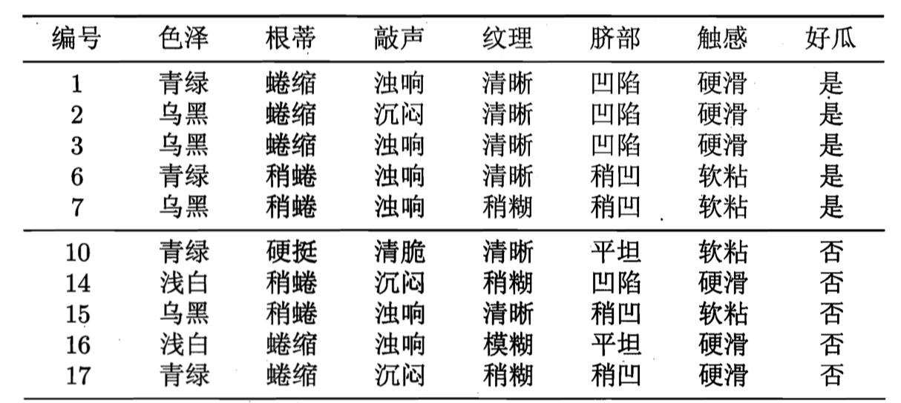
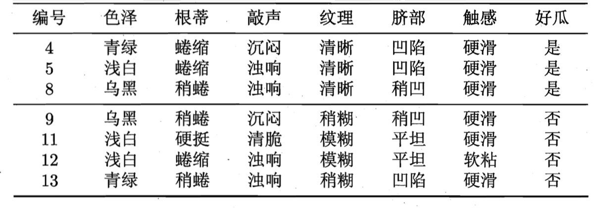
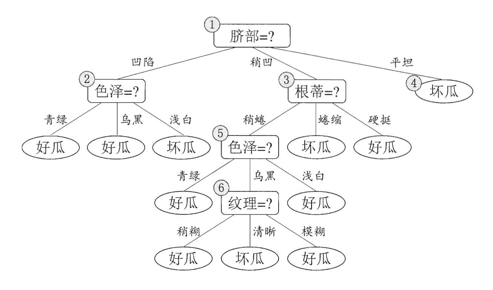
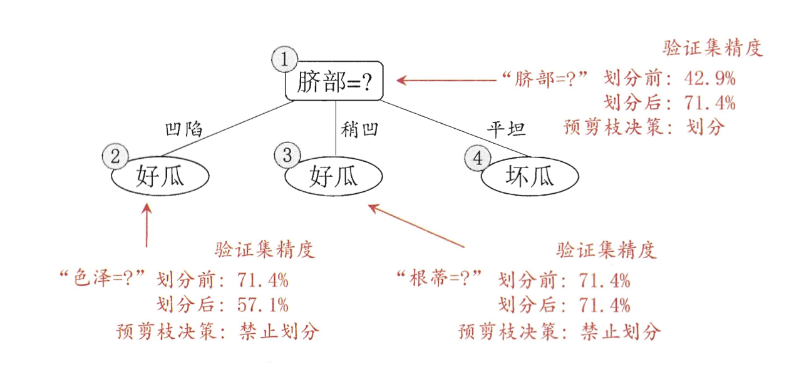
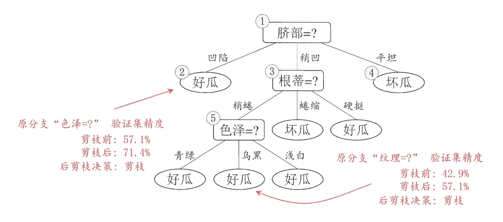
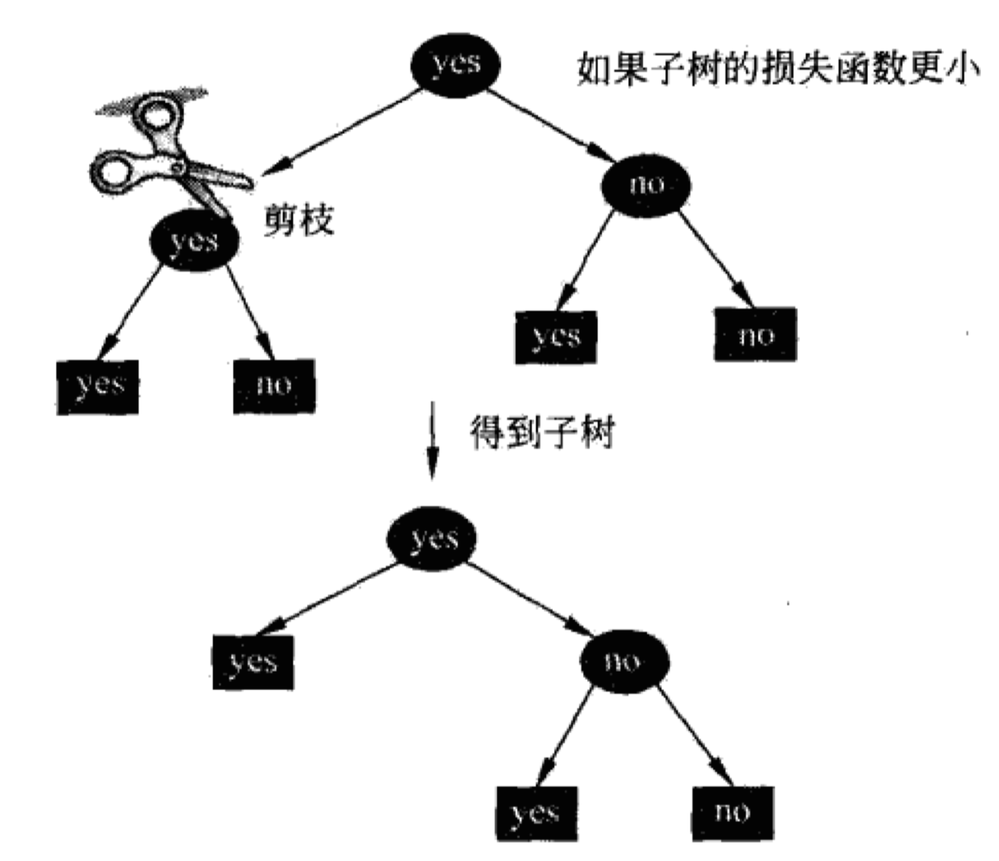
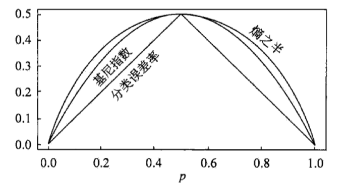

# 决策树

> 决策树是一种常见的分类与回归方法，实际上可以被看作是if-then规则的一个集合。决策树有着模型可读性好，分类速度快的特点。使用决策树算法包含这样几个过程：特征的选择，决策树的生成和决策树的修剪。决策树学习的损失函数一般为正则化的极大似然函数，实际上决策树的学习问题就变成了在损失函数意义下的最优决策树问题。但非常遗憾的是，从所有可能的决策树中选出最优决策树是NP完全问题，所以现实中得到的往往是次优的决策树。

# 特征选择与信息增益

我在信息与熵中讲述了信息与熵的关系。特征A对训练数据集D的信息增益定义为：

$$
g(D,A)=H(D)-H(D|A)
$$

$H(D)$实际上是数据集$D$上的熵（经验熵），代表对数据集$D$进行分类的不确定性，而$H(D|A)$表示在给定特征$A$的条件下，对数据集$D$进行分类的不确定性（经验条件熵）。而两者之差，实际代表的含义就是引入特征$A$，究竟减少了多少的不确定性，这些减少的不确定性就是增加的信息，即信息增益。

根据信息增益准则的特征选择方法是：对训练数据集$D$，计算每个特征的信息增益，并比较它们的大小，选择信息增益最大的特征。

假设训练数据集为$D$，$|D|$为样本个数，需要分成$K$个类$C_k$，$k=1,2,...,K$，$|C_k|$为每个类的样本数量，因此，$\sum_{k=1}^K|C_k|=|D|$。假设特征$A$有$n$个不同的取值${a_1,a_2,...,a_n}$，根据特征$A$将数据集$D$划分为$n$个不同的子集$D_1,D_2,...,D_n$，$|D_i|$为$D_i$的样本个数，满足$\sum_{i=1}^n|D_i|=D$。记子集$D_i$中属于类$C_k$的样本集合为$D_{ik}$，即$D_{ik}=D_i\cap C_k$，$|D_{ik}|$为$D_{ik}$的样本数。信息增益的算法如下：

1. 计算数据集$D$的经验熵：
$$
H(D)=-\sum_{k=1}^K\dfrac{|C_k|}{D}log\dfrac{C_k}{D}
$$
2. 计算特征$A$对数据集$D$的经验条件熵：
$$
H(D|A)=-\sum_{i=1}^n\dfrac{|D_i|}{|D|}H(D_i)=-\sum_{i=1}^n\dfrac{|D_i|}{|D|}\sum_{k=1}^K \dfrac{|D_{ik}|}{|D_i|}log \dfrac{|D_{ik}|}{|D_i|}
$$
3. 计算信息增益
$$
g(D,A)=H(D)-H(D|A)
$$

信息增益的值的大小是相对于训练数据集而言的，如果训练数据集的经验熵比较大时，信息增益也可能会比较大。为了避免不同类的经验熵大小不一导致分类失效，可以引入信息增益比来解决这个问题：

$$
g_R(D,A)=\dfrac{g(D,A)}{H(D)}
$$

# 决策树生成

## ID3算法

> ID3算法的核心是在决策树各个节点上应用信息增益准则选择特征，递归地构造决策树。

ID3算法的具体方法是：从根节点开始，对节点计算所有可能的特征的信息增益，选择信息增益最大的特征作为节点的特征，由该特征的不同取值建立子节点，再对子节点递归地调用以上方法，构建决策树；直到所有特征的信息增益均很小或者没有特征可以选择为止。最后得到一个决策树。ID3算法相当于用极大似然法进行概率模型的选择。算法可以按照如下步骤：

1. 若$D$中所有样本属于同一类$C_k$，则$T$为单节点树，并把类$C_k$作为该节点的类标记，返回$T$；
2. 若$A=\emptyset$，则$T$为单节点树，并把$D$中样本数最大的类$C_k$作为该节点的类标记，返回$T$；
3. 否则，按照信息增益算法计算$A$中各特征对$D$的信息增益，选择信息增益最大的特征$A_g$；
4. 如果$A_g$的信息增益小于阈值$\epsilon$，则置$T$为单节点树，并将$D$中样本数最大的类$C_k$作为该节点的类标记，返回$T$；
5. 否则，对$A_g$的每一可能值$a_i$，按照$A_g=a_i$把$D$分为若干非空子集$D_i$，把$D_i$中样本数最大的类作为标记，构建子节点，由节点及其子节点构成树$T$并返回；
6. 对第$i$个子节点，以$D_i$为训练集，以$A-{A_g}$为特征集，递归调用1~5，得到子树$T_i$并返回；

ID3算法只有树的生成，所以该算法生成的树容易产生过拟合。

## C4.5算法

C4.5算法实际上就是ID3的改进版，把判别准则从信息增益改成信息增益比。具体步骤如下：

1. 若$D$中所有样本属于同一类$C_k$，则$T$为单节点树，并把类$C_k$作为该节点的类标记，返回$T$；
2. 若$A=\emptyset$，则$T$为单节点树，并把$D$中样本数最大的类$C_k$作为该节点的类标记，返回$T$；
3. 否则，按照信息增益比算法计算$A$中各特征对$D$的信息增益比，选择信息增益比最大的特征$A_g$；
4. 如果$A_g$的信息增益比小于阈值$\epsilon$，则置$T$为单节点树，并将$D$中样本数最大的类$C_k$作为该节点的类标记，返回$T$；
5. 否则，对$A_g$的每一可能值$a_i$，按照$A_g=a_i$把$D$分为若干非空子集$D_i$，把$D_i$中样本数最大的类作为标记，构建子节点，由节点及其子节点构成树$T$并返回；
6. 对第$i$个子节点，以$D_i$为训练集，以$A-{A_g}$为特征集，递归调用1~5，得到子树$T_i$并返回；

## 决策树剪枝

> 决策树生成算法递归地产生决策树，直到不能生成为止。但这样的过程对训练数据集的效果比较好，对未知的测试数据则不一定。因此，为了避免决策树过于复杂，需要对其进行修剪，以便将模型泛化。这一过程称为剪枝。剪枝的策略有两种，一种是预剪枝，在决策树生成过程中，对每个节点在划分前先进行估计，如果当前节点的划分不能带来决策树泛化性能提升，就停止划分并标记为叶节点；另一种是后剪枝，就是对已经生成的完整的决策树进行自底向上的考察，如果将该节点对应的子树替换为叶节点能够带来决策树泛化性能提升，则将子树替换为叶节点。

我们的训练集如下

验证集如下：

假设我们有如下的决策树：

### 预剪枝

预剪枝使得决策树的很多分支都未能展开，不仅降低了过拟合的风险，开显著减少了决策树的训练时间开销和测试时间开销。但是，有些分支的划分虽不能提升泛化性能，甚至可能导致泛化性能暂时下降，但在其基础上进行的后续划分却可能导致性能的显著提高；预剪枝基于贪心本质禁止这些分支展开，给预剪枝决策树带来了欠拟合的风险。

### 后剪枝

后剪枝决策树一般比预剪枝决策树保留了更多的分支，一般情形下，后剪枝决策树的欠拟合风险很小，泛化性能往往优于预剪枝决策树。但是后剪枝过程是在决策树完全生成后进行的，并且需要自底向上对决策树的非叶节点进行逐一考察，因此其训练时间开销比未剪枝和预剪枝决策树要大得多。

### 损失函数

上面的剪枝是通过验证集的精度来进行的，但其实也可以通过决策树的损失函数来判定。

假设树$T$的叶节点个数为$|T|$，$t$是树$T$的叶节点，该叶节点有$N_t$个样本，其中$k$类的样本有$N_{tk}$个，$k=1,2,...,K$。$H_t(T)$是叶节点$t$上的经验熵，$\alpha\ge0$为参数，决策树的损失函数定义如下：

$$
C_\alpha(T)=\sum_{t=1}^T N_t H_t(T) + \alpha|T|
$$

其中经验熵为：

$$
H_t(T)=-\sum_k \dfrac{N_{tk}}{N_t}log\dfrac{N_{tk}}{N_t}
$$

定义：

$$
C(T)=\sum_{t=1}^T N_t H_t(T)=-\sum_{t=1}^T\sum_{k=1}^K N_{tk}log\dfrac{N_{tk}}{N_t}
$$

这时我们的损失函数可以改写为：

$$
C_\alpha(T)=C(T) + \alpha|T| 
$$

在损失函数中，$C(T)$表示的是对模型对训练集的误差，即模型与训练集数据的拟合程度。$|T|$表示的是模型的复杂度。参数$\alpha$控制的是两者之间的相对大小。所谓剪枝，实际就是在确定了拟合程度和复杂度二者的相对重要性的前提下，选择损失函数最小的模型，即损失函数最小的子树。决策树生成学习了局部的模型，而决策树剪枝学习整体的模型。

树的剪枝算法如下：

1. 计算每个节点的经验熵；
2. 递归地从树的节点向上回缩。设一组叶节点回缩到其父节点前后的树的整体分别为$T_A$和$T_B$，对应的损失函数分别为$C(T_A)$和$C(T_B)$，如果$C(T_A)\ge C(T_B)$，则进行剪枝，将父节点变为叶节点；
3. 返回2，直到不能进行为止。

这么一看，决策树剪枝的算法可以通过一种动态规划的方式实现。

## CART

分类与回归树（Classification and Regression Tree, CART）是一种典型的决策树，既可以用于分类也可以用于回归。CART假设决策树是二叉树，内部节点的取值是“是”或者“否”。CART的主要步骤可以总结为以下两步：
1. 决策树生成：基于训练集生成决策树，决策树要尽可能大；
2. 决策树剪枝：用验证数据集对已经生成的树进行剪枝并选择最优子树，剪枝的标准为损失函数最小。

### 回归树的生成

我们假设X和Y分别为输入和输出变量，且Y是连续变量，给定训练数据集$D={(x_1,y_1),(x_2,y_2)...(x_N,y_N)}$，考虑如何生成回归树。一个回归树实际上对应着输入空间（特征空间）的一个划分（记为$R_1,R_2...R_M$），每个划分单元（$R_m$）对应着一个值$c_m$。这样回归树的模型可以用数学表达为：

$$
f(x)=\sum_{m=1}^Mc_m I(x\in R_m)
$$

对于输入空间的划分，则采用启发式的方式，选择第$j$个变量$x_j$和它的取值$s$作为切分变量和切分点，并定义它划分的两个区域：

$$
R_1(j,s)=\{x|x_j\le s\} 和 R_2(j,s)=\{x|x_j\gt s\}
$$

然后我们寻找最优切分变量和切分点的的目标函数就是：

$$
cost = {min}_{j,s}[{min}_{c_1} \sum_{{x_j}\in R_1(j,s)}(y_j-c_1)^2+{min}_{c_2} \sum_{{x_j}\in R_2(j,s)}(y_j-c_2)^2]
$$

遍历所有的输入变量，找到最优的切分变量$j$，构成一个对$(j,s)$。然后重复上述步骤，直到满足停止条件，这样就生成了一棵回归树。这样的回归树通常被称为最小二乘回归树。

算法如下：

1. 求解cost，找到最优的$(j,s)$；
2. 用选定的$(j,s)$划分空间并决定相应的输出值：
$$
R_1(j,s)=\{x|x_j \le s\}, R_2(j,s)=\{x|x_j \gt s\} \\
\hat{c_m}=\dfrac{1}{N_m}\sum_{x_j\in R_m(j,s)} y_i, x\in R_m, m=1,2
$$
3. 继续对两个子区域重复1-2，直到满足停止条件；
4. 将输入空间划分为$M$个区域$R_1,R_2...R_M$，生成决策树：
$$
f(x)=\sum_{m=1}^M \hat{c_m}I(x \in R_m)
$$

### 分类树的生成

分类树用基尼指数选择最优特征并决定该特征的最优二值切分点。

假设有$K$类，样本点属于第$k$类的概率是$p_k$，基尼指数定义如下：

$$
Gini(p)=\sum_{k=1}^K p_k(1-p_k)=1-\sum_{k=1}^K p_k^2
$$

对于二分类，基尼指数就变形为：

$$
Gini(p)=2p(1-p)
$$

对于给定的样本集合$D$，$D$中属于第$k$类的样本子集为$C_k$，其基尼指数为：

$$
Gini(D)=1-\sum_{k=1}^K (\dfrac{|C_k|}{|D|})^2
$$

如果样本集合$D$根据特征$A$是否取某一可能值$a$被分割为$D_1$和$D_2$两部分，即：

$$
D_1=\{(x,y)\in D|A(x)=a\}, D_2=D-D_1
$$

则在特征$A$的条件下，集合$D$的基尼指数定义为：

$$
Gini(D,A)=\dfrac{|D_1|}{|D|}Gini(D_1)+\dfrac{|D_2|}{|D|}Gini(D_2)
$$

基尼指数$Gini(D)$表示集合$D$的不确定性，基尼指数$Gini(D,A)$表示经$A=a$的分割后集合$D$的不确定性。基尼指数越大，样本集合的不确定性就越大。基尼指数、熵的一半和分类误差率的关系图如下：

具体算法如下：

1. 假设节点的训练数据集为$D$，计算现有的特征对该数据集的基尼指数，此时，对每一个特征$A$，对其可能取的每个值$a$，根据样本点对$A=a$的测试为“是”或者“否”将$D$分割为$D_1$和$D_2$两部分并计算$A=a$条件下的基尼指数；
2. 在所有可能的特征$A$以及它们所有可能的切分点$a$中，选择基尼指数最小的特征及其对应的切分点作为最优特征和最优切分点。按照最优特征和最优切分点，从现节点生成两个子节点，把训练数据集依特征分配到两个子节点中去；
3. 对两个子节点递归地调用1-2，直到满足停止条件；
4. 生成CART分类树

停止条件是指样本集合中的样本数小于一个阈值，或者样本的基尼指数小于一个阈值，或者没有更多的特征。

### CART的剪枝

> CART的剪枝首先从决策树$T_0$底端不断剪枝，直到$T_0$的根节点，形成一个子树序列$\{T_0,T_1,...,T_n\}$，然后通过交叉验证法在独立的验证数据集上对子树序列进行测试，从中选择最优子树

CART的损失函数仍然可以表示为：

$$
C_\alpha(T)=C(T) + \alpha|T| 
$$

只不过当中的具体计算可以用基尼指数等代替。

容易看出，对于固定的$\alpha$，一定存在使损失函数$C_{\alpha}(T)$最小的子树，将其表示为$T_\alpha$。当$\alpha$偏大时，$T_\alpha$偏小；反之，当$\alpha$偏大时，$T_\alpha$偏大。极端情况$\alpha=0$，整体树是最优的，而当$\alpha->\infty$，根节点组成的单节点树是最优的。

可以用递归的方法对树进行剪枝，当$\alpha$从小到大$[\alpha_i,\alpha_{i+1}),i=0,1,...,n$形成的区间进行剪枝对应着的最优子树$\{T_0,T_1,...,T_n\}$，序列中的子树是嵌套的。

具体地说，从整体树$T_0$开始剪枝，对$T_0$的任意内部节点$t$，以$t$为单节点的树的损失函数为

$$
C_\alpha(t)=C(t)+\alpha
$$

以$t$为根节点的子树$T_t$的损失函数是

$$
C_\alpha(T_t)=C(T_t)+\alpha|T_t|
$$

当$\alpha=0$，$C_\alpha(T_t)<C_\alpha(t)$；

当$\alpha$增大时，在某一$\alpha$有$C_\alpha(T_t)=C_\alpha(t)$；

当$\alpha$再增大时，只要$\alpha=\dfrac{C(t)-C(T_t)}{|T_t|-1}$，$T_t$和$t$有相同的损失函数，而$t$的节点少，因此对$T_t$剪枝。

剪枝的具体算法如下：

1. 假设$k=0$，$T=T_0$；
2. 设$\alpha=+\infty$；
3. 自下而上对各内部节点$t$计算$C(T_t)$，$|T_t|$以及

$$
g(t)=\dfrac{C(t)-C(T_t)}{|T_t|-1} \\
\alpha=min(\alpha,g(t))
$$

4. 自上而下地访问内部结点$t$，若$g(t)=\alpha$，进行剪枝，并对叶节点$t$以多数表决法决定其类，得到树$T$；
5. 设$k=k+1$，$\alpha_k=\alpha$，$T_k=T$
6. 如果$T$不是由根节点单独构成的树，则回到4；
7. 对子树序列采用交叉验证法并选取最优子树$T_\alpha$