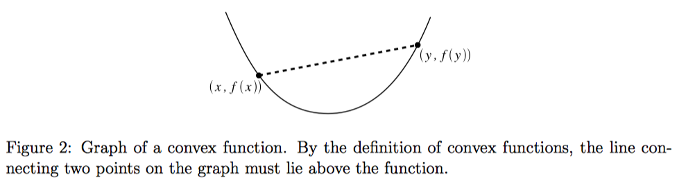
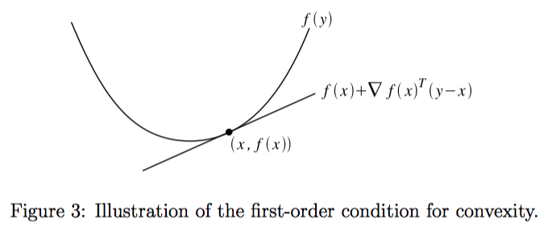
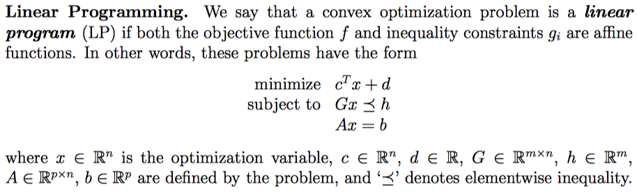
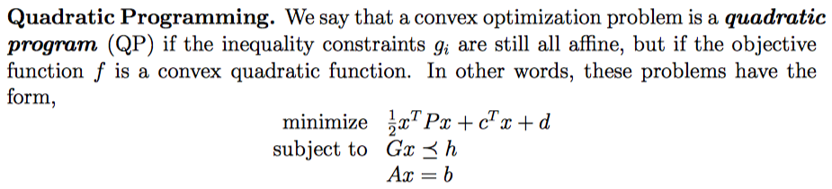
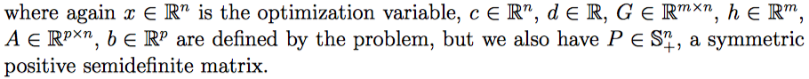
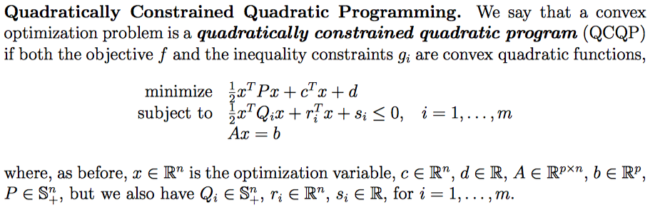
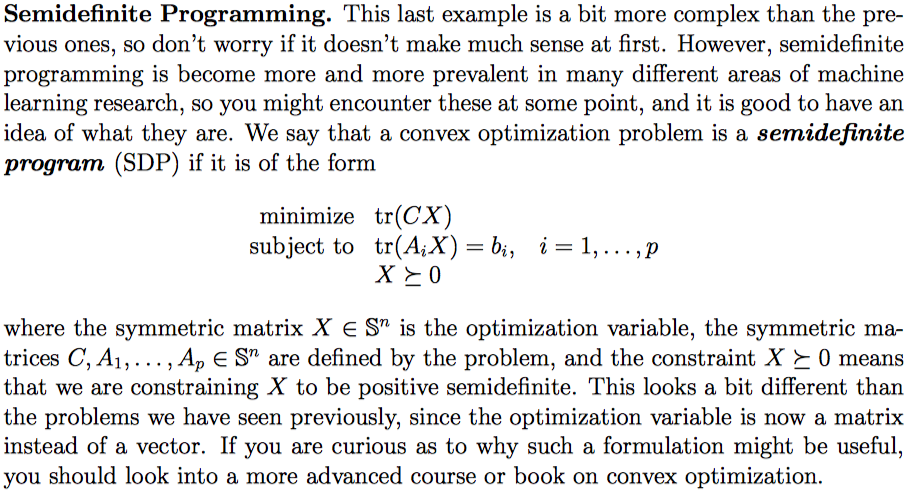

# 凸集

如果集合中任意元素$x,y$，对于$0 \le \theta \le 1$，组合后$\theta x + (1-\theta)y$也在集合中，则此集合为凸集。

有限个凸集的交仍然是凸集。

# 凸函数

如果函数定义域是凸集，然后能够满足对于任意元素$x,y$，对于$0 \le \theta \le 1$，满足：$f(\theta x + (1-\theta)y) \le \theta f(x) + (1-\theta)f(y)$，则函数为凸函数。

# 一阶凸性

一阶凸性实际上就是定义域为凸集，同时满足：
$$
f(y) \ge f(x) + \nabla_x f(x)^T(y-x)
$$

# 二阶凸性

二阶凸性实际上就是满足定义域为凸集，同时满足Hessian矩阵为半正定$\nabla_x^2 f(x) \ge 0$

# Jensen不等式

假设$f(x)$是凸函数，这里可以有如下几种不等式的形式：
$$
f(\theta x + (1-\theta)y) \le \theta f(x) + (1-\theta)f(y), 0 \le \theta \le 1
$$

$$
f(\sum_{i=1}^k \theta_i x_i) \le \sum_{i=1}^k \theta_i f(x_i), \sum_{i=1}^k \theta_i = 1, \theta_i \ge 0
$$

$$
f(\int p(x)xdx) \le \int p(x)f(x)dx, \int p(x)dx=1, p(x) \ge 0
$$

$$
f(E[x]) \le E[f(x)]
$$

# $\alpha$-sublevel set

对于凸函数，其定义域内满足$f(x) \le \alpha$的所有的$x$，这个集合称为$\alpha$-sublevel set。这种集合一定是凸集

# 凸优化问题

凸优化问题的一般形式如下：
$$
\text{minimize f(x)} \\
\text{subject to } x \in C \\
\text{f is a convex function} \\
C \text{ is a convex set}
$$
也可以更明确地写为：
$$
\text{minimize f(x)} \\
\text{subject to } g_i(x) \le 0, i=1,...,m \\
h_i(x)=0, i=1,...,p \\
\text{f is a convex function} \\
g_ i \text{are convex functions} \\
h_i \text{are affine functions (仿射函数)}
$$
这里需要注意，$g_i$一定要小于0，这样可以保证可行解的集合是凸集。如果我们要求$g_i$对于某些i是大于0的，那么可行解的集合就不一定是凸集了。道理很简单，每个$g_i$的解是一个集合，如果我们能够保证每个解的集合都是$\alpha$-sublevel set，那么最后整个问题的解，也就是这些解的交集，一定是凸集。

这里有一个定理：**对于凸优化问题，局部极小点一定也是全局极小点**

# 一些特殊形式的凸优化问题

## 线性规划

## 二次规划

## QCPC

## Semidefinite Programming

