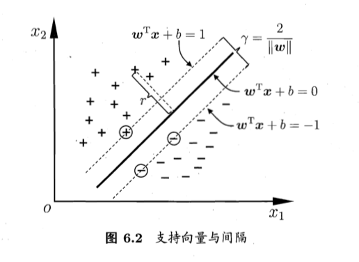
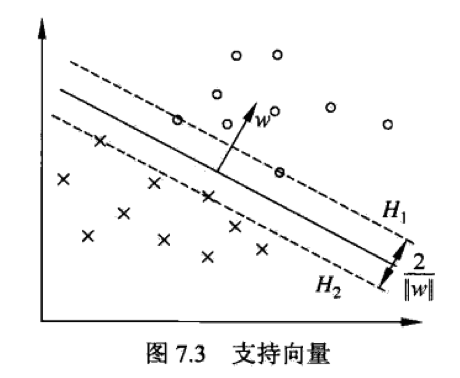
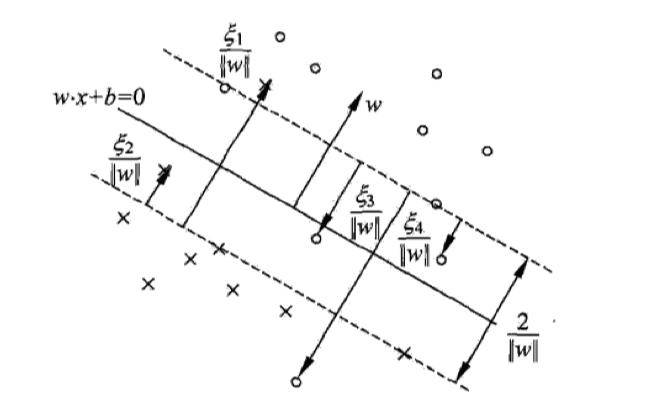
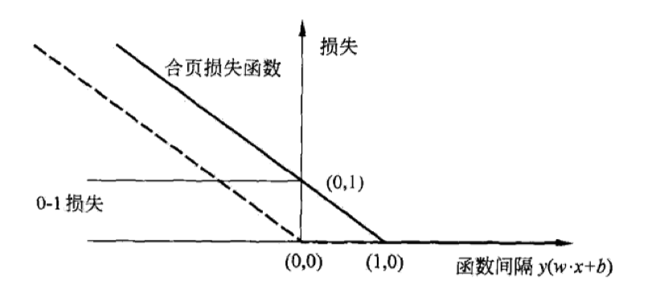
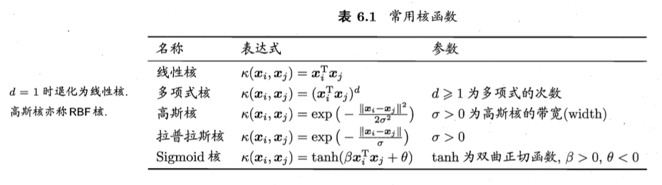
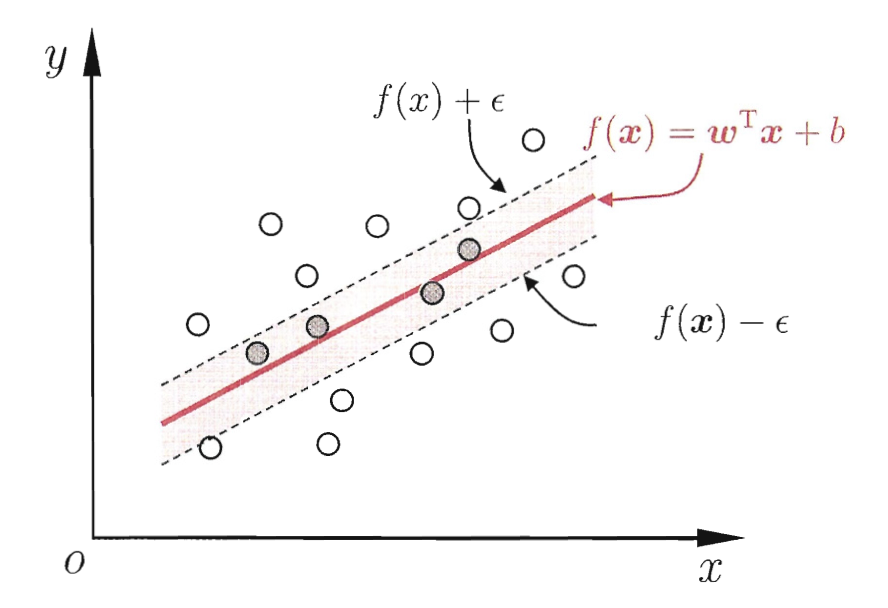
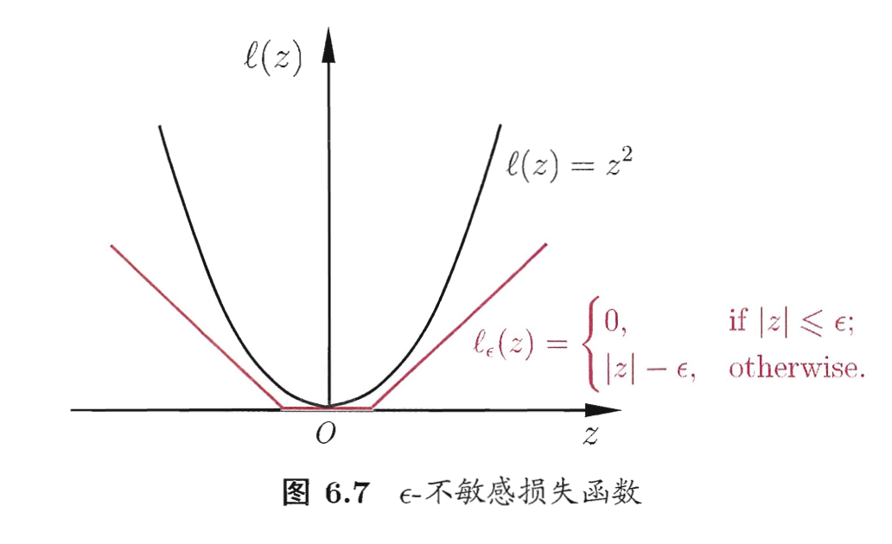

# 支持向量机

> 支持向量机是一种二分类模型，最基本的SVM是定义在特征空间上的间隔最大的线性分类器。间隔最大使得它与感知机不同。SVM还包含核技巧，使得SVM能够作为非线性分类器。支持向量机的学习策略就是间隔最大化，可形式化为一个求解凸二次规划的问题，也等价于正则化的合页损失函数的最小化问题。SVM的学习算法是求解凸二次规划的最优化算法。当输入空间为欧氏空间或离散集合，特征空间为希尔伯特空间时，核函数表示将输入从输入空间映射到特征空间得到的特征向量之间的内积。通过使用核函数可以学习非线性SVM，等价于隐式地在高维的特征空间中学习线性SVM。这样的方法称为核技巧。

# SVM的分类

- 线性可分SVM：硬间隔最大化
- 线性SVM：软间隔最大化
- 非线性SVM：核技巧和软间隔最大化

# 线性可分SVM

给定线性可分的训练数据集，通过间隔最大化或求解相应的凸二次规划问题学习得到的分离超平面为：

$$
\omega \cdot x + b = 0
$$

以及相应的分类决策函数

$$
f(x) = sign(\omega \cdot x + b)
$$

这称为线性可分SVM

## 函数间隔

对于给定的训练集和超平面，定义超平面关于样本点$x_i,y_i$的函数间隔为（注意$y_i$取值为$+1,-1$）

$$
\hat{\gamma_i} = y_i(\omega \cdot x_i + b)
$$

## 几何间隔

函数间隔对参数$\omega$和$b$的大小有依赖，如果这两个参数变成原来的两倍，虽然函数间隔变成了原先的两倍，但是超平面还是同一个。这就需要我们队超平面的法向量加一些约束，使得间隔是确定的，这样就得到了几何间隔：

$$
\gamma_i = y_i(\dfrac{\omega}{||\omega||} \cdot x_i + \dfrac{b}{||\omega||})
$$

如果$||\omega||=1$，那么函数间隔和几何间隔相等。如果超平面的两个参数成比例地改变，函数间隔也按照此比例改变，但几何间隔不变。

$$
\gamma=\dfrac{\hat{\gamma}}{||\omega||}
$$

## 间隔最大化

最大化间隔分离超平面，可以表述为下面的约束最优化问题：

$$
{max}_{\omega,b} \text{ $\gamma$} \\
\text{s.t. } y_i (\dfrac{\omega}{||\omega||} \cdot x_i + \dfrac{b}{||\omega||}) \ge \gamma
$$

利用几何间隔和函数间隔的关系，可以等价为：

$$
{max}_{\omega,b} \text{ $\dfrac{\hat{\gamma}}{||\omega||}$} \\
\text{s.t. } y_i (\omega \cdot x_i + b) \ge \hat{\gamma}
$$

最大化$\dfrac{1}{||\omega||}$和最小化$\dfrac{1}{2}||\omega||^2$是等价的，于是又可以等价为：

$$
{min}_{\omega,b} \dfrac{1}{2}||\omega||^2 \\
\text{s.t. } y_i (\omega \cdot x_i + b) - 1 \ge 0
$$

这是一个凸二次规划问题。

凸优化问题是指约束最优化问题：

$$
{min}_\omega f(\omega) \\
\text{s.t. } g_i(\omega) \le 0 \\
h_j(\omega) = 0
$$

第一式和第二式是连续可微的凸函数，第三式是仿射函数。

当第一式是二次函数且第二式是仿射函数的时候，上述的凸优化问题成为凸二次规划问题。

**若数据集线性可分，则可将训练集中的样本点完全正确分开的最大间隔分离超平面存在且唯一。**

## 支持向量和间隔边界

在线性可分的情况下，训练集的样本点中与分离超平面距离最近的样本点的实例叫做支持向量，他们能够满足式：

$$
\text{s.t. } y_i (\omega \cdot x_i + b) - 1 \ge 0
$$

即

$$
y_i(\omega \cdot x_i + b) - 1 = 0
$$

图中在$H_1$和$H_2$上的点就是支持向量。

决定分离超平面时只有支持向量起作用，而其他实例点并不起作用。如果移动支持向量将改变所求解；但如果移动甚至去掉间隔边界外的样本点，则解是不会改变的。由于支持向量在确定分离超平面中起着决定性的作用，所以这种模型称为支持向量机。支持向量的数量一般比较少，换言之这个模型实际上是由部分相对“重要”的训练样本确定的。

## 对偶

对偶的优点在于，对偶问题往往更容易求解，同时对偶问题能够自然地引入核函数，从而推广到非线性分类问题。

构造拉格朗日函数：

$$
L(\omega,b,\alpha)=\dfrac{1}{2}||\omega||^2-\sum_{i=1}^N \alpha_i y_i(\omega \cdot x_i + b)+\sum_{i=1}^N\alpha_i
$$

根据拉格朗日对偶性，原始问题的对偶问题是极大极小问题：

$$
{max}_{\alpha}{min}_{\omega,b}L(\omega,b,\alpha)
$$

拉格朗日函数分别对参数$\omega$和$b$求导，并令导数为0。得到的结果直接代入拉格朗日函数：

$$
L(\omega,b,\alpha)=-\dfrac{1}{2}\sum_{i=1}^N\sum_{j=1}^N \alpha_i \alpha_j y_i y_j(x_i \cdot x_j)+\sum_{i=1}^N \alpha_i
$$

最终可以得到：

$$
{min}_{\alpha}\dfrac{1}{2}\sum_{i=1}^N\sum_{j=1}^N \alpha_i \alpha_j y_i y_j(x_i \cdot x_j)-\sum_{i=1}^N \alpha_i \\
\text{s.t. } \sum_{i=1}^N \alpha_i y_i = 0 \\
\alpha_i \ge 0
$$

## 线性可分SVM的学习算法

1. 构造并求解约束最优化问题，公式就是上面这个👆；求得最优解$\alpha^*=(a_1^*,a_2^*,...,a_N^*)^T$
2. 计算
$$
\omega^*=\sum_{i=1}^N \alpha_i^* y_i x_i
$$
并选择$\alpha^*$的一个正分量$\alpha_j^*$，计算
$$
b^*=y_j-\sum_{i=1}^N \alpha_i^* y_i(x_i \cdot x_j)
$$
3.求得分离超平面和分类决策函数：
$$
\omega^* \cdot x + b^* = 0 \\
f(x)=sign(\omega^* \cdot x + b^*)
$$

# 线性SVM

线性不可分意味着某些样本点不能满足函数间隔大于1的约束条件。为了解决这个问题，可以对每个样本点引入一个松弛变量$\xi_i \ge 0$，使得函数间隔加上松弛变量大于等于1。这样，约束条件变为：

$$
y_i(\omega \cdot x_i + b) \ge 1-\xi_i
$$

同时，对每个松弛变量$\xi_i$，付出一个代价$\xi_i$，目标函数由原来的$\dfrac{1}{2}||\omega||^2$变为：

$$
\dfrac{1}{2}||\omega||^2+C\sum_{i=1}^N \xi_i
$$

这里，$C>0$称为惩罚参数，一般由应用问题决定。$C$值大时，对误分类的惩罚增大，$C$值小时，对误分类的惩罚减小。最小化目标函数有两层含义，一是尽量使间隔最大，二是使误分类点的个数尽量小，$C$是调和二者的系数。

上面这种思路就称为软间隔最大化。

线性不可分的线性SVM的学习问题变成如下的凸二次规划（原始问题）：

$$
{min}_{\omega,b,\xi}\dfrac{1}{2}||\omega||^2+C\sum_{i=1}^N\xi_i \\
\text{s.t. } y_i(\omega\cdot x_i+b)\ge 1-\xi_i \\
\xi_i \ge 0 \\
i=1,2,...,N
$$

这个问题的解，$\omega$是唯一的，但是$b$的解是不唯一的，$b$的解存在一个区间。

## 对偶

原始问题的对偶问题如下：

$$
{min}_{\alpha}\dfrac{1}{2}\sum_{i=1}^N\sum_{j=1}^N \alpha_i \alpha_j y_i y_j(x_i \cdot x_j)-\sum_{i=1}^N \alpha_i \\
\text{s.t. } \sum_{i=1}^N \alpha_i y_i = 0 \\
0 \le \alpha_i \le C
$$

构造的拉格朗日函数为：

$$
L(\omega,b,\xi,\alpha,\mu)=\dfrac{1}{2}||\omega||^2+C\sum_{i=1}^N \xi_i - \sum_{i=1}^N \alpha_i(y_i(\omega \cdot x_i + b)-1+\xi_i)-\sum_{i=1}^N \mu_i \xi_i \\
\alpha_i,\mu_i \ge 0
$$

拉格朗日函数对$\omega,b,\mu$三个参数求导并设为0，得到的结果直接代入拉格朗日函数，再进行简单的数学变换后就得到了对偶问题。

## 线性SVM的学习算法

1. 选择惩罚参数$C \gt 0$，构造并求解凸二次规划问题👆，求得最优解$\alpha^*=(a_1^*,a_2^*,...,a_N^*)^T$；
2. 计算
$$
\omega^*=\sum_{i=1}^N \alpha_i^* y_i x_i
$$
并选择$\alpha^*$的一个分量$\alpha_j^*$，满足条件$0<\alpha_j^*<C$，计算
$$
b^*=y_j-\sum_{i=1}^N \alpha_i^* y_i(x_i \cdot x_j)
$$
3.求得分离超平面和分类决策函数：
$$
\omega^* \cdot x + b^* = 0 \\
f(x)=sign(\omega^* \cdot x + b^*)
$$

对于步骤2，对任意满足条件的$\alpha_j^*$都可以求出$b^*$，实际计算时可以取在所有符合条件的样本点上的平均值。

## 支持向量

软间隔的支持向量$x_i$或者在间隔边界上，或者在间隔边界与分离超平面之间，或者在分离超平面误分的一侧。

## 合页损失函数

线性SVM还有另外一种解释，就是最小化以下目标函数：

$$
\sum_{i=1}^N [1-y_i(\omega \cdot x_i+b)]_+ + \lambda ||\omega||^2
$$

目标函数的第一项是经验损失或者经验风险，函数

$$
L(y(\omega \cdot x + b))=[1-y(\omega \cdot x + b)]_+
$$

称为合页损失函数。下标的“+”表示以下取正值的函数：

$$
[z]_+=\begin{cases}
z & z \gt 0 \\
0 & z \le 0
\end{cases}
$$

也就是说，当样本被正确分类且函数间隔$y_i(\omega \cdot x_i+b)$大于1时，损失是0，否则损失是$1-y_i(\omega \cdot x_i+b)$。

目标函数的第二项是正则化项。

线性SVM的原始最优化问题：

$$
{min}_{\omega,b,\xi}\dfrac{1}{2}||\omega||^2+C\sum_{i=1}^N\xi_i \\
\text{s.t. } y_i(\omega\cdot x_i+b)\ge 1-\xi_i \\
\xi_i \ge 0 \\
i=1,2,...,N
$$

等价于最优化问题

$$
{min}_{\omega,b}\sum_{i=1}^N [1-y_i(\omega \cdot x_i+b)]_+ + \lambda ||\omega||^2
$$

# 核函数

## 核函数

假设X是输入空间，H为特征空间，如果存在X到H的映射，使得对所有的$x,z \in X$，函数$K(x,z)$满足条件

$$
K(x,z)=\phi(x) \cdot \phi(z)
$$

则称$K(x,z)$为核函数，$\phi(x)$为映射函数，式中的$\phi(x) \cdot \phi(z)$为内积。

核技巧的基础想法是，在学习和预测中只定义核函数，而不显式地定义映射函数，因为一般情况下计算核函数比较容易而计算映射函数比较难。

从前面的线性SVM中可以看出，对偶问题的目标函数中的内积$x_i \cdot x_j$可以用核函数$K(x,z)=\phi(x) \cdot \phi(z)$来代替。此时对偶问题的目标函数成为：

$$
W(\alpha)=\dfrac{1}{2}\sum_{i=1}^N \sum_{j=1}^N \alpha_i \alpha_j y_i y_j K(x_i,x_j)-\sum_{i=1}^N
\alpha_i
$$

分类决策函数中的内积也可以用核函数替代：

$$
f(x)=sign(\sum_{i=1}^{N_s} a_i^* y_i \phi(x_i) \cdot \phi(x) + b^*)=sign(\sum_{i=1}^{N_s} a_i^* y_i K(x_i,x)+b)
$$

这就相当于利用映射函数把原来的输入空间变换到一个新的特征空间，将输入空间中的内积变换为特征空间中的内积，在新的特征空间里从训练样本中学习线性SVM。

## 正定核

一般情况下说的核函数是正定核函数。

假设$K(x,z)$是定义在$X \times X$上的对称函数，并且对任意的$x_1,...,x_m\in X$，$K(x,z)$关于$x_1,...,x_m$的Gram矩阵是半正定的，可以根据函数$K(x,z)$构成一个希尔伯特空间，步骤是：定义映射$\phi$并构成向量空间$S$；在$S$上定义内积构成内积空间；最后将$S$完备化构成希尔伯特空间。

正定核的充要条件：

设$K: X \times X->R$是对称函数，则$K(x,z)$为正定核函数的充要条件是对任意的$x_i\in X$，$K(x,z)$对应的Gram矩阵$K=[K(x_i,x_j)]_{m\times m}$是半正定矩阵。

换言之，如果Gram矩阵是半正定矩阵，则$K$为正定核。

## 常见的核函数

核函数还可以通过组合得到，例如线性组合和直积，也可以通过：

$$
K(x,z)=g(x)K(x,z)g(z)
$$

$K$为核函数，$g$为任意函数。

# 非线性SVM

利用核函数，我们可以直接写出非线性SVM的算法：

1. 选取适当的核函数$K(x,z)$和适当的参数C，构造并求解最优化问题：
$$
{min}_\alpha\dfrac{1}{2}\sum_{i=1}^N \sum_{j=1}^N \alpha_i \alpha_j y_i y_j K(x_i,x_j)-\sum_{i=1}^N \alpha_i \\
\text{s.t. } \sum_{i=1}^N \alpha_i y_i = 0 \\
0 \le \alpha_i \le C
$$
并求得最优解$\alpha^*=(\alpha_1^*,...,\alpha_N^*)^T$;
2. 选择$\alpha^*$的一个正分量$0 \lt \alpha^* \lt C$，计算$b^*=y_j-\sum_{i=1}^N \alpha_i^* y_i K(x_i \cdot x_j)$;
3. 构造决策函数$f(x)=sign(\sum_{i=1}^N \alpha_i^* y_i K(x \cdot x_i)+b^*)$，当$K$为正定核时，1~3是凸二次规划问题，解是存在的

# 序列最小最优化算法（SMO）

SMO算法求解的是如下凸二次规划的对偶问题：

$$
{min}_\alpha\dfrac{1}{2}\sum_{i=1}^N \sum_{j=1}^N \alpha_i \alpha_j y_i y_j K(x_i,x_j)-\sum_{i=1}^N \alpha_i \\
\text{s.t. }\sum_{i=1}^N \alpha_i y_i = 0 \\
0 \le \alpha_i \le C
$$

SMO算法的基本思路是：如果所有变量的解都满足此优化问题的KKT条件，那么这个最优化问题的解就得到了。因为KKT条件是该最优化问题的充要条件。否则，选择两个变量，固定其他变量，针对这两个变量构建一个二次规划问题，这个二次规划问题关于这两个变量的解应该更接近原始二次规划问题的解，因为这会使得原始二次规划问题的目标函数值变得更小。重要的是，此时子问题可以通过解析方法求解，就极大地提升了运算速度。子问题有两个变量，一个是违反KKT条件最严重的那个，另一个由约束条件自动确定。如此，SMO算法将原问题不断分解为子问题并对子问题求解，进而达到求解原问题的目的。

注意，子问题的两个变量中只有一个是自由变量。假设$\alpha_1,\alpha_2$为两个变量，$\alpha_3,...,\alpha_N$固定，那么由等式约束可知：

$$
\alpha_1 = -y_1 \sum_{i=2}^N \alpha_i y_i
$$

如果$\alpha_2$确定，那么$\alpha_1$也随之确定。所以子问题同时更新两个变量。

如何确定偏移项$b$呢？注意到对任意的支持向量$(x_i,y_i)$都有$y_i f(x_i)=1$，即

$$
y_j (\sum \alpha_i y_i x_i x_j+b)=1
$$

实际应用中会使用所有支持向量求解的平均值。

# 支持向量回归（SVR）

一般的SVM中，只有当模型输出$f(x)$和样本的真实值$y$完全一致时，才不计入损失，而SVR则是允许模型输出$f(x)$和样本的真实值$y$有一定的偏差，在这个偏差范围内，不计入损失。

SVR的模型可以表述为：

$$
{min}_{\omega,b} \dfrac{1}{2}||\omega||^2+C\sum_{i=1}^m l_{\epsilon} (f(x_i)-y_i)
$$

其中，$C$为正则化损失，而$l_{\epsilon}$是$\epsilon$不敏感损失：

引入松弛变量$\xi_i$，$\hat{\xi_i}$，则优化目标可以改写为：

$$
{min}_{\omega,b,\xi_i,\hat{\xi_i}} \dfrac{1}{2}||\omega||^2+C\sum_{i=1}^m (\xi_i+\hat{\xi_i}) \\
\text{s.t. } f(x_i)-y_i \le \epsilon+\xi_i \\
y_i -f(x_i) \le \epsilon+\hat{\xi_i} \\
\xi_i \ge 0 \\
\hat{\xi_i} \ge 0 \\
i=1,...,m
$$

根据上述公式构造拉格朗日函数并对四个参数分别求导并设为0，然后得到的结果代入原公式，则有：

$$
{max}_{\alpha,\hat{\alpha}}\sum_{i=1}^m y_i(\hat{\alpha_i}-\alpha_i)-\epsilon(\hat{\alpha_i}+\alpha_i)-\dfrac{1}{2}\sum_{i=1}^m \sum_{j=1}^m(\hat{\alpha_i}-\alpha_i)(\hat{\alpha_j}-\alpha_j)x_i^Tx_j \\
\text{s.t. } \sum_{i=1}^m (\hat{\alpha_i}-\alpha_i)=0 \\
0 \le \alpha_i, \hat{\alpha_i} \le C
$$

其中，$\alpha_i$和$\hat{\alpha_i}$分别是构造拉格朗日函数时，约束条件第一个公式和第二个公式的系数。

SVR的解最终可以表示为：

$$
f(x)=\sum_{i=1}^m (\hat{\alpha_i}-\alpha_i)x_i^Tx + b
$$

那些能够让$\hat{\alpha_i}-\alpha_i \ne 0$的$x$，就是那些落在间隔带之外的样本，也就是我们的支持向量。与SVM一样，SVR的支持向量也仅仅只是样本中的一部分，解仍然具有稀疏性。

当然，SVR也可以用核函数来表示：

$$
f(x)=\sum_{i=1}^m (\hat{\alpha_i}-\alpha_i)K(x,x_i)+b \\
K(x_i,x_j)=\phi(x_i)^T\phi(x_i)
$$

