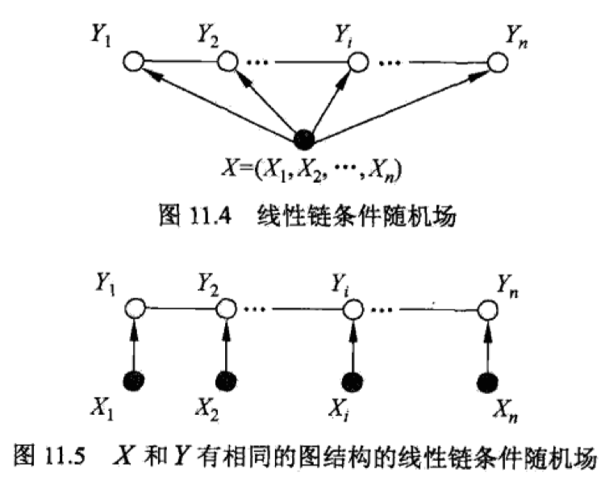

> 条件随机场是给定一组输入随机变量条件下，另一组输出随机变量的条件概率分布模型。特点是假设输出随机变量构成马尔科夫随机场。

## 概率无向图

概率无向图模型，又称为马尔科夫随机场，是一个可以由无向图表示的联合概率分布

概率图模型是由图表示的概率分布。设有联合概率分布$P(Y)$是一组随机变量，由无向图$G=(V,E)$表示概率分布$P(Y)$，即在图$G$中，节点$v \in V$表示一个随机变量$Y_v,Y=(Y_v)_{v \in V}$；边$e \in E$表示随机变量之间的概率依赖关系

**成对马尔可夫性**：设u和v是无向图G中任意两个没有边连接的节点，节点u和v分别对应随机变量$Y_u$和$Y_v$。其他所有节点为O，对应的随机变量组是$Y_O$。成对马尔可夫性是指给定随机变量组$Y_O$的条件下随机变量$Y_u$和$Y_v$是条件独立的，即：
$$
P(Y_u,Y_v|Y_O) = P(Y_u|Y_O)P(Y_v|Y_O)
$$
**局部马尔可夫性**：设$v \in V$是无向图中任意一个节点，$W$是与$v$有边连接的所有节点，O是v、W以外的其他所有节点。v表示的随机变量组$Y_v$，W表示的随机变量组是$Y_W$，O表示的随机变量组是$Y_O$，局部马尔可夫性是指在给定随机变量组$Y_W$的条件下随机变量$Y_v$与随机变量组$Y_O$是独立的，即：
$$
P(Y_v,Y_O|Y_W)=P(Y_v|Y_W)P(Y_O|Y_W)
$$
在$P(Y_O|Y_W)\gt0$时，等价有：
$$
P(Y_v|Y_W)=P(Y_v|Y_W,Y_O)
$$

**全局马尔科夫性**：设节点集合A、B是无向图G中被节点集合C分开的任意节点集合。A、B、C对应的随机变量组分别为$Y_A$、$Y_B$、$Y_C$。全局马尔科夫性是指给定随机变量组$Y_C$条件下随机变量组$Y_A$和$Y_B$是条件独立的，即：
$$
P(Y_A,Y_B|Y_C) = P(Y_A|Y_C)P(Y_B|Y_C)
$$
成对、局部和全局马尔科夫性是等价的

**概率无向图模型**：设有联合概率分布$P(Y)$，由无向图$G=(V,E)$表示，在图G中，节点表示随机变量，边表示随机变量之间的依赖关系。如果联合概率分布$P(Y)$满足成对、局部或全局马尔科夫性，就称此联合概率分布为概率无向图模型或者马尔科夫随机场

**团与最大团**：无向图G中任何两个节点均有边连接的节点子集称为团。若C为无向图G的一个团，且不能再加进任何一个G的节点使其成为一个更大的团，则称此C为最大团

将无向图模型的联合概率分布表示为其最大团上的随机变量的函数乘积形式的操作，称为概率无向图模型的因子分解。

概率无向图模型的联合概率分布$P(Y)$可以改变为如下形式：
$$
P(Y)=\dfrac{1}{Z}\prod_C \Psi_C(Y_C) \\
Z = \sum_Y \prod_C \Psi_C(Y_C)
$$
其中，C是无向图的最大团，$Y_C$是C的节点对应的随机变量，$\Psi_C(Y_C)$是C上定义的严格正函数，乘积是在无向图上所有的最大团上进行的。

$\Psi_C(Y_C)$称为势函数，一般定义为指数函数：$\Psi_C(Y_C)=exp[-E(Y_C)]$

## 条件随机场

设X与Y是随机变量，$P(Y|X)$是在给定X的条件下Y的条件概率分布，若随机变量Y构成一个由无向图$G=(V,E)$表示的马尔科夫随机场，即：
$$
P(Y_v|X,Y_w,w \neq v)=P(Y_v|X,Y_w,w \sim v)
$$
对任意节点v成立，则称条件概率分布$P(Y|X)$为条件随机场。式中$w \sim v$表示在图G中与节点v有边连接的所有节点w；$w \neq v$表示节点v以外的所有节点

设$X=(X_1,...,X_n), Y=(Y_1,...,Y_n)$均为线性链表示的随机变量序列，若在给定随机变量序列X的条件下，随机变量序列Y的条件概率分布$P(Y|X)$构成条件随机场，即满足马尔科夫性：
$$
P(Y_i|X,Y_1,...,Y_{i-1},Y_{i+1},...,Y_n)=P(Y_i|X,Y_{i-1},Y_{i+1}),i=1,2,...,n
$$
在$i=1$和$i=n$时只考虑单边

则称$P(Y|X)$为线性链条件随机场。在标注问题中，X表示输入观测序列，Y表示对应的输出标记序列或状态序列

设$P(Y|X)$为线性链条件随机场，则在随机变量X取值为x的条件下，随机变量Y取值为y的条件概率具有如下形式：
$$
P(y|x)=\dfrac{1}{Z(x)}exp \left( \sum_{i,k}\lambda_k t_k(y_{i-1},y_i,x,i) + \sum_{i,l} \mu_l s_l(y_i,x,i) \right) \\
Z(x) = \sum_y exp \left( \sum_{i,k} \lambda_k t_k(y_{i-1},y_i,x,i) + \sum_{i,l} \mu_l s_l(y_i,x,i) \right)
$$
其中，$t_k$和$s_l$是特征函数，$\lambda_k$和$\mu_l$是对应的权值，$Z(x)$是规范化因子，求和是在所有可能的输出序列上进行的

上式是线性链条件随机场模型的基本形式，表示给定输入序列x，对输出序列y预测的条件概率。其中，$t_k$是定义在边上的特征函数，称为转移特征，依赖于当前和前一个位置；$s_l$是定义在节点上的特征函数，称为状态特征，依赖于当前位置。$t_k$和$s_l$都依赖于位置，是局部特征函数。通常，特征函数$t_k$和$s_l$取值为1或0，当满足特征条件时取值为1，否则为0。条件随机场完全由特征函数$t_k$和$s_l$和对应的权值$\lambda_k$和$\mu_l$确定

线性链条件随机场也是对数线性模型

上面两个公式的含义是，对于i，我们有边和节点对应的转移特征和状态特征，然后它们又有各自对应的权重，将它们相乘相加，再对i求和，得到最终结果。因此，设有$K_1$个转移特征和$K_2$个状态特征，上述公式也可以简化：
$$
P(y|x)=\dfrac{1}{Z(x)} exp \sum_{k=1}^K w_k f_k(y,x) \\
Z(x) = \sum_y exp \sum_{k=1}^K w_k f_k(y,x) \\
w_k = \lambda_k, k=1,2,...,K_1 \\
w_k = \mu_l, k=K_1+l; l=1,2,...K_2 \\
K = K_1 + K_2 \\
f_k(y,x)=\sum_{i=1}^n f_k(y_{i-1},y_i,x,i), k = 1,2,...,K \\
f_k(y_{i-1},y_i,x,i)=t_k(y_{i-1},y_i,x,i), k=1,2,...,K_1 \\
f_k(y_{i-1},y_i,x,i)=s_l(y_i,x,i), k=K_1+l; l=1,2,...,K_2
$$
条件随机场也能表示为矩阵形式：
$$
M_i(x)=[M_i(y_{i-1},y_i|x)] \\
M_i(y_{i-1},y_i|x)=exp(W_i(y_{i-1},y_i|x)) \\
W_i(y_{i-1},y_i|x)=\sum_{i=1}^K w_k f_k(y_{i-1},y_i,x,i) \\
P_w(y|x)=\dfrac{1}{Z_w(x)}\prod_{i=1}^{n+1} M_i(y_{i-1},y_i|x) \\
Z_w(x)=(M_1(x)M_2(x)...M_{n+1}(x))_{start,stop}
$$

规范化因子Z是以start为七点stop为重点通过状态的所有路径$y_1,y_2,...,y_n$的非规范化概率之和

#### 概率计算的前向-后向算法

对每个指标$i=0,1,...,n+1$，定义前向向量$\alpha_i(x)$：
$$
\alpha_0(y|x) = \begin{cases}
    1,  & y=start \\
    0, & y \neq start
    \end{cases} \\
\alpha_i^T(y_i|x)=\alpha_{i-1}^T(y_{i-1}|x)M_i(y_{i-1},y_i|x), i=1,2,...,n+1
$$
定义后向向量$\beta_i(x)$：
$$
\beta_{n+1}(y_{n+1}|x) = \begin{cases}
    1,  & y_{n+1}=stop \\
    0, & y \neq stop
    \end{cases} \\
\beta_i(y_i|x) = M_i(y_i,y_{i+1}|x)\beta_{i-1}(y_{i+1}|x)
$$

$$
P(Y_i=y_i|x)=\dfrac{\alpha_i^T(y_i|x)\beta_i(y_i|x)}{Z(x)} \\
P(Y_{i-1}=y_{i-1},Y_i=y_i|x)=\dfrac{\alpha_{i-1}^T(y_{i-1}|x)M_i(y_{i-1},y_i|x)\beta_i(y_i|x)}{Z(x)} \\
Z(x) = \alpha_n^T(x) \cdot 1 \\
E_{P(Y|X)}[f_k] = \sum_y P(y|x)f_k(y,x)=\sum_{i=1}^{n+1} \sum_{y_{i-1}y_i} f_k(y_{i-1},y_i,x,i)\dfrac{\alpha_{i-1}^T(y_{i-1}|x)M_i(y_{i-1},y_i|x)\beta_i(y_i|x)}{Z(x)}, k=1,2,..,K \\
Z(x) = \alpha_n^T \cdot 1 \\
E_{P(X,Y)}[f_k] = \sum_{x,y}P(x,y)\sum_{i=1}^{n+1} f_k(y_{i-1},y_i,x,i)=\sum_x \tilde{P}(x)\sum_y P(y|x) \sum_{i=1}^{n+1} f_k(y_{i-1},y_i,x,i)=\sum_x \tilde{P}(x) \sum_y P(y|x) \sum_{i=1}^{n+1} f_k(y_{i-1},y_i,x,i)=\sum_x \tilde{P}(x) \sum_{i=1}^{n+1} \sum_{y_{i-1},y_i} f_k(y_{i-1},y_i,x,i)\dfrac{\alpha_{i-1}^T(y_{i-1}|x)M_i(y_{i-1},y_i|x)\beta_i(y_i|x)}{Z(x)}, k=1,2,...,K
$$

#### 学习算法

##### 改进的迭代尺度法

输入：特征函数$t_1,...,t_{K_1}$，$s_1,...,s_{K_2}$，经验分布$\tilde{P}(x,y)$

输出：参数估计值$\hat{w}$，模型$P_w$

1. 对所有$k \in \{ 1,2,...,K \}$，取初始化值$w_k=0$

2. 对每一个$k$:

   a. 当$k=1,2,...,K_1$时，令$\delta_k$是方程
   $$
   \sum_{x,y} \tilde{P}(x)P(y|x) \sum_{i=1}^{n+1} t_k(y_{i-1},y_i,x,i)exp(\delta_k T(x,y))=E_{\tilde{P}}[t_k] \\
   T(x,y) = \sum_k f_k(y,x) = \sum_{k=1}^K \sum_{i=1}^{n+1} f_k(y_{i-1},y_i,x,i)
   $$
   的解

   b. 更新$w_k$的值，$w_k=w_k+\delta_k$

3. 如果不是所有的$w_k$都收敛，就重复步骤2

##### BFGS算法

输入：特征函数$f_1,...,f_n$，经验分布$\tilde{P}(X,Y)$

输出：最优参数值$\hat{w}$，最优模型$P_{\hat{w}}(y|x)$

1. 选定初始点$w_0$，取$B_0$为正定对称矩阵，置$k=0$

2. 计算$g_k=g(w^{(k)})$，若$g_k=0$，停止计算，否则到3

3. 通过$B_k p_k = -g_k$求出$p_k$

4. 一维搜索：求满足$f(w^{(k)}+\lambda_k p_k)=min_{\lambda \ge0} f(w^{(k)}+\lambda p_k)$

5. $w^{(k+1)}=w^{(k)}+\lambda_k p_k$

6. 计算$g_{k+1}=g(w^{(k+1)})$，若$g_k=0$，停止计算，否则按照下面的公式求出$B_{k+1}$：
   $$
   B_{k+1}=B_k+\dfrac{y_k y_k^T}{y_k^T \delta_k}-\dfrac{B_k \delta_k \delta_k^T B_k}{\delta_k^T B_k \delta_k} \\
   y_k = g_{k+1}-g_k \\
   \delta_k = w^{(k+1)}-w^{(k)}
   $$

7. $k=k+1$，转3

#### 预测算法（维特比算法）

输入：模型特征向量$F(y,x)$和权值向量$w$，观测序列$x=( x_1,...,x_n )$

输出：最优路径$y^*=(y_1^*,...,y_n^*)​$

1. 初始化：$\delta_1(j)=w \cdot F_1(y_0=start,y_1=j,x), j=1,2,...,m$

2. 递推：对$i=2,3,...,n$
   $$
   delta_i(l)=max_{1 \le j \le m} \delta_{i-1}(j) + w \cdot F_i(y_{i-1}=j,y_i=l,x),l=1,2,...m \\
   \Psi_i(l)=argmax_{1 \le j \le m} \delta_{i-1}(j) + w \cdot F_i(y_{i-1}=j,y_i=l,x),l=1,2,...,m
   $$

3. 终止：
   $$
   max_y(w \cdot F(y,x))=max_{1 \le j \le m} \delta_n(j) \\
   y_n^* = argmax_{1 \le j \le m} \delta_n(j)
   $$

4. 返回路径
   $$
   y_i^* = \Psi_{i+1}(y_{i+1}^*), i=n-1,n-2,...,1
   $$
   求得最优路径$y^*=(y_1^*,...,y_n^*)$