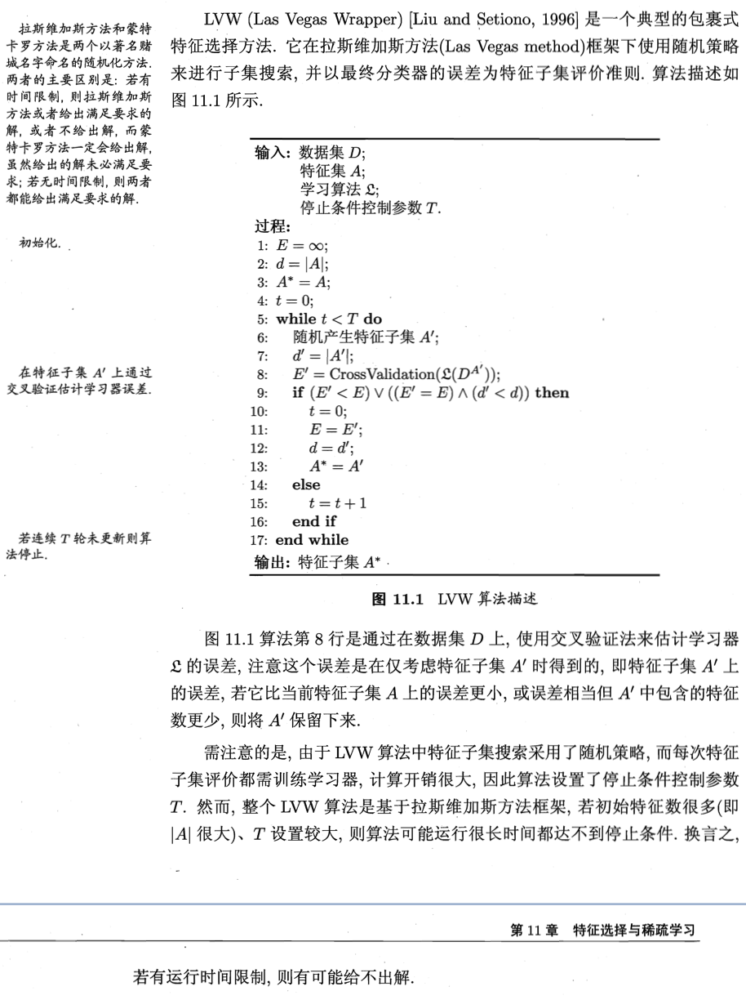

# 模型选择

## 普通方法

对于训练集$S$，我们在$S$上训练每个模型$M_i$，得到对应的假设（模型）$h_i$，选择训练误差最小的模型。

## 简单交叉验证

将训练集$S$分成训练集（70%）和交叉验证集（30%），在70%的训练集上训练每个模型$M_i$，得到得到对应的假设（模型）$h_i$，计算每个模型在交叉验证集上的误差，然后选择误差最小的一个。

## k折交叉验证

将训练集$S$随机划分为$k$个不相交的集合。对于每个模型$M_i$，我们用如下的步骤：

1. $M_i$在$S_1 \cup...\cup S_{j-1} \cup S_{j+1}...\cup S_k$上训练，即，挑出一个集合$S_j$，把剩下的全部集合作为训练集，训练模型并得到对应的假设$h_i$，然后在挑出的集合$S_j$上进行验证，得到误差$\epsilon_{S_j}(h_{ij})$；
2. 将1中的$j$从1遍历到$k$，然后得到$k$个验证误差，将他们求平均；
3. 选出平均误差最小的那个模型；

# 特征选择

## Wrapper Model Feature Selection（包裹式选择）

### Forward Search Method 

1. 初始化特征集合为空集；
2. 对于每一个特征，如果该特征不在特征集内，则尝试将该特征加入特征集，仅利用特征集中的特征进行模型训练；
3. 特征集中，训练误差最小的子集就是我们需要的集合；

### Backward Search Method

1. 初始化特征集合为全集；
2. 对于每一个特征，尝试从特征集合中剔除，然后用剔除后的集合进行模型训练；
3. 特征集的子集中，训练误差最小的就是我们需要的集合；

### 拉斯维加斯算法

## Filter Model Feature Selection（过滤式选择）

这个方法主要是基于信息论。

对于标签$y$和每个特征$x_i$，计算KL散度$KL(p(x_i,y)||p(x_i)p(y))$。当$x_i$和$y$完全不相关时，KL散度为0；而当$x_i$能够为$y$的确定提供足够多的信息时，$KL$散度就会很大。因此，我们选择KL散度大的几个特征。

### Relief算法

对于每个样本$x_i$，先在$x_i$的同类样本中寻找其最近邻$x_{i,nh}$，称为猜中近邻（near-hit）；再从$x_i$的异类样本中寻找其最近邻$x_{i,nm}$，称为猜错近邻，然后相关统计量对应于属性j的分量为：
$$
\delta^j = \sum_i -diff(x_i^j,x_{i,nh}^j)^2 + diff(x_i^j,x_{i,nm}^j)^2
$$
其中，$x_a^j$表示样本$x_a$在属性j上的取值；对于$diff(x_a^j,x_b^j)$，如果属性j为离散型，则$x_a^j=x_b^j$时，diff=0，否则diff=1；如果属性j为连续型，则$diff(x_a^j,x_b^j)=|x_a^j-x_b^j|$，注意$x_a^j,x_b^j$已经规范到$[0,1]$区间。

这个公式的意义是，如果$x_i$和其猜中近邻在属性j上的距离小于其猜错近邻，说明属性对于区分同类和异类样本是有益的，所以增大属性j对应的统计量分量，反之，则减小。最后，基于不同样本得到的估计结果进行平均，就得到各属性的相关统计量分量，分量值越大，则对应属性的分类能力就越强。

## 嵌入式选择

所谓嵌入式选择，其实就是在误差函数中加入L1或者L2正则化项。