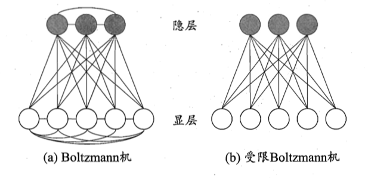

# 神经网络：一些常见的神经网络

# 径向基RBF网络

RBF网络可以表示为：

$$
\phi(x)=\sum_{i=1}^q \omega_i \rho(x,c_i)
$$

其中$q$为隐藏层神经元个数，$c_i$和$\omega_i$分别是第$i$个神经元对应的中心和权重，$\rho(x,c_i)$是径向基函数，这是某种沿径向对称的标量函数，通常定义为样本$x$到数据中心$c_i$之间的欧氏距离的单调函数，常用的高斯径向基函数形如：

$$
\rho(x,c_i)=e^{-\beta_i ||x-c_i||^2}
$$

具有足够多隐藏层神经元的RBF网络能够以任意精度逼近任意连续函数。

通常采用两步来训练RBF网络：1. 确定神经元中心$c_i$，常用的方式包括随机采样、聚类等；2. 利用BP算法确定$\omega_i$和$\beta_i$

# ART网络

竞争型学习是神经网络中常用的无监督学习策略，在使用该策略时，网络的输出神经元相互竞争，每个时刻仅有一个竞争获胜的神经元被激活，其他神经元的状态被抑制。这种机制也被称为“胜者通吃”原则。

ART（Adaptive Resonance Theory，自适应谐振理论）网络是竞争学习的代表。该网络由比较层、识别层、识别阈值和重置模块构成。其中，比较层负责接收输入样本，并将其传递给识别层神经元。识别层每个神经元对应一个模式类，神经元数目可在训练过程中动态增长以增加新的模式类。

在接收到比较层的输入信号后，识别层神经元之间相互竞争产生获胜神经元。竞争的最简单方式是：计算输入向量和每个识别层神经元所对应的模式类的代表向量之间的距离，距离最小者胜。获胜神经元将向其他识别层神经元发送信号，抑制其激活。若输入向量与获胜神经元所对应的代表向量之间的相似度大于识别阈值，则当前输入样本将被归为该代表向量所属类别，同时，网络连接权将会更新，使得以后再接收到相似的输入样本时该模式类会计算出更大的相似度，从而使该获胜神经元有更大的可能获胜；若相似度不大于识别阈值，则重置模块将在识别层增设一个新的神经元，其代表向量就设置为当前输入向量。

显然，识别阈值对ART网络的性能有着重要的影响。当识别阈值较高时，输入样本将会被分成比较多、比较精细的模式类，而如果识别阈值较低，则会产生比较少、比较粗略的模式类。

ART比较好地缓解了竞争型学习中的“可塑性-稳定性窘境”，可塑性是指神经网络要有学习新知识的能力，而稳定性则是指神经网络在学习新知识时要保持对旧知识的记忆。这就使得ART网络具有一个很重要的有点：可进行增量学习或在线学习。

早期的ART网络智能处理布尔型输入数据，此后ART发展成了一个算法族，包括能处理实值输入的ART2网络、结合模糊处理的FuzzyART网络以及可进行监督学习的ARTMAP网络等。

# SOM网络

SOM（Self-Organizing Map，自组织映射）网络是一种竞争学习型无监督神经网络，它能够将高维输入数据映射到低维空间（通常为二维），同时保持输入的数据在高维空间的拓扑结构，即将高维空间中相似的样本点映射到网络输出层中的邻近神经元。

如图所示，SOM网络中的输出层神经元以矩阵方式排列在二维空间中，每个神经元都拥有一个权向量，网络在接受输入向量后，将会确定输出层获胜神经元，它决定了该输入向量在低维空间中的位置。SOM的训练目标就是为每个输出神经元找到合适的权向量，以达到保持拓扑结构的目的。

SOM的训练过程很简单：在接收到一个训练样本后，每个输出层神经元会计算该样本与自身携带的权向量之间的距离，距离最近的神经元成为竞争获胜者，称为最佳匹配单元。然后，最佳匹配单元及其邻近神经元的权向量将被调整，以使得这些权向量与当前输入样本的距离缩小，这个过程不断迭代，直至收敛。

# 级联相关网络

一般的神经网络模型通常假定网络结构是事先固定的，训练的目的是利用训练样本来确定合适的连接权、阈值等参数。与此不同，结构自适应网络则将网络结构也当作学习的目标之一，并希望能在训练过程中找到最符合数据特点的网络结构。级联相关网络是结构自适应网络的重要代表。

级联相关网络有两个主要成分：级联和相关。级联是指建立层次链接的层级结构。在开始训练时，网络只有输入层和输出层，处于最小拓扑结构；随着训练的进行，新的隐藏层神经元逐渐加入，从而创建起层级结构。当新的隐藏层神经元加入时，其输入端连接权值是冻结固定的，相关是指通过最大化神经元的输出与网络误差间的相关性来训练相关的参数。

与一般的前馈神经网络相比，级联相关网络无需设置网络层数，隐藏层神经元数目，且训练速度较快，但其在数据较小时易陷入过拟合。

# Elman网络

与前馈神经网络不通，“递归神经网络”允许网络中出现环形结构，从而可以让一些神经元的输出反馈回来作为输入信号。这样的结构与信息反馈过程，使得网络在$t$时刻的输入状态不仅与$t$时刻的输入有关，还与$t-1$时刻的网络状态有关，从而能处理与时间有关的动态变化。

Elman网络是最常用的递归神经网络之一，结构如上图所示。它的结构与多层前馈网络很相似，但隐藏层神经元的输出被反馈回来，与下一时刻输入层神经元提供的信号一起，作为隐藏层神经元在下一时刻的输入。隐藏层神经元通常采用Sigmoid激活函数，而网络的训练则通常通过推广的BP算法进行。

# Boltzman机

神经网络中有一类模型是为网络状态定义一个“能量”，能量最小化时网络达到理想状态，而网络的训练就是在最小化这个能量函数。Boltzman机就是一种“基于能量的模型”。常见结构如下图所示。其神经元氛围两层，显层和隐层。显层用于表示数据的输入和输出，隐层则被理解为数据的内在表达。Boltzman机中的神经元都是布尔型的，1表示激活，0表示抑制。令向量$s \in \{0,1\}^n$表示$n$个神经元的状态，$\omega_{ij}$表示神经元$i$和$j$之间的连接权，$\theta_i$表示神经元$i$的阈值，则状态向量$s$所对应的Boltzman机能量定义为：

$$
E(s)=-\sum_{i=1}^{n-1}\sum_{j=i+1}^n \omega_{ij} s_i s_j-\sum_{i=1}^n \theta_i s_i
$$

如果网络中的神经元以任意不依赖于输入值的顺序进行更新，则网络最终将达到Boltzman分布，此时状态向量$s$出现的概率将仅仅由其能量与所有可能状态向量的能量确定：

$$
P(s)=\dfrac{e^{-E(s)}}{\sum_t e^{-E(t)}}
$$

Boltzman机的训练过程就是将每个训练样本视为一个状态向量，使得其出现的概率尽可能大。标准的Boltzman机是一个全连接图，训练网络的复杂度很高，这使其难以用于解决现实任务。现实中常采用受限Boltzman机（RBM）。受限Boltzman机仅仅保留显层和隐层之间的连接，从而将Boltzman机结构由完全图简化为二部图。

受限Boltzman机常用“对比散度”算法进行训练。假定网络中有$d$个显层神经元和$q$个隐层神经元，令$v$和$h$分别表示显层和隐层的状态向量，则由于同一层内不存在连接，有：

$$
P(v|h)=\prod_{i=1}^d P(v_i|h) \\
P(h|v)=\prod_{j=1}^q P(h_j|v)
$$

对比散度算法对每个训练样本$v$，先根据第二个公式算出隐层神经元状态的概率分布，然后根据这个分布采样得到$h$；此后，再根据第一个公式从$h$产生$v'$，再从$v'$产生$h$；连接权的更新公式为：

$$
\Delta \omega=\eta(vh^T-v'h'^T)
$$
