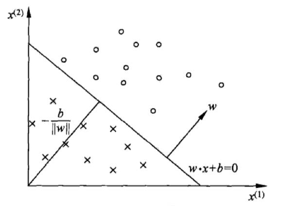
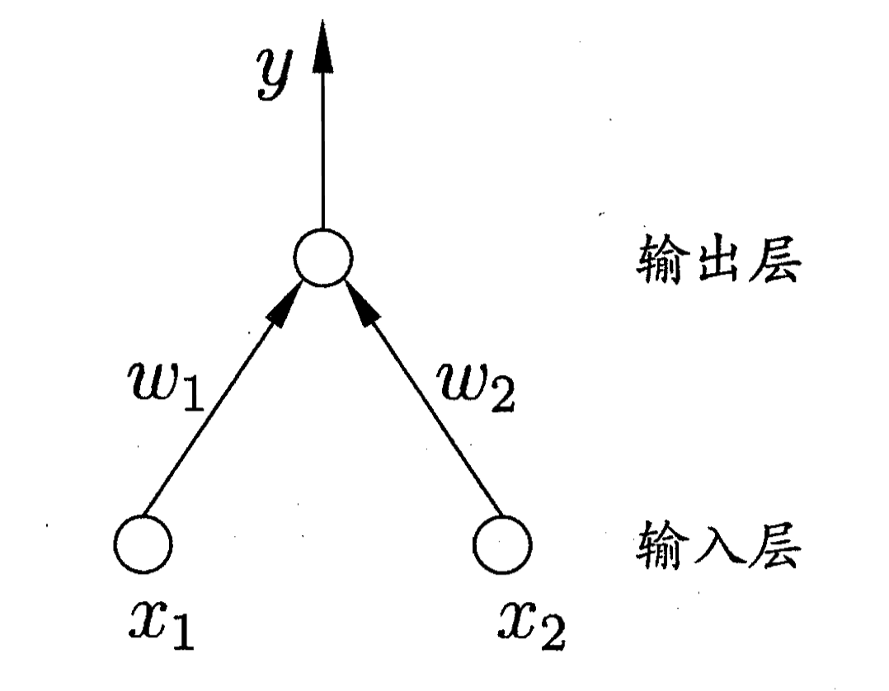
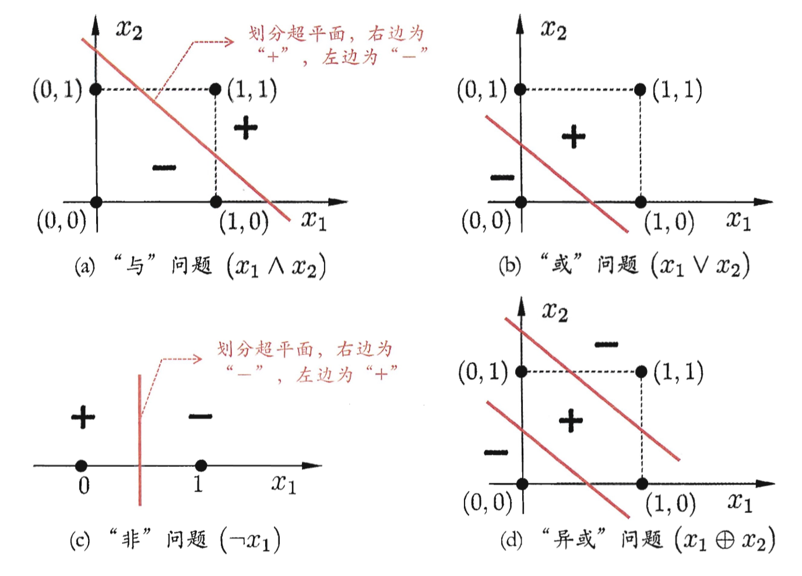
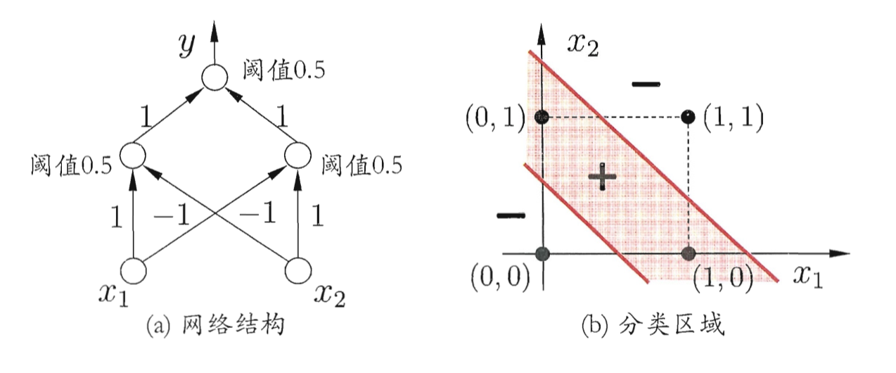

# 神经网络：感知机

> 感知机是一种极其简单的神经网络，之后的CNN和RNN都是基于感知机这一简单的模型。

# 感知机模型

感知机的模型其实非常的简单：

$$
f(x)=sign(\omega \cdot x + b) \\
sign(x)=\begin{cases}
+1& x \ge 0 \\
-1& x \lt 0
\end{cases}
$$

其中，$\omega$和$b$为感知机的模型参数。从公式上我们可以看出，感知机模型是一种线性分类模型，属于判别模型的一种。

# 感知机几何解释

感知机有一种简单的几何解释。对于线性方程$\omega \cdot x + b=0$，对应有一个$R^n$中的超平面$S$，其中$\omega$是超平面的法向量，而$b$是超平面的截距。这个超平面将特征空间划分为两部分，位于超平面两侧的点被分为正负两类。这个超平面称为分离超平面。

# 数据集的线性可分性

给定某数据集$T={(x_1,y_1),...,(x_N,y_N)}$，其中，$x_i \in R^n,y_i \in \{+1,-1\}, i=1,2,...,N$。如果存在一个超平面$\omega\cdot x+b=0$，能够完全正确地把数据集的正样本点（$y_i \gt 0$）和负样本（$y_i \lt 0$）点划分到超平面的两侧，则称数据集线性可分。

# 感知机的学习策略

损失函数的一种策略是误分类点的样本总数，但是这样的损失函数不是连续光滑的，求导困难，不容易优化。另一种策略是求样本点到超平面的距离，这里我们假设一个样本$x_0$，距离公式可以写为：

$$
\dfrac{1}{||\omega||}|\omega \cdot x_0+b|
$$

对于分类错误的情形，如果$\omega \cdot x_i+b \gt 0$，那么输出的$y_i=-1$；如果$\omega \cdot x_i+b \lt 0$，那么输出的$y_i = +1$。这两种情形可以写为：$-y_i(\omega \cdot x_0+b)$

那么所有点的距离总和为：

$$
-\dfrac{1}{||\omega||}\sum_{x_i \in M}y_i(\omega \cdot x_i+b)
$$

忽略$||\omega||$，这样我们就可以自然而然地写出损失函数：

$$
cost=-\sum_{x_i \in M}y_i(\omega \cdot x_i+b)
$$

很容易看出这个损失函数是非负的。感知机的损失函数的优化可以采用梯度下降方法。

这里采用随机梯度下降，即随机选取一个点使梯度下降：

$$
\nabla_\omega cost=-\sum y_i x_i \\
\nabla_b cost=-\sum y_i
$$

随机选取一个点对$\omega$和$b$进行更新：

$$
\omega=\omega+\eta y_i x_i \\
b=b+\eta y_i
$$

$\eta$在0和1之间，称为学习率。

优化算法具体如下：

1. 选取初值；
2. 在训练集中随机选取某个样本；
3. 利用选取的这个样本更新$\omega$和$b$；
4. 重复2，直到分类无误；

在数据集线性可分的条件下，感知机算法一定是收敛的，如果数据集不是线性可分，那么感知机就没啥用了，例如下面学习异或。

# 感知机学习逻辑门

我们让感知机为$y=f(\sum_{i}\omega_i x_i+b),i=1,2$

1. 逻辑与：只要令$\omega_1=\omega_2=1,b=2$
2. 逻辑或：只要令$\omega_1=\omega_2=1,b=0.5$
3. 逻辑非：只要令$\omega_1=-0.6,\omega_2=0,b=-0.5$

但是对于异或，感知机是处理不了的，因为不是线性可分。。。

要解决非线性可分，只能使用多层网络。。。例如两层网络就可以解决异或问题：

# 感知机的对偶形式

感知机的一般形式实际上是用样本来更新参数$\omega$和$b$：

$$
\omega=\omega+\eta y_i x_i \\
b=b+\eta y_i
$$

从公式我们不难看出，最后学习得到的形式实际上是$x_i$和$y_i$的线性组合。

对偶形式的基本想法就是把$\omega$和$b$直接表达为样本的线性组合：

$$
\omega=\sum \alpha_i y_i x_i \\
b=\sum \alpha_i y_i
$$

然后想办法求得参数$\alpha_i$

具体算法如下：

1. 初始化，$\alpha=0$和$b=0$；
2. 随机选取样本点$(x_i,y_i)$；
3. 若$y_i[\sum_{j=1}^N \alpha_j y_j x_j \cdot x_i+b]\le 0$，那么更新参数$\alpha_i$和$b$：
$$
\alpha_i=\alpha_i+\eta \\
b=b+\eta y_i
$$
4. 转到2直到没有分类错误；

对偶形式中的训练样本的内积可以提前计算出来并存储为矩阵，这就是所谓的Gram矩阵：

$$
G=[x_i,x_j]_{N \times N}
$$

# 感知机的算法收敛性

这里不具体证明感知机的收敛性，仅仅强调一下结论：

**对于线性可分的数据集，感知机的算法是迭代收敛的，而且算法存在无穷多个解，解由于不同的初值和迭代顺序而可能有所不同**