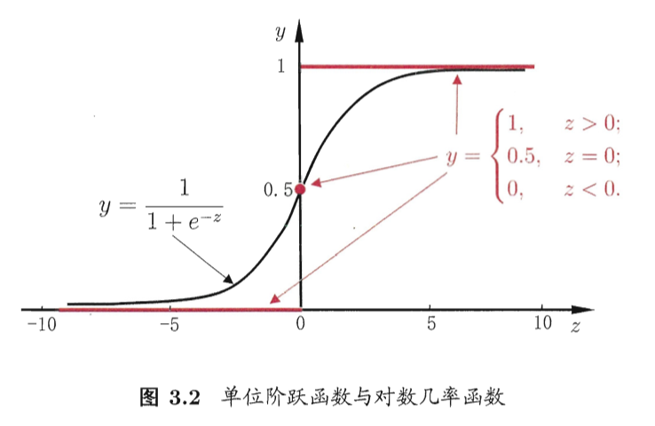

# 线性模型

## 线性回归

对于后面的讨论，我们假设给定数据集$D={(x_1,y_1),...(x_m,y_m)}$，其中$x_i=(x_{i1},x_{i2}...x_{id})$。如果属性是离散的，若属性值之间存在某种序关系，则可以通过连续化将其转化为连续值，例如二值属性“身高”的取值“高”、“矮”可以转化为{1.0，0.0}；若属性值之间不存在序关系，假设有k个属性值，则一般可以转化为k维向量，例如属性“瓜类”的取值西瓜、黄瓜、南瓜可以转化为(0,0,1)，(0,1,0)，(1,0,0)。

### 一元线性回归

对于一元线性回归，数据集的数学形式可以转变为$D={(x_i,y_i)}_{i=1}^{m}$。一元线性回归试图学得：

$f(x_i)=\omega x_i+b$

使得$f(x_i)\simeq y_i$

为了确定$\omega$和$b$这两个参数的形式，这里我们利用均方误差来衡量学习器的性能，即让均方误差最小化：

$(\omega^*,b^*)=argmin \Sigma_{i=1}^{m}(f(x_i)-y_i)^2=argmin \Sigma_{i=1}^{m}(y_i-\omega x_i-y_i)^2$

### 多元线性回归

多元线性回归试图学得：

$f(\boldsymbol{x_i})=\boldsymbol{\omega^T x_i}+\boldsymbol{b}$

使得$f(x_i)\simeq y_i$

我们仍然可以使用均方误差衡量学习器的性能从而学得$\boldsymbol{\omega}$和$\boldsymbol{b}$。为了简便，我们把$\boldsymbol{b}$和$\boldsymbol{\omega}$整合在一起构造$\hat{\omega}=(\boldsymbol{\omega},\boldsymbol{b})$，而数据集也可以表示为一个最后一列为1的矩阵$X$。标记$y_i$也可以写成向量形式$\boldsymbol{y}=(y_1;y_2;...;y_m)$。

这样我们的学习目标就可以转写为：

$\hat{\omega}^*=argmin(\boldsymbol{y}-\boldsymbol{X}\boldsymbol{\hat{\omega}})^T(\boldsymbol{y}-\boldsymbol{X}\boldsymbol{\hat{\omega}})$

### 线性回归的正规方程

所谓正规方程（normal equation），其实就是在求解线性回归的参数时得到的一个方程。

对于多元线性回归的目标：

$\hat{\omega}^*=argmin(\boldsymbol{y}-\boldsymbol{X}\boldsymbol{\hat{\omega}})^T(\boldsymbol{y}-\boldsymbol{X}\boldsymbol{\hat{\omega}})$

我们对$\boldsymbol{\hat{\omega}}$求一次导数可以得到：

$\dfrac{\partial E_{\boldsymbol{\hat{\omega}}}}{\partial \hat{\omega}}=2\boldsymbol{X}^T(\boldsymbol{X}\boldsymbol{\hat{\omega}}-\boldsymbol{y})$

其中，$E_{\boldsymbol{\hat{\omega}}}=(\boldsymbol{y}-\boldsymbol{X}\boldsymbol{\hat{\omega}})^T(\boldsymbol{y}-\boldsymbol{X}\boldsymbol{\hat{\omega}})$

假设$X^TX$为满秩矩阵或正定矩阵，同时我们令上述的导数为0，则可以得到：

$\hat{\omega}^*=(\boldsymbol{X}^T\boldsymbol{X})^{-1}\boldsymbol{X}^T\boldsymbol{y}$

正规方程其实就是：

$(\boldsymbol{X}^T\boldsymbol{X})\hat{\omega}^*=\boldsymbol{X}^T\boldsymbol{y}$

### 从统计角度看线性回归

对于公式$f(x_i)=\omega x_i+b$，我们可以从另一种角度来解释。公式等号右侧的第一项实际上表示的特征的一些组合，这些是直接与预测结果相关的（即模型部分）而其他的一些因素，例如某些被我们遗漏的特征，或者模式中的噪声等等（即非模型部分），则是通过$b$来表征。

那么，我们可以很自然地假设$b$服从均值为0的正态分布。所以线性回归就变成了一个统计问题$p(y_i|x_i; \omega)$，即在参数$\omega$的条件下，给出$x_i$来估计$y_i$。而对于学习过程，实际上就是我们根据已知的$x_i$和$y_i$来找到最合适的参数$\omega$。正如我在先验-后验-似然-极大似然估计-最大后验估计中所提到的那样，实际上这个问题就是在求似然，即从不同的模型参数中选择一个让得到目标数据的概率最大。

现在，我们已经假设了$b$服从均值为0的正态分布：

$p(b) = \dfrac{1}{\sqrt{2\pi}\sigma}exp(-\dfrac{b^2}{2\sigma^2})$

这也就意味着：

$p(y_i|x_i; \omega)= \dfrac{1}{\sqrt{2\pi}\sigma}exp(-\dfrac{(y_i-\omega x_i)^2}{2\sigma^2})$

这样我们可以求得似然函数：

$L(\omega)=\sum_{i=1}^m p(y_i|x_i; \omega)=\sum_{i=1}^m\dfrac{1}{\sqrt{2\pi}\sigma}exp(-\dfrac{(y_i-\omega x_i)^2}{2\sigma^2})$

利用极大似然法来求得参数$\omega$，我们可以将似然函数先求一次对数：

$logL(\omega)=\sum_{i=1}^m log \dfrac{1}{\sqrt{2\pi}\sigma}exp(-\dfrac{(y_i-\omega x_i)^2}{2\sigma^2})=m log \dfrac{1}{\sqrt{2\pi}\sigma}-\dfrac{1}{\sigma^2}\dfrac{1}{2}\sum_{i=1}^m (y_i-\omega x_i)^2$

到这一步，其实就很容易看出，如果我们以均方误差为代价函数进行最小化（即最小二乘法），实际上就是在进行极大似然估计。

### 局部权重线性回归

当训练数据足够多时，有些情况下特征的选择的标准相对可以放宽。所谓局部权重线性回归，实际上就是最小化：

$\sum_{i=1}^m \Omega_i (y_i-\omega x_i -b)^2$

实际上就是在前面加了一项权重。一般地，这个权重可以选择下面这个函数：

$\Omega_i = exp(-\dfrac{(x_i-x)^2}{2\tau^2})$

公式当中的$x$是我们希望进行预测时的某个$x$。这个公式实际上表示的是距离目标$x$越远，权重就越小，而$\tau$这个参数控制了这种权重随着距离衰减的衰减速率。

## 逻辑斯蒂回归

逻辑斯蒂函数（又称sigmoid函数）如下所示：

$g(z)=\dfrac{1}{1+e^{-z}}$

逻辑斯蒂函数的导数有如下性质：

$g'(z)=g(z)(1-g(z))$

逻辑斯蒂回归是用于解决分类问题的一个方法。

$h(\omega x)=g(\boldsymbol{\omega}^Tx)=\dfrac{1}{1+e^{\boldsymbol{{{-\omega}}}^TX}}$

我们可以令：

$P(y=1|x; \omega)=h(\omega x)$

$P(y=0|x; \omega)=1-h(\omega x)$

上述两式可以简写为下面这一个公式：

$P(y|x; \omega)=(h(\omega x))^y(1-h(\omega x))^{(1-y)}$

同样我们可以求得似然函数：

$L(\omega)=\sum_{i=1}^m(h_\omega(x_i))^{y_i}(1-h_\omega(x_i))^{1-y_i}$

我们可以对似然函数求对数再求导：

$log L(\omega)=\sum_{i=1}^m y_i log[h(\omega x_i)]+(1-y_i)log[1-h(\omega x_i)]$

$\dfrac{\partial log L(\omega)}{\partial \omega}=\sum_{i=1}^m(y_i-h(\omega x_i))x_i$

为了极大化似然函数，我们可以采用梯度上升的办法：

$\omega = \omega + \alpha \nabla_{\omega} log L(\omega)$

## Softmax回归

Softmax回归实际上是逻辑斯蒂回归的一种推广。

我们可以假设我们的模型为：

$$
h(\omega x)=
\begin{bmatrix}
P(y_i=1|x_i;\omega) \\
P(y_i=2|x_i;\omega) \\
...\\
P(y_i=k|x_i;\omega)
\end{bmatrix}
=\dfrac{1}{\sum_{j=1}^k e^{\omega_j^T x_i}}
\begin{bmatrix}
e^{\omega_1^T x_i} \\
e^{\omega_2^T x_i} \\
...\\
e^{\omega_k^T x_i} 
\end{bmatrix}
$$

公式中的$\dfrac{1}{\sum_{j=1}^k e^{\omega_j^T x_i}}$是进行归一化，为了保证所有事件的概率之和为1。

Softmax回归的对数似然函数为：

$logL(\omega)=\sum_{i=1}^m log P(y_i|x_i;\omega)=\sum_{i=1}^m log \prod_{l=1}^k (\dfrac{e^{\omega_l^T x_i}}{\sum_{j=1}^k e^{\omega_j^T x_i}})^{1\{y_i=l\}}$

其中，$1\{\cdot\}$表示的是一种指示函数，括号中如果为真，则值为1，否则为0。

## 广义线性模型

根据前面的讨论，我们可以想到线性回归还有很多种不同的变形方式，例如可以用线性回归逼近y的衍生物：

$log(y) = \boldsymbol{\omega}^T x+b$ 

更一般地，我们也可以假设某单调可微函数$G(x)$，则可以得到广义线性模型：

$G(y)=\boldsymbol{\omega}^T x+b$

下面我们就广义线性模型做一个探讨。

### 指数分布族（exponential family）

我们可以假设如下的指数分布族：

$P(y;\eta)=b(y)exp(\eta^TT(y)-a(\eta))$

实际上，前面讨论线性回归时提到的正态分布和讨论逻辑斯蒂回归时提到的二项分布，都属于指数分布族。

对于二项分布：

$P(y;\phi)=\phi^y(1-\phi)^{1-y}=exp[ylog \phi-(1-y)log(1-\phi)]=exp[ylog\dfrac{\phi}{1-\phi}+log(1-\phi)]$

实际上就是令指数分布族的这些参数为：

$\eta=log\dfrac{\phi}{1-\phi}$

$T(y)=y$

$a(\eta)=-log(1-\phi)=log(1+e^{\eta})$

$b(y)=1$

对于正态分布：

$P(y;\mu,\sigma)=\dfrac{1}{\sqrt{2\pi}}exp[-\dfrac{(y-\mu)^2}{2\sigma^2}]=\dfrac{1}{\sqrt{2\pi}}exp[\dfrac{1}{\sigma^2}]exp[-\dfrac{1}{2}y^2+\mu y-\dfrac{1}{2}\mu^2]$

实际上就是令指数分布族的这些参数为：

$\eta=\mu$

$T(y)=y$

$a(\eta)=\mu^2/2=\eta^2/2$

$b(y)=\dfrac{1}{\sqrt{2\pi}}exp[\dfrac{1}{\sigma^2}]exp[-\dfrac{y^2}{2}]$

其他的分布，如Poisson分布，也可以写指数分布族的形式。

### 构造广义线性模型

我们可以通过下述三个步骤构造广义线性模型：

1. 假设$P(y|x)$服从指数分布族；
2. 对于给定的x，我们的目标是根据x来估计T(y)；对于多数的分布，T(y)=y，这也就意味着我们的模型需要满足$h(x)=E[T(y)|x]=E[y|x]$；
3. 指数分布族的参数$\eta$与x之间是线性关系，即$\eta=\omega x$；

对于第二步，我们可以发现它对于线性回归和逻辑斯蒂回归是成立的；实际上，这三步都是一些构造的技巧，也可以说是一些假设，某些步骤可以根据实际情况做一些调整。

### 最小二乘法

对于最小二乘法，我们可以假设指数分布族是正态分布，这样我们就可以得到：

$h(\omega x)=E[y|x; \omega]=\mu=\eta=\omega^T x$

上面这个公式的第一个等号实际上就是构造广义线性模型的第二步；第二个等号是根据正态分布的均值得到的；第三个等号是根据指数分布族中正态分布情况下的参数假设得到的；第四个等号则是根据构造广义线性模型的第三步得到的。

### 逻辑斯蒂回归

对于逻辑斯蒂回归，实际上就是假设指数分布族是二项分布。这样就可以得到：

$h(\omega x)=E[y|x; \omega]=\phi=1/(1+e^{-\eta})=1/(1+e^{-\omega^T x})$

### Softmax回归

Softmax回归也可以利用指数分布族来表达。对于Softmax回归，我们的T(y)不再等于实数y，而是可以表达为下面这样一系列的向量：

$$
T(1)=
\begin{bmatrix}
1 \\
0 \\
... \\
0 \\
\end{bmatrix},
T(2)=
\begin{bmatrix}
0 \\
1 \\
... \\
0 \\
\end{bmatrix},
...,
T(k-1)=
\begin{bmatrix}
0 \\
0 \\
... \\
1 \\
\end{bmatrix},
T(k)=
\begin{bmatrix}
0 \\
0 \\
... \\
0 \\
\end{bmatrix}
$$

利用之前的指示函数，我们可以得到：

$T(y)_i=1\{y=i\}$

$E[T(y)_i]=P(y=i)=\phi_i$

我们用$\phi_1,\phi_2...\phi_k$来表示事件可能的结果，则对于$1...k-1$，可以得到：$\phi_i=P(y=i;\phi)$，而剩下的最后一个，可以表示为$\phi_k=1-\sum_{i=1}^{k-1}\phi_i$。

那么分布函数可以表示为：

$$
p(y;\phi)=\phi_1^{1\{y=1\}}...\phi_k^{1\{y=k\}} \\
= \phi_1^{T(y)_1}...\phi_k^{T(y)_k} \\
= exp[T(y)_1 log \phi_1 + T(y)_2 log \phi_2 + ... + (1-\sum_{i=1}^{k-1}T(y)_i) log \phi_k] \\
= exp[T(y)_i log (\phi_i/\phi_k)+...+T(y)_{k-1} log (\phi_{k-1}/\phi_{k})+log \phi_k] \\
= b(y)exp(\eta^T T(y)-\alpha(\eta))
$$

指数函数族中的几个参数分别为：

$$
\eta = 
\begin{bmatrix}
log(\phi_1/\phi_k) \\
... \\
log(\phi_{k-1}/\phi_k)
\end{bmatrix}
$$

$$
a(\eta)=-log(\phi_k)
$$

$$
b(y)=1
$$

根据上面的讨论，我们可以得到：

$\eta_i=log(\phi_1/\phi_k)$
$e^{\eta_i}=\phi_1/\phi_k$
$\sum_{i=1}^k\phi_ke^{\eta_i}=\sum_{i=1}^k \phi_i=1$
$\phi_i=e^{\eta_i}/\sum_{j=1}^{k}e^{\eta_j}$

最后一个等式表达的函数就是Softmax函数。

我们的模型$h(\omega x)=E[T(y)|x;\omega]=[\phi_1...\phi_k]$，把Softmax函数代入上式就可以得到Softmax回归的模型，并可以通过推导得出回归的目标函数。