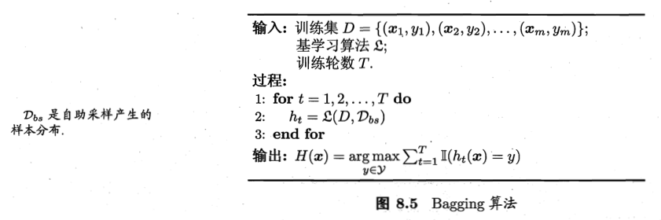

> 集成学习通过勾践并结合多个学习器来完成学习任务。如果集成中的个体学习器都是同一种，比如全是神经网络，则称这样的集成是同质的，同质集成中的个体学习器也称为“基学习器”，算法称为“基学习算法”。异质集成中的个体学习器称为“组件学习器”或者直接称为“个体学习器”。
>
> 集成的个体需要满足：每个个体学习器要有一定的准确性，即学习器不能太坏，并且要有多样性，即学习器间存在一定差异
>
> 根据个体学习器的生成方式，目前的集成学习方法大致可分为两大类，一类是个体学习器间存在强依赖关系、必须串行生成的序列化方法，例如boosting，另一种是个体学习器间不存在强依赖关系，可同时生成的并行化方法，例如bagging和随机森林

# Boosting（AdaBoost）

> AdaBoost的思路是，提高那些被前一轮弱分类器错误分类样本的权值，而降低那些被正确分类的样本的权值，于是，没有正确分类的的数据由于权值上升而得到弱分类器更大的关注。

## AdaBoost算法

假设给定一个二分类的训练数据集$T=\{(x_1,y_1),(x_2,y_2),...,(x_N,y_N)\}$，其中$x_i \in R^n,y_i \in \{-1,+1\}$。

1. 初始化训练数据的权值分布$D_1=(w_{11},...,w_{1i},...,w_{1N}),w_{1i}=\dfrac{1}{N},i=1,2,...,N$

2. 对于$m=1,2,...,M$

   （a）使用具有权值分布$D_m$的训练数据集学习，得到基本分类器$G_m(x): X->\{-1,+1\}$

   （b）计算$G_m(x)$在训练数据集上的分类误差率：$e_m=P(G_m(x_i) \neq y_i)=\sum_{i=1}^N w_{mi}I(G_m(x_i) \neq y_i)$

   （c）计算$G_m(x)$的系数$\alpha_m=\dfrac{1}{2}log\dfrac{1-e_m}{e_m}$

   （d）更新训练数据集的权值分布$D_{m+1}=(w_{m+1,1},...,w_{m+1,i},...,w_{m+1,N})$，$w_{m+1,i}=\dfrac{w_{mi}}{Z_m}exp(-\alpha_m y_i G_m(x_i))$，$i=1,2,...,N$，其中，$Z_m$是规范化因子$Z_m=\sum_{i=1}^N w_{mi}exp(-\alpha_m y_i G_m(x_i))$，它使得$D_{m+1}$成为一个概率分布

3. 构建基本分类器的线性组合$f(x)=\sum_{m=1}^M \alpha_m G_m(x)$，得到最终分类器$G(x)=sign[f(x)]=sign[\sum_{m=1}^M \alpha_m G_m(x)]$

## AdaBoost算法的解释

> AdaBoost可以被看作模型为加法模型，损失函数为指数函数，学习算法为前向分步算法时的二分类学习方法

### 前向分步算法

考虑加法模型
$$
f(x)=\sum_{i=1}^M \beta_m b(x;\gamma_m)
$$
其中，$b(x;\gamma_m)$为基函数。这个模型就是加法模型。

在给定训练数据以及损失函数$L(y,f(x))$的条件下，学习加法模型成为经验风险极小化，即损失函数极小化的问题：$min_{\beta_m,\gamma_m}\sum_{i=1}^N L(y_i;f(x))$。通常这是一个复杂的优化问题，而前向分步算法的基本想法是，因为学习的是加法模型，如果能够从前向后，每一步只学习一个基函数及其系数，逐步逼近优化目标，那么就可以简化优化的复杂度。具体地，每步只需优化损失函数：$min_{\beta,\gamma}\sum_{i=1}^N L(y_i,\beta b(x_i;\gamma))$

具体算法如下：

1. 初始化$f_0(x)=0$

2. 对$m=1,2,...,M$

   （a）极小化损失函数$(\beta_m,\gamma_m)=argmin_{\beta,\gamma}\sum_{i=1}^N L(y_i,f_{m-1}(x_i)+\beta b(x_i;\gamma))$

   （b）更新$f_m(x)=f_{m-1}(x)+\beta_m b(x;\gamma_m)$

3. 得到加法模型$f(x)=f_M(x)=\sum_{m=1}^M \beta_m b(x;\gamma_m)$

### 前向分步算法与AdaBoost

AdaBoost算法是前向分步算法的特例，模型是由基本分类器组成的加法模型，损失函数是指数函数。

## 提升树

> 提升树是以分类树或回归树为基本分类器的提升方法。提升树被认为是统计学习中性能最好的方法之一。提升方法实际上就是采用了加法模型（即基函数的线性组合）与前向分步算法。以决策树为基函数的提升方法称为提升树。

提升树模型可以表示为决策树的加法模型：
$$
f_M(x)=\sum_{m=1}^M T(x;\theta_m)
$$
其中，$T(x;\theta_m)$表示决策树，$\theta_m$为决策树的参数，$M$为树的个数。

回归问题的提升树算法如下：

输入：训练数据集$T=\{(x_1,y_1),(x_2,y_2),...,(x_N,y_N)\}$

1. 初始化$f_0(x)=0$

2. 对m=1,2...,M

   a）计算残差$r_{mi}=y_i-f_{m-1}(x), i=1,2,...,N$

   b）拟合残差$r_{mi}$学习一个回归树，得到$T(x;\theta_m)$

   c）更新$f_m(x)=f_{m-1}(x)+T(x;\theta_m)$

3. 得到回归问题提升树$f_M(x)=\sum_{m=1}^M T(x;\theta_m)$

### 梯度提升

> 当损失函数为平方损失或者指数损失时，每一步优化是简单的，但对一般损失函数而言，往往每一步的优化不太容易，所以可以利用梯度提升算法。

1. 初始化：$f_0(x)=argmin_c \sum_{i=1}^N L(y_i,c)$

2. 对$i=1,2,...,M$，

   a）对$i=1,2,...,N$计算$r_{mi}=-[\dfrac{\partial L(y_i,f(x_i))}{\partial f(x_i)}]_{f(x)=f_{m-1}(x)}$

   b）对$r_{mi}$拟合一个回归树，得到第$m$棵树的叶节点区域$R_{mj},j=1,2,...,J$

   c）对$j=1,2,...,J$计算$c_{mj}=argmin_c \sum_{x_i \in R_{mj}} L(y_i,f_{m-1}(x_i)+c)$

   d）更新$f_m(x)=f_{m-1}(x)+\sum_{j=1}^J c_{mj}I(x \in R_{mj})$

3. 得到回归树$\hat{f}(x)=f_M(x)=\sum_{m=1}^M \sum_{j=1}^J c_{mj} I(x \in R_{mj})$

# Bagging与随机森林

> bagging是并行式集成学习方法最著名的代表，基于bootstrap采样。

### Bootstrap Sampling

给定包含m个样本的数据集，我们先随机取出一个样本放入采样集中，再把该样本放回初始数据集，使得下次采样时该样本仍有可能被选中，这样，经过m次随机采样操作，我们得到了含m个样本的采样集。数据集中有的样本在采样集中重复出现，有的则从未出现。理论计算表明，样本在m次采样中始终不被采到的概率约为0.368

### Bagging

在Bootstrap的基础上，我们可以采样出T个含有m个训练样本的采样集，然后基于每个采样集训练处一个基学习器，再将这些基学习器进行结合，这就是Bagging的基本流程。

由于Bagging是基于Bootstrap，所以每个基学习器只使用了初始训练集中约63.2%的样本，剩下的36.8%的样本可以用作验证集来对泛化性能进行包外估计（out-of-bag estimate）

Bagging主要关注降低方差，因此它在不剪枝决策树，神经网络等易受样本扰动的学习器上效用更为明显。

### 随机森林

随机森林是Bagging的一个扩展变体。在以决策树为基学习器构造Bagging的基础上，进一步在决策树的训练过程中引入了随机属性选择。具体地，一般决策树在选择划分属性时是在当前节点的属性集合（设有d个属性）中选择一个最优属性，而在随机森林中，对基决策树的每个节点，先从该节点的属性集合中随机选择一个包含k个属性的子集，然后再从这个子集中选择一个最优属性用于划分。这里属性的数量k决定了随机性的大小。如果k是整个属性集的大小，那么就和传统决策树相同。如果k=1，则是随机选择一个属性用于划分。一般情况下，推荐$k=log_2 d$。

# 结合策略

> 学习器结合有三个好处：1.由于学习任务的假设空间往往很大，可能有多个假设在训练集上能够达到同等性能，使用结合可以避免使用单学习器误选而导致的泛化性能不佳；2. 学习算法容易陷入局部极小，结合方法可以降低陷入糟糕局部极小点的风险；3.某些学习任务的真实假设可能不在当前学习算法的假设空间内，此时仅仅使用单个学习器的性能就比较低，通过结合多个学习器，可以扩大相应的假设空间，从而让学得更好的近似称为可能。

### 平均法

平均法主要包含简单平均法和加权平均法，实践表明，加权平均法未必优于简单平均法，一般而言，个体学习器性能差距较大时，使用加权平均法比较合适，而如果个体学习器性能比较接近时，使用简单平均法比较合适。

### 投票法

投票法包含：

1. 绝对投票法：若某标记得票超过半数，则预测该标记，否则拒绝预测。这种机制对可靠性要求比较高的任务是个比较好的机制；
2. 相对多数投票法：预测为得票最多的标记。如果同时有多个标记获得最高票，则从中随机选取一个
3. 加权投票法：类似加权平均法

### 学习法

Stacking是一种学习法。Stacking先从初始数据集训练出一个初级学习器，然后，把初级学习器的输出当做样例输入特征，而初始样本的标记仍被当做样例标记，这样生成的一个新的数据集训练一个次级学习器。

### 多样性

理论分析表明，个体学习器准确性越高，多样性越大，则集成越好。

对多样性的度量有多种方式，比如：不合度量，相关系数，Q统计量，k统计量等。

增强多样性有多种方式：数据样本扰动，输入属性扰动，输出表示扰动，算法参数扰动等

